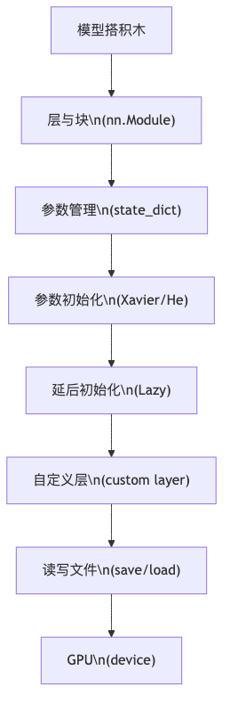

# 第6章 深度学习计算 — 学习笔记

**参考 Notebooks：**
- [index.ipynb](index.ipynb) — 本章索引
- [model-construction.ipynb](model-construction.ipynb) — 层和块
- [parameters.ipynb](parameters.ipynb) — 参数管理
- [init-param.ipynb](init-param.ipynb) — 参数初始化
- [lazy-init.ipynb](lazy-init.ipynb) — 延后初始化
- [custom-layer.ipynb](custom-layer.ipynb) — 自定义层
- [read-write.ipynb](read-write.ipynb) — 读写文件
- [use-gpu.ipynb](use-gpu.ipynb) — GPU

---
---

# 这一章在干什么？

到第 6 章为止，我们已经会“用积木搭模型”了：线性回归、softmax 回归、MLP，既能从零实现，也能用 `nn.Sequential` 很快搭出来。但如果你只停在“会用 API”，一旦遇到更复杂的网络（比如 ResNet、Transformer 里的各种子模块），你会很容易卡在三个地方：**模型结构怎么组织才不乱、参数到底在哪/怎么初始化/怎么共享、训练怎么跑得快还不出错（保存/加载、GPU、设备一致性）**。

这章（Builders' Guide）的定位就是把你从“会用库的人”往前推一步：让你理解深度学习框架里最常用的“搭建与维护能力”。它不像前几章那样引入新模型/新数据集，而是专门讲“深度学习计算的工具箱”：你以后做 CNN、RNN、Attention 时，会反复用到这里的技巧。

你可以把这章理解成 7 个常见问题的答案（也是本章 7 个小节的主线）：

1) **层和块（Layers & Blocks）**：为什么要从“单层”升级到“块”？因为真实网络常常是“可复用的小结构”反复出现。学会把多层封装成一个 `nn.Module`，再递归地组合成大网络，你的代码才可读、可复用、可扩展。

2) **参数管理（Parameter Management）**：训练到底在更新什么？参数在哪能找到？怎么查看形状/名字？怎么做参数共享？以及为什么 `state_dict` 是保存模型的“事实标准”。

3) **参数初始化（Initialization）**：同样的网络结构，初始化不同，训练可能天差地别。这里更偏“怎么在框架里把初始化落实到每一层”，而不是重新推导 Xavier/He 的数学（你在 MLP 章已经见过核心直觉）。

4) **延后初始化（Lazy Initialization）**：有时你写模型时还不知道输入维度（例如动态输入、先写骨架再接数据管道），`Lazy*` 层允许你先把结构搭起来，等第一次看到数据再自动确定参数形状。

5) **自定义层（Custom Layers）**：当标准层不够用时，怎么最小成本写一个自己的层/块——关键是“注册参数 + 定义前向”，让自动求导和优化器都能接得上。

6) **读写文件（Save/Load）**：训练是一个长流程，保存与恢复是必需技能。最稳的实践是“先建同结构的网络，再加载 `state_dict`”，这样可控、可迁移、也更不容易踩坑。

7) **GPU（Use GPUs）**：GPU 的核心优势是并行，但最常见的 bug 也来自设备不一致：数据在 CPU、模型在 GPU（或相反）会直接报错。这一节会把“设备”这件事讲清楚，并给你一个能通用复用的检查思路。

读完本章，你应该能做到两件事：第一，看到一个复杂网络结构时，知道该怎么拆成模块并组织代码；第二，遇到训练/保存/GPU 的问题时，知道从哪几条“硬规则”开始排查，而不是靠猜。

# 原理篇

---

## 一、层和块 <sub>([model-construction.ipynb](model-construction.ipynb))</sub>

### 1.1 为什么需要“块”

从线性模型到 MLP，我们一直在堆层。但真实模型更像“拼积木”：一小段结构反复出现（比如 Residual Block）。如果你只会一层一层手写，代码会又长又难改。

“块”的意义：**把多层封装成一个可复用的模块**。模块既像层一样有输入输出，也像模型一样有参数。这样就能递归组合成复杂网络。

### 1.2 模块的数学形态

一个模块本质是一个函数：

$$\mathbf{y} = f(\mathbf{x}; \theta) \tag{1.1}$$

> $\mathbf{x}$ 是输入，$\mathbf{y}$ 是输出，$\theta$ 是模块内部的参数集合（权重与偏置）。把模块当成“带参数的函数”就好理解。

多个模块串联就是函数复合：

$$\mathbf{y} = f_3(f_2(f_1(\mathbf{x};\theta_1);\theta_2);\theta_3) \tag{1.2}$$

> $f_1,f_2,f_3$ 是不同层（或块），每一层有自己的参数 $\theta_1,\theta_2,\theta_3$。前一层输出就是后一层输入。

### 1.3 数值走查示例：计算一个小块的参数量

假设一个两层 MLP 块：输入维度 3，隐藏层 4，输出维度 2。

线性层参数数目：

$$\#\text{params} = d_{\text{out}}\cdot d_{\text{in}} + d_{\text{out}} \tag{1.3}$$

> 权重矩阵大小 $d_{\text{out}}\times d_{\text{in}}$，偏置长度 $d_{\text{out}}$，所以总参数 = 权重 + 偏置。

第一层：$4\cdot3 + 4 = 16$；第二层：$2\cdot4 + 2 = 10$。

**总参数 = 26**。这就是“块”的参数预算。

---

## 二、参数管理 <sub>([parameters.ipynb](parameters.ipynb))</sub>

### 2.1 参数的生命周期

训练只是参数生命周期的一段：

- 训练中：更新参数最小化损失
- 训练后：保存参数以便复用
- 调试时：查看参数分布，排查异常

### 2.2 共享参数的直觉

有时我们希望多个地方用**同一份参数**，例如 Siamese 网络。共享参数意味着：

$$\mathbf{y}_1 = f(\mathbf{x}_1;\theta),\quad \mathbf{y}_2 = f(\mathbf{x}_2;\theta) \tag{2.1}$$

> 两个输入走同一个模块，参数 $\theta$ 共享。训练时梯度会汇总到同一份参数上。

### 2.3 状态 vs 参数

- **参数（Parameters）**：需要训练更新的张量（`requires_grad=True`）
- **缓冲区（Buffers）**：不需要训练但要保存的状态（如 BN 的 running mean）
- **状态字典（state_dict）**：参数 + 缓冲区的集合

---

## 三、参数初始化 <sub>([init-param.ipynb](init-param.ipynb))</sub>

### 3.1 为什么初始化决定训练成败

如果权重太大，激活会爆；太小，信号会衰减。初始化的目标是：**让信号在层间传播时不爆不衰。**

### 3.2 Xavier 初始化

适合 tanh / sigmoid：

$$\operatorname{Var}(w) = \frac{2}{n_{\text{in}} + n_{\text{out}}} \tag{3.1}$$

> $n_{\text{in}}$ 是输入维度，$n_{\text{out}}$ 是输出维度。让前向与反向的方差在层间保持稳定。

### 3.3 He 初始化

适合 ReLU：

$$\operatorname{Var}(w) = \frac{2}{n_{\text{in}}} \tag{3.2}$$

> ReLU 会“砍掉”一半负值，所以方差需要更大一些补偿。

---

## 四、延后初始化 <sub>([lazy-init.ipynb](lazy-init.ipynb))</sub>

### 4.1 为什么要延后初始化

写模型时经常不知道输入维度（比如多模态、动态输入）。延后初始化让你**先写结构，等见到第一批数据再自动推断参数形状**。

核心机制：

$$\theta \leftarrow \text{Init}(\text{shape}(\mathbf{x})) \tag{4.1}$$

> 参数形状由输入 $\mathbf{x}$ 的形状推断得到，然后再初始化。

---

## 五、自定义层 <sub>([custom-layer.ipynb](custom-layer.ipynb))</sub>

### 5.1 自定义层要解决什么问题

标准层不够用时，需要自己写：

- 特殊结构（比如带门控的自定义模块）
- 特定算子组合（比如插入自定义归一化）

### 5.2 自定义层的最小结构

一个自定义层至少要做两件事：

- 在 `__init__` 里注册参数
- 在 `forward` 里定义前向传播

数学上就是：

$$\mathbf{y} = g(\mathbf{x}; \phi) \tag{5.1}$$

> $g$ 是你自己定义的运算，$\phi$ 是该层内部参数。

---

## 六、读写文件 <sub>([read-write.ipynb](read-write.ipynb))</sub>

模型保存的目标是**能重现当时的参数与结构**。实践中最稳定的方式是：

- 保存 `state_dict`（参数 + 缓冲区）
- 重新构建网络结构
- 再加载 `state_dict`

---

## 七、GPU <sub>([use-gpu.ipynb](use-gpu.ipynb))</sub>

### 7.1 为什么 GPU 快

GPU 的优势是**并行**。矩阵乘法正好是大量独立的乘加运算，GPU 可以成千上万线程同时做。

### 7.2 最小原则：数据和模型必须在同一设备

核心规则：

$$\mathbf{x},\ \theta \in \text{same device} \tag{7.1}$$

> 如果输入在 GPU，参数在 CPU，计算会直接报错。要么都在 CPU，要么都在 GPU。



---

## 关键概念串联表

| 模块 | 关键问题 | 解决方案 | 常见坑 | 关键 API |
|---|---|---|---|---|
| 层和块 | 结构复用 | 模块化组合 | 硬编码导致难维护 | `nn.Module`, `nn.Sequential` |
| 参数管理 | 参数查看/共享 | `parameters`, `state_dict` | 不小心复制成两份参数 | `named_parameters` |
| 初始化 | 信号爆炸/衰减 | Xavier / He | 默认初始化不适配激活 | `nn.init` |
| 延后初始化 | 形状未知 | Lazy 层 | 首次前向前无法读参数形状 | `nn.LazyLinear` |
| 自定义层 | 标准层不够用 | 自定义 `forward` | 忘记注册参数 | `nn.Parameter` |
| 读写文件 | 模型复现 | 保存 state_dict | 只存模型类无法复现参数 | `torch.save`, `load_state_dict` |
| GPU | 加速训练 | 设备一致性 | 模型/数据不在同一设备 | `.to(device)` |

**下一章预告：** 有了“搭积木”的能力，下一章进入卷积神经网络，用结构先验替代全连接的参数爆炸。

---
---

# 代码实现篇

---

## 一、层与块的构造 <sub>([model-construction.ipynb](model-construction.ipynb))</sub>

```python
net = nn.Sequential(
    nn.Linear(20, 256),
    nn.ReLU(),
    nn.Linear(256, 10)
)
```

**要点：**
- `nn.Sequential` 只是“容器”，不做计算
- 真正计算发生在各个子模块的 `forward`

---

## 二、参数访问与共享 <sub>([parameters.ipynb](parameters.ipynb))</sub>

```python
for name, param in net.named_parameters():
    print(name, param.shape)

# 共享参数
shared = nn.Linear(8, 8)
net = nn.Sequential(shared, nn.ReLU(), shared)
```

**要点：**
- 同一个层实例放进多处 → 参数共享
- `state_dict` 会包含共享参数的一份引用

---

## 三、初始化策略 <sub>([init-param.ipynb](init-param.ipynb))</sub>

```python
def init_weights(m):
    if isinstance(m, nn.Linear):
        nn.init.xavier_uniform_(m.weight)

net.apply(init_weights)
```

**要点：**
- 用 `apply` 递归初始化子模块
- ReLU 用 He 初始化更稳

---

## 四、延后初始化 <sub>([lazy-init.ipynb](lazy-init.ipynb))</sub>

```python
net = nn.Sequential(
    nn.LazyLinear(128),
    nn.ReLU(),
    nn.LazyLinear(10)
)

X = torch.randn(4, 20)
net(X)  # 第一次前向才真正初始化权重形状
```

**要点：**
- 未见数据前参数形状是“未定”
- 第一次前向后才能查看具体 shape

---

## 五、自定义层 <sub>([custom-layer.ipynb](custom-layer.ipynb))</sub>

```python
class MyLayer(nn.Module):
    def __init__(self):
        super().__init__()
        self.weight = nn.Parameter(torch.randn(20, 20))

    def forward(self, X):
        return X @ self.weight
```

**要点：**
- 用 `nn.Parameter` 注册可训练参数
- 没有注册就不会被优化器更新

---

## 六、模型保存与加载 <sub>([read-write.ipynb](read-write.ipynb))</sub>

```python
torch.save(net.state_dict(), 'mlp.params')

net2 = nn.Sequential(
    nn.Linear(20, 256),
    nn.ReLU(),
    nn.Linear(256, 10)
)
net2.load_state_dict(torch.load('mlp.params'))
```

**要点：**
- 先建结构，再加载参数
- 结构不一致会报错

---

## 七、GPU 使用 <sub>([use-gpu.ipynb](use-gpu.ipynb))</sub>

```python
device = torch.device('cuda' if torch.cuda.is_available() else 'cpu')
net = net.to(device)
X = X.to(device)
```

**要点：**
- 模型和数据必须在同一设备
- `to(device)` 会递归移动所有参数

---

**完成后自检清单：**
- 是否为每个公式添加了 `\tag{X.Y}` 并紧跟符号解释
- 是否包含数值走查示例
- 是否包含至少一张流程图与对比表
- 是否在原理篇末尾给出关键概念串联表
