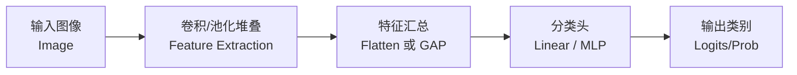
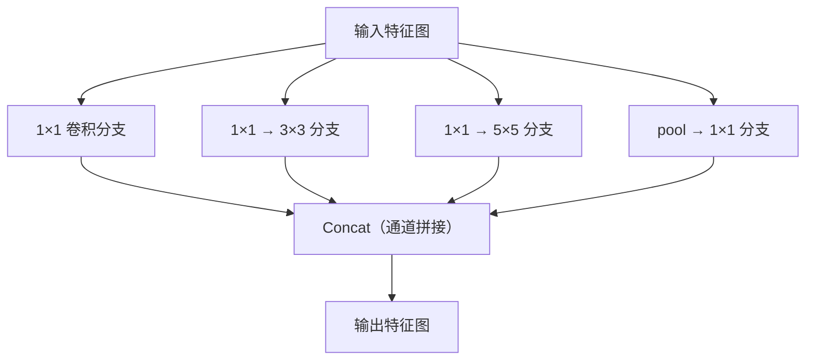

# 第8章 现代卷积神经网络 — 学习笔记

**参考 Notebooks：**
- [index.ipynb](index.ipynb) — 本章索引
- [alexnet.ipynb](alexnet.ipynb) — AlexNet
- [vgg.ipynb](vgg.ipynb) — VGG
- [nin.ipynb](nin.ipynb) — NiN
- [googlenet.ipynb](googlenet.ipynb) — GoogLeNet / Inception
- [batch-norm.ipynb](batch-norm.ipynb) — Batch Normalization
- [resnet.ipynb](resnet.ipynb) — ResNet / ResNeXt
- [densenet.ipynb](densenet.ipynb) — DenseNet
- [cnn-design.ipynb](cnn-design.ipynb) — CNN 设计空间 / RegNet

---

## 开篇：这一章在学什么（先看大图）

第7章你已经把 CNN 的“积木”（卷积、填充、步幅、通道、池化、LeNet）摸清了。但从 LeNet 到真正能打 ImageNet 的模型，中间发生的不是“又堆了几层而已”，而是出现了一系列关键的工程/结构思想：**怎么让网络变深、变强，同时还能训练得动、跑得快、效果稳定**。

这一章可以当作“现代 CNN 旅游团”：我们按时间线参观几类经典结构（AlexNet → VGG → NiN → GoogLeNet/Inception → ResNet/ResNeXt → DenseNet），最后看一类更系统的设计方法（AnyNet/RegNet）。这些网络不仅能直接做分类，也经常被当作下游任务（检测、分割、跟踪、风格迁移）的**特征提取器（feature extractor）**。

如果你只想先抓住主线，可以先记住三类常见“招式”（看到任何现代 CNN 都能对号入座）：

- **块化（block）**：把一段结构当积木反复堆（VGG blocks、Inception blocks、Residual blocks、Dense blocks）。
- **跨层连接（skip / shortcut / residual connection）**：让信息/梯度走“高速路”，深层也能训练（ResNet/DenseNet）。
- **归一化（normalization）**：让每层数值分布更稳定，训练更快、更不容易崩（BatchNorm）。

下面这张图是你在第7章已经建立过的“流水线直觉”：左边负责提特征，右边负责汇总并分类。注意：训练时前向/反向是**整条链路贯穿**的，不是两个模块各练各的。

再给你一个“时间线地图”，后面你就知道每个模型是在解决什么痛点：

> 小提示：这里的 FC 是全连接层（fully connected）的缩写；“大 FC”通常指参数量很大的全连接分类头。

（原书也提到：近几年 Transformer 开始在视觉任务里挑战并部分取代 CNN，这块会在后续注意力/Transformer 章节再系统讲。）

# 原理篇

---

## 一、AlexNet：深度 CNN 的大爆发 ([alexnet.ipynb](alexnet.ipynb))

> **背景速记：** 时间：2012（ImageNet 2012）。提出者：Alex Krizhevsky、Ilya Sutskever、Geoffrey Hinton。机构/国家：多伦多大学（University of Toronto，加拿大）。

### 1.1 AlexNet 之前：为什么 CNN 没那么早统治视觉

直觉上，你可以把 2012 年之前的经典视觉管线想成：

> 人类手工做“特征提取”（SIFT/HOG 等）→ 再用一个传统分类器（线性模型、SVM 等）做决策。

更具体一点，传统管线常常长得像这样（重点是“特征主要靠手工”）：

1) 采集/整理数据集  
2) 做预处理 + 设计特征（基于几何/光学/经验）  
3) 用特征提取器（SIFT、HOG、视觉词袋等）把图片变成特征向量  
4) 把特征向量丢给分类器（线性模型/核方法等）

所以当我们说 AlexNet 之后“端到端（end-to-end）”很重要，本质是：**让网络自己学“表示（representation）”**，而不是把最关键的那一步交给人类手工管线。

CNN 在 LeNet 时代就已经出现，但在更大、更真实的任务上并没有马上成为主流，原因主要不在“想法不对”，而在三个现实条件不够成熟：

- **数据（Data）不够大**：深模型参数多，需要大量数据才能显著超越传统方法。ImageNet 把规模抬到了百万级样本、千类分类，直接改变了游戏规则。
- **硬件（Hardware）不够强**：卷积计算量大，GPU 的通用计算能力成熟后，训练深网才变得可行。
- **训练技巧（Training tricks）不够完善**：包括更合适的初始化、优化器改进、非饱和激活（ReLU）、有效正则化（dropout）等。

这三件事一齐到位后，AlexNet 才“把端到端（end-to-end）学特征”从概念变成了现实胜利。

### 1.2 AlexNet 的关键改动：不是“卷积新发明”，而是“把网络训对了”

AlexNet（AlexNet）可以理解成“更大号的 LeNet + 更现代的训练配置”，典型要点：

- **更深更宽**：更多卷积通道、更大模型容量。
- **ReLU（Rectified Linear Unit）**：比 sigmoid 这类饱和激活更好训练（梯度更不容易消失）。
- **Dropout（dropout）**：在全连接层常用来缓解过拟合。
- **数据增强（data augmentation）**：随机裁剪、翻转等，让模型见到更多变化。
- **GPU 训练**：把卷积的吞吐拉起来。

你可以把 AlexNet 的意义记成一句话：它让大家相信“特征不是必须手工做的”，网络可以自己从像素里学到层级特征（边缘 → 纹理 → 部件 → 物体）。

> 看这张图时你可以只抓一个直觉：它学出来的东西像不像“人类以前手工写的滤波器”？像，就说明网络真的在学“可解释的底层特征”。越往后层，特征越抽象，越难直接可视化，但更贴近“语义”。

### 1.3 AlexNet 的结构（理解到“节奏”就够）

你不需要死记每一层参数，但要能读懂它的整体节奏：

1) 前面若干层卷积 + 池化：逐步下采样、通道数变多，负责提特征。  
2) 后面几层大 FC：把特征图展平成向量做分类（这部分参数很大，也是后来 NiN 想削弱的部分）。

这章后面的很多模型，都是在回答同一个问题的不同版本：**怎样把“提特征”做得更强，同时把“训练”做得更稳，把“分类头”做得更轻。**

---

## 二、VGG：把网络写成“积木说明书” ([vgg.ipynb](vgg.ipynb))

> **背景速记：** 时间：2014。提出者：Karen Simonyan、Andrew Zisserman。机构/国家：牛津大学 Visual Geometry Group（英国）。

### 2.1 从“设计每层”到“设计块（block）”

AlexNet 证明了“深网有用”，但它没有给一个很清晰的“怎么系统设计网络”的模板。Visual Geometry Group（VGG）最大的贡献是：把架构写成可复用的积木。

一个 VGG block 通常是：

- 多个 $3\times3$ 卷积（padding=1，尽量保持分辨率）
- ReLU
- 最后用 $2\times2$ max pooling（stride=2）做一次下采样

这样做的动机是：如果你每次卷积后都池化，下采样太快，空间尺寸很快就“卷没了”。VGG 选择在下采样之间插入多次卷积，让网络更深、更强。

原书里还有一个很实用的提醒：如果你“卷积后立刻池化”作为固定套路，那么空间尺寸每次都减半，你最多只能做大约 $\log_2 d$ 次这样的下采样（$d$ 是输入分辨率边长），否则尺寸会变成 0。这就是为什么 VGG 要在两次下采样之间堆多层卷积：**深度主要堆在“分辨率不变”的阶段里**。

### 2.2 为什么反复用 $3\times3$（小核堆叠的好处）

为什么大家爱 $3\times3$？因为它是一个很好的“折中尺度”：局部、便宜、好堆叠。更关键的是：堆两层 $3\times3$，感受野直觉上相当于 $5\times5$；堆三层相当于 $7\times7$，但参数量更省、非线性更多。

$$\text{两层 }3\times3 \approx \text{一层 }5\times5,\quad \text{三层 }3\times3 \approx \text{一层 }7\times7$$
> 这里的“≈”是感受野（receptive field）的直觉对齐：多个小核堆叠会让输出点看到更大的输入范围，而且每多一层就多一次非线性（ReLU），表达能力更强。参数量上也更划算：$5\times5$ 有 25 个权重；两层 $3\times3$ 总共 18 个权重（不考虑通道数时），通常更省。

### 2.3 VGG 是“家族”而不是一个单一模型

VGG 常被描述为一串 block 的配置（每个 block 里卷积层数、输出通道数），因此它天然是一族网络。经典的 VGG-11/16/19 只是其中几个常见配置。

把 VGG 和 AlexNet 的区别记成一句话：

> AlexNet 像“每一层都手工定制”；VGG 像“用同一种积木反复搭”。

VGG 的代价也很明确：它的 FC 层参数巨大、内存占用很高，这就是下一节 NiN 要出手解决的关键痛点之一。

---

## 三、NiN：把“大 FC”拆掉，让分类头更轻 ([nin.ipynb](nin.ipynb))

> **背景速记：** 时间：2013。提出者：Min Lin、Qiang Chen、Shuicheng Yan。机构/国家：常见说法为新加坡国立大学（National University of Singapore，新加坡）相关团队。

### 3.1 NiN 在解决什么痛点

LeNet/AlexNet/VGG 的共同套路是：左边用卷积提特征，右边用大 FC 分类。但这里有两个现实问题：

1) **大 FC 参数太多**：以 VGG 为例，FC 层会占掉非常大的参数量和内存，对移动端尤其不友好。  
2) **中间层加 FC 不现实**：FC 会打碎空间结构，代价更大。

NiN（Network in Network）提出一个很简单的想法：能不能把“强非线性 + 分类”尽量放回卷积里做？

### 3.2 NiN 的两个核心招式

- **$1\times1$ 卷积（$1\times1$ convolution）**：你可以把它当成“每个像素位置上独立做一次全连接”，专门用来做通道维度的混合和非线性增强。
- **全局平均池化（global average pooling, GAP）**：把每个通道整张特征图平均成一个数，直接得到一个长度为通道数的向量（logits）。

直觉上 NiN 的“尾巴”长这样：

> 先用卷积把通道数变成“类别数” → 对每个通道做全局平均 → 得到每个类别一个分数。

这一下就把大 FC 砍掉了：参数更少，也更不容易过拟合。

NiN 的结构细节（只要读懂，不要背）：

- 一个 NiN block 常常是：“一次普通卷积”后面跟两次 $1\times1$ 卷积（每次都带 ReLU），相当于在局部窗口提特征后，立刻做两次通道混合增强非线性。
- 最后用一个“输出通道数 = 类别数”的 NiN block，再接 GAP，就直接得到 logits 向量。

#### 3.3 把你刚才的直觉“钉死”：NiN 到底怎么融合（对比 Flatten+FC）

你刚才的理解可以总结成一句很准确的话：**以前是“把空间和通道一起大融合”，NiN 是“先在通道里融合，再在空间里汇总”。**

更具体地对比一下两种分类头（classifier head）：

- **经典套路（Flatten + FC）**：把最后一叠特征图（形状 $C\times H\times W$）先展平成一个超长向量（长度 $C\cdot H\cdot W$），再用全连接层把“所有通道 + 所有空间位置”一起混合来做分类。直觉：把整张特征图当成一串特征列表，让 FC 来做全局融合。
- **NiN（$1\times1$ + GAP）**：用 $1\times1$ 卷积先做“通道融合”，再用全局平均池化做“空间汇总”。其中：
  - $1\times1$ 卷积在每个位置 $(i,j)$ 只看这一点的通道向量 $x(i,j)\in\mathbb{R}^{C_{\text{in}}}$，用同一个权重矩阵 $W\in\mathbb{R}^{C_{\text{out}}\times C_{\text{in}}}$ 变换成 $y(i,j)\in\mathbb{R}^{C_{\text{out}}}$（这就是“通道混合”，而且对所有位置共享同一套 $W$）。
  - **GAP 不会把通道互相融合**：它是“每个通道自己对整张 $H\times W$ 做平均”，于是把每个通道压成 1 个数，最终得到长度为 $C_{\text{out}}$ 的向量。

所以你问“NiN 中是不是还要把所有通道融合池化？”答案是：**不需要**。通道之间的信息融合主要由 $1\times1$ 卷积完成；池化（尤其是 GAP）主要负责把空间维度汇总掉。

再补一个你问过的极端情况，帮助你建立边界感：如果 $C_{\text{in}}=C_{\text{out}}=1$，那 $1\times1$ 卷积的 $W$ 就是一个 $1\times1$ 的权重（本质上就是一个标量 $w$），每个位置做的是同样的“缩放+平移”（再加一个偏置 $b$）。一旦通道数大于 1，$W$ 就是矩阵，不是标量了。

常见误解：GAP 会不会“丢位置”太多？  
对分类任务，很多时候我们只关心“有没有某个特征”，而不强求它在哪里；这正好符合 GAP 的偏好。检测/分割等任务会用不同的 head（比如保留空间分辨率的预测头）。

---

## 四、GoogLeNet / Inception：同一层里“多路并行” ([googlenet.ipynb](googlenet.ipynb))

> **背景速记：** 时间：2014（ImageNet 2014 冠军模型），论文发表：2015。提出者：Christian Szegedy 等。机构/国家：Google（美国）。

### 4.1 GoogLeNet 的整体设计语言：stem / body / head

GoogLeNet（GoogLeNet）有一个对后世影响很大的结构语言：把 CNN 拆成

- **stem**：最前面几层“吃进图片”，提低级特征
- **body**：主体堆叠各种 block 做主要计算
- **head**：把特征映射到任务输出（分类/检测/分割…）

你会在后面几乎所有视觉 backbone 里看到这套说法。

### 4.2 Inception block：多尺度同时看，然后拼起来

Inception 模块的直觉是：一张图里同时存在不同尺度的模式（小纹理、大轮廓），那我们能不能在同一层里同时用多种尺度的卷积/池化去看，然后把结果拼起来？

你可以把它想象成“同一个位置同时放了几种放大镜”（$1\times1$、$3\times3$、$5\times5$、pooling 分支），最后把看到的东西在通道维度 concat 合并。

原书强调的两个“工程细节”也很关键：

- 四个分支都会用合适的 padding，让它们输出的 $H\times W$ 一致，这样才能在通道维度拼接。
- Inception block 的主要超参数不是“选哪个核最好”，而是“每个分支分配多少输出通道”——也就是你把容量投到哪个尺度上。

### 4.3 bottleneck：用 $1\times1$ 先“瘦身”再做大核

如果你直接在很高的通道数上做 $5\times5$，计算会爆炸。Inception 的聪明之处是：先用 $1\times1$ 把通道数压下去（bottleneck），再做 $3\times3$ / $5\times5$，最后再拼起来。你可以把它当成“先压缩信息，再做昂贵操作”。

原书还有一张 Inception block 的结构图：`../img/inception.svg`，以及 GoogLeNet 全网结构图：`../img/inception-full-90.svg`。如果你看图时抓不住重点，只需要记住一句话：**GoogLeNet 的 body 就是在堆 Inception，多分支帮它自动兼顾不同尺度的特征。**

从全网角度看，GoogLeNet 的主体通常是**多组 Inception block**（原书是 9 个 block，分成 3 组，中间用池化做下采样），最后 head 用全局平均池化把空间维度汇总掉，再接一个线性层输出类别。

原书还提到一个历史细节：最早的 GoogLeNet 里有一些“中间层辅助分类器（auxiliary loss）”来帮助训练稳定；在今天更好的优化器、归一化与训练技巧出现后，这些技巧往往不再是必须的，所以书里实现的是一个更简化的版本。

---

## 五、BatchNorm：让训练变得“稳”和“快” ([batch-norm.ipynb](batch-norm.ipynb))

> **背景速记：** 时间：2015。提出者：Sergey Ioffe、Christian Szegedy。机构/国家：Google（美国）。

Batch Normalization（BatchNorm，批量归一化）属于“训练技巧”，但它的影响大到可以算“现代深网能训起来的关键件”。你可以把它当成网络里的“稳压器/定标器”。

### 5.1 为什么 BN 有用：把“标准化输入”的思想搬进网络内部

你在做数据预处理时可能见过：把特征标准化成均值 0、方差 1 会让优化更舒服。BN 的直觉非常像：既然输入层标准化有用，那能不能把“标准化”也用在中间层的激活上，让每层都别飘得太厉害？

这能带来三个常见收益：

- **数值更稳定**：不同层激活尺度别差太离谱，更好设学习率。
- **收敛更快**：训练速度往往明显变快。
- **有点正则化效果**：因为每个 batch 的均值方差有噪声，类似轻微的噪声注入。

### 5.2 BN 的核心公式（训练时）

$$\mathrm{BN}(x)=\gamma\cdot\frac{x-\mu}{\sqrt{\sigma^2+\epsilon}}+\beta$$
> 这条式子可以按“三步走”理解：先用当前小批量的均值 $\mu$ 和方差 $\sigma^2$ 把 $x$ 标准化（变成大致均值 0、方差 1），再用可学习参数 $\gamma,\beta$ 把它拉回到网络需要的尺度。$\epsilon$ 是防止除零的小常数。直觉上：BN 不是为了“把数永远变成标准正态”，而是为了让优化过程更顺；$\gamma,\beta$ 让网络在需要时可以学回任何合适的尺度与偏移。

### 5.3 训练模式 vs 推理模式（最容易踩坑的点）

BN 在训练和推理（prediction/inference）时行为不同：

- 训练时：用当前 batch 的均值/方差来标准化。
- 推理时：用训练过程中累计的“移动平均”（moving mean/var）来标准化（否则单张图片推理时均值方差会很不稳定）。

这也是为什么你在框架里会看到模型有 `train()` / `eval()` 之分（BN、Dropout 都依赖这个模式切换）。

原书还有一个容易忽略但很重要的提醒：如果你在全连接层里用 BN，而 batch size 只有 1，那么均值就是它自己，减完均值就全是 0，基本学不到东西。所以 **BN 的效果和 batch size 绑定得更紧**；在一些小 batch 场景里，人们会更偏好 LayerNorm/GroupNorm 之类的替代方案（后面遇到再展开）。

### 5.4 BN 用在卷积层时：按“通道”做标准化

卷积层输出是 $N\times C\times H\times W$（或 channels-last 版本），BN 通常会对每个通道 $C$ 单独计算均值/方差，但统计时会把 batch 和空间位置都算进去（也就是每个通道会用 $N\cdot H\cdot W$ 个数估计均值方差）。直觉：这符合卷积的“平移等变”假设——我们不想让不同空间位置用完全不同的标准化尺度。

原书还顺带提到了 Layer Normalization（LayerNorm）：它对每个样本内部做标准化，不依赖 batch 大小。这里先记住“BN 依赖 batch（训练/推理模式不同），LN 不依赖 batch（行为更一致）”就够了。

---

## 六、ResNet / ResNeXt：给梯度修一条高速公路 ([resnet.ipynb](resnet.ipynb))

> **背景速记：** ResNet 时间：2015（ImageNet 2015 冠军），论文发表：2016。提出者：Kaiming He、Xiangyu Zhang、Shaoqing Ren、Jian Sun。机构/国家：Microsoft Research（微软研究院，常见为 MSRA 团队；中国/美国）。ResNeXt 时间：2017。提出者：Saining Xie、Ross Girshick、Piotr Dollár、Zhuowen Tu、Kaiming He。机构/国家：Facebook AI Research（FAIR，美国）等。

ResNet（Residual Network，残差网络）解决的是“网络越深越难训练”的核心问题之一。它的思路非常像“给信息/梯度修一条旁路高速公路”，让深层网络不至于一层层传着传着就崩掉。

### 6.1 先讲动机：加深网络，至少不能更差

你可以用一个朴素要求理解 ResNet：如果我在一个已经不错的网络里又加了一层，新网络**至少不应该更差**。这就要求“新增的层”有能力变成“什么都不做”（恒等映射，identity mapping），这样网络至少能退回到原来的效果。

原书为了讲清这个动机，引入了“函数类（function class）”的直觉：如果新架构的可表示函数集合不是旧集合的超集，那“加了层”也不保证更好。图可以帮你建立直觉（左边：非嵌套；右边：嵌套）：`../img/functionclasses.svg`。

### 6.2 残差块公式与直觉

$$y=x+F(x)$$
> 这里 $x$ 是输入，$F(x)$ 是一小段卷积网络学到的“改动量”（residual），输出 $y$ 是“原样保留 + 小改动”。直觉上：如果这一段学不好，最差也能让 $F(x)\approx0$，于是 $y\approx x$；反向传播时，梯度也可以沿着这条“加法捷径”更顺畅地传回去，所以深层更好训。

原书的残差块示意图很直观：`../img/residual-block.svg`（左：普通块直接学 $f(x)$；右：残差块学 $f(x)-x$）。

在实现上，原书用的是很经典的 ResNet block 结构：两层 $3\times3$ 卷积，每层后面跟 BN，第一层后面跟 ReLU，最后把 $x$ 加回去再过一次 ReLU。你可以把它记成一句口令：**Conv-BN-ReLU → Conv-BN → +skip → ReLU**。

### 6.3 形状对齐：什么时候需要 $1\times1$ 卷积

残差相加要求 $x$ 和 $F(x)$ 形状一致（通道数、空间尺寸）。当你想在某个 stage 里做下采样（比如 stride=2）或改变通道数时，就需要用一个 $1\times1$ 卷积把 $x$ 投影到合适形状再相加。原书有图：`../img/resnet-block.svg`。

### 6.4 ResNet 的“节奏”与“家族”

ResNet 通常按 stage 组织：分辨率逐步下降，通道数逐步上升，每个 stage 堆若干残差块。常见的 ResNet-18/34/50/101 只是“每个 stage 堆多少块、用什么块（basic/bottleneck）”的不同配置（可参考：`../img/resnet18-90.svg`）。

### 6.5 ResNeXt：在残差块里做“分组卷积（grouped convolution）”

ResNeXt（ResNeXt）可以理解为“残差 + 更稀疏的连接”：把通道拆成若干组，每组做自己的卷积再汇总（有点像“受控的多分支”）。这样常常能在相似计算量下得到更好的精度/效率权衡。原书把这种“分支数量”称为 cardinality，你可以理解为“并行变换的条数”。

---

## 七、DenseNet：让特征“层层复用” ([densenet.ipynb](densenet.ipynb))

> **背景速记：** 时间：2017。提出者：Gao Huang、Zhuang Liu、Laurens van der Maaten、Kilian Q. Weinberger。机构/国家：Cornell University 等（美国为主的跨机构团队）。

DenseNet（Densely Connected Network，稠密连接网络）把跨层连接做得更激进：ResNet 是“加回去”，DenseNet 是“拼起来带着走”。

### 7.1 从 ResNet 到 DenseNet：加法 vs 拼接

ResNet 的一个视角是把函数写成“简单项 + 复杂项”：

$$f(x)=x+g(x)$$
> 这条式子是在说：ResNet 更偏向学习“改动量” $g(x)$，而把 $x$ 原封不动地通过捷径保留下来。DenseNet 想要的不只是“保留一条捷径”，而是把不同深度学到的特征都保留下来给后面用，所以它用 concat（拼接）而不是加法。

DenseNet 的基本连接方式可以直觉写成：

$$x_\ell = H_\ell([x_0, x_1, \ldots, x_{\ell-1}])$$
> 这里 $[\,]$ 表示在通道维度拼接（concatenation）：第 $\ell$ 层的输入不是上一层的输出，而是“所有历史层输出拼在一起”。$H_\ell(\cdot)$ 通常是一小段卷积变换（常见结构是 BN → ReLU → Conv）。直觉：后面的层可以直接复用早期的边缘/纹理等低层特征，也让梯度有很多条路可以传回去。

原书对比图很直观：`../img/densenet-block.svg`，以及“随着深度通道数会增长”的示意：`../img/densenet.svg`。

### 7.2 Dense block 与 growth rate（增长率）

因为每一层都会把自己的输出 concat 到通道上，所以通道数会越来越大。DenseNet 用 growth rate（增长率）来描述“每加一层通道数增加多少”。你可以把它理解为：每层新增的特征数量。

### 7.3 Transition layer（过渡层）：控制通道数别爆炸

Dense block 之间通常会插 transition layer（transition layer）：用 $1\times1$ 卷积压通道，再用平均池化（常见 stride=2）把分辨率减半，防止通道数和计算量失控。直觉上它在做两件事：**压缩通道（省参数/显存）+ 下采样（省计算）**。

---

## 八、从“拍脑袋”到“设计空间”：AnyNet / RegNet ([cnn-design.ipynb](cnn-design.ipynb))

> **背景速记：** 时间：2020。提出者：Ilija Radosavovic 等。机构/国家：Facebook AI Research（FAIR，美国）。

你可能已经发现：这些网络看起来花样很多，但背后经常在重复一些固定套路：按 stage 下采样、通道逐步变大、块重复堆叠……这一节就是把这些套路“抽象成模板”，从“手工发明一个网络”走向“定义一类网络，然后在这一类里系统探索”。

### 8.1 AnyNet：用统一模板描述一大类 CNN

AnyNet 的核心模板是：

- 网络由 stem / body / head 组成
- body 由多个 stage 组成（常见是 4 个 stage）
- 每个 stage 由若干 block 组成
- stage 之间通常会下采样（分辨率变小，通道变多）

在这个模板里，每个 stage 的主要“可调旋钮”通常包括：

- 深度：这一段堆多少个 block（depth）
- 宽度：通道数多少（channels）
- 分组：group convolution 的组数（groups）
- bottleneck 比例：中间压通道比例（bottleneck ratio）

原书有一张 AnyNet 设计空间的大图：`../img/anynet.svg`，建议你看一眼建立“stem/body/head + stage/block”的空间感。

### 8.2 RegNet：优化的是“网络分布”，不是“单个网络”

NAS（neural architecture search）常见思路是“在巨大空间里找一个最优网络”，但代价很高。RegNet 的想法更像“先定义一个结构分布，让这个分布里大多数网络都不错”，再从中挑选合适大小的型号。

你可以把 RegNet 理解成一种更工程化的结果：

> 给定预算（算力/延迟/参数量），用一套规则直接生成一族网络配置，而不是每次都从头设计。

这一节还想传达一个“研究方法”的味道：不要只追单个最优点，也要学会总结出可复用的设计规律（哪些旋钮该怎么随深度/分辨率变化）。

原书里提到的几个“方法论假设”很值得一读（不需要背，但要理解为什么这样做省钱）：

- 不是只有一个好网络，而是“好网络有一堆”，可以用“分布”来描述。
- 不一定要把每个候选网络训练到完全收敛，早期训练结果也能做相对比较（这类思路常被叫做 multi-fidelity）。
- 小模型上得到的规律能迁移到大模型上，所以可以先在小规模上探索，再放大验证。

---

## 小结：这一章你应该带走什么

如果只带走三句话：

1. **block 思维**：现代 CNN 不是堆散乱的层，而是堆可重复、可组合的模块。
2. **训练可行性**：BatchNorm 和残差连接让深网真正“训得动”。
3. **结构与训练同等重要**：架构很关键，但数据规模、算力、优化器、数据增强、正则化等训练技巧同样决定上限。

你下一步如果要“抓住最值钱的思想”，我建议优先吃透两件事：**BatchNorm（训练稳定）+ ResNet（深网可训练）**。很多后续模型都是围绕它们做改造。

# 代码实现篇

> 你目前不打算写代码也完全没问题。本章 notebooks 里每一节都有对应的实现与训练对比；等你准备动手时，我们可以从 AlexNet/VGG 这种结构更直观的开始，一步步搭起来。
