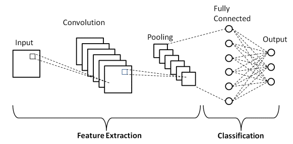
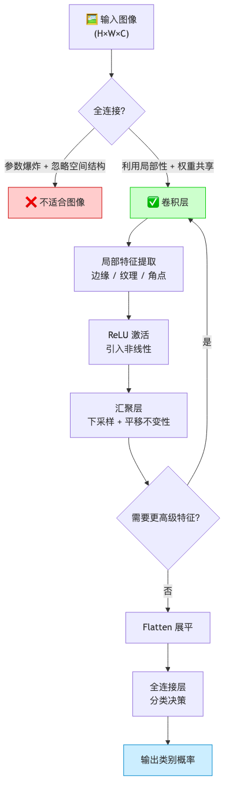

# 第7章 卷积神经网络 — 学习笔记

**参考 Notebooks：**
- [index.ipynb](index.ipynb) — 本章索引
- [why-conv.ipynb](why-conv.ipynb) — 从全连接层到卷积
- [conv-layer.ipynb](conv-layer.ipynb) — 图像卷积
- [padding-and-strides.ipynb](padding-and-strides.ipynb) — 填充与步幅
- [channels.ipynb](channels.ipynb) — 多输入多输出通道
- [pooling.ipynb](pooling.ipynb) — 汇聚层
- [lenet.ipynb](lenet.ipynb) — LeNet

---

## 开篇：我们要解决什么问题

前面几章我们一直在处理"结构化数据"——每个样本就是一行数字（面积、房龄、价格……），特征之间没有空间关系。但现实世界有大量数据不是这样的，最典型的就是**图像**。

想象你看一张猫的照片。你是怎么认出它是猫的？你看到了尖耳朵、胡须、圆眼睛——这些都是**局部特征**，而且它们的**空间位置**很重要（耳朵在头顶、胡须在嘴旁）。你不需要看完整张图再做判断，而是先注意到局部细节，再把它们组合起来。

这就是卷积神经网络（CNN）要模仿的思路：**像人类一样，先看局部、再看整体，逐层提取越来越抽象的特征。**

为了先有个全景直觉，你可以把很多 CNN 的结构粗略看成两段：左边做“特征提取”（卷积/池化反复堆叠），右边做“分类”（把特征汇总成向量再输出类别，也就是前面几章我们学过的全连接层神经网络）：



但在走到 CNN 之前，我们得先搞清楚一个关键问题：我们之前学的全连接网络（MLP），为什么处理不好图像？

# 原理篇

---

## 一、从全连接到卷积：为什么需要新武器 <sub>([why-conv.ipynb](why-conv.ipynb))</sub>

### 1.1 全连接处理图像：哪里出了问题

在第5章（多层感知机）中，我们学了全连接网络：每一层的每个神经元都和上一层的**所有**神经元相连。对表格数据来说这没问题——特征之间没有空间关系，"面积"和"房龄"谁在前谁在后无所谓。

但图像不一样。一张 $28\times28$ 的灰度图（比如 MNIST 手写数字）有 784 个像素。如果用全连接层接一个 256 维的隐藏层，参数量是 $784 \times 256 = 200{,}704$ 个。听起来还行？

现在换成 ImageNet 常用的 $224\times224$ 彩色图，输入维度变成 $224\times224\times3 = 150{,}528$。同样接 256 个隐藏单元，参数量暴增到 **3,853 万**——而这才只是第一层！更深的网络就直接爆炸了。

但参数太多只是问题的表面。更根本的问题是：**全连接层完全忽略了图像的空间结构。**

想象你把一张猫的照片的所有像素随机打乱顺序，对全连接层来说，输入向量变了，但本质上处理方式没有任何不同——它并不知道"像素 (10,10) 和像素 (10,11) 是邻居"。而人类之所以能认出猫，恰恰依赖于像素之间的空间关系：相邻像素构成边缘，边缘构成轮廓，轮廓构成物体。

所以我们需要一种新的网络结构，它要满足两个要求：
1. **利用图像的空间结构**——相邻像素比远处像素更相关
2. **参数量可控**——不能随图像分辨率爆炸式增长

### 1.2 图像的两个关键先验

仔细想想，图像有两个非常重要的统计特性，全连接层没有利用：

**先验一：局部性（Locality）**——图像中的有意义模式（边缘、纹理、角点）都是**局部的**。一只猫的耳朵由几十个相邻像素构成，不需要看到图像另一头的像素就能识别出"这是个尖角形状"。换句话说，**远处的像素对当前位置的判断几乎没有影响。**

**先验二：平移等变性（Translation Equivariance）**——同一个模式（比如一条竖直边缘）不管出现在图像的左上角还是右下角，它的本质都一样。识别这个模式的"检测器"不应该因为位置不同就完全不同。换句话说，**同一个特征提取器应该在整张图上通用。**

这两个先验直接对应 CNN 的两个核心设计：

| 图像先验 | CNN 对应机制 | 效果 |
|----------|-------------|------|
| 局部性：有意义的模式是局部的 | **局部连接**：每个输出只看一个小窗口 | 大幅减少参数 |
| 平移等变性：同一模式在不同位置本质相同 | **权重共享**：同一个卷积核在整张图上滑动复用 | 进一步压缩参数，且自带平移等变性 |

### 1.3 从数学上看：全连接到卷积的"退化"

全连接层的输出可以写成：

$$h_{i,j} = \sum_{a}\sum_{b} W_{i,j,a,b}\, X_{a,b} + \text{bias} \tag{1.1}$$
> 这条式子把“全连接层看图像”的行为写得很直白：我们在算输出位置 $(i,j)$ 的值 $h_{i,j}$，但它会把整张输入图 $X$ 的每个像素 $(a,b)$ 都拿来参与计算（两个求和 $\sum_a\sum_b$）。$X_{a,b}$ 是输入在位置 $(a,b)$ 的像素值；$W_{i,j,a,b}$ 是把输入位置 $(a,b)$ 的像素“连到”输出位置 $(i,j)$ 的权重——注意它有四个下标，意味着**不同的输出位置 $(i,j)$ 会有完全不同的一套权重**，而且每个输出位置还要和所有输入位置都连一遍。直觉上这等价于“每个位置都要单独学一张属于自己的整图模板”，所以参数量会随着图像分辨率暴涨，也完全没利用“相邻像素更相关、同一个局部模式到处都一样”这两个图像先验。

现在施加"局部性"限制——只看 $(i,j)$ 附近的一个小窗口，用偏移量 $(u,v)$ 代替 $(a,b)$：

$$h_{i,j} = \sum_{u=-\Delta}^{\Delta}\sum_{v=-\Delta}^{\Delta} W_{i,j,u,v}\, X_{i+u, j+v} + \text{bias} \tag{1.2}$$
> 这条式子是在 (1.1) 上先加“局部性（locality）”约束：输出位置 $(i,j)$ 不再看全图，只看它周围一个小窗口。$u,v$ 是相对偏移（offset），范围是 $[-\Delta,\Delta]$，所以 $X_{i+u,\,j+v}$ 表示“以 $(i,j)$ 为中心的窗口里某个像素”。关键变化是：求和不再遍历整张图，而只遍历窗口大小 $(2\Delta+1)\times(2\Delta+1)$，因此每个输出位置的计算只用到附近像素，参数预算也从“整图级别”降到了“窗口级别”。但注意权重仍然写成 $W_{i,j,u,v}$：**不同的输出位置 $(i,j)$ 仍然各自拥有一套窗口内的权重**，也就是说“检测器”还没做到在全图通用，只是从“看全图”变成了“每个位置有自己的小模板”。

再施加"权重共享"限制—— $W$ 不再随 $(i,j)$ 变化：

$$h_{i,j} = \sum_{u=-\Delta}^{\Delta}\sum_{v=-\Delta}^{\Delta} W_{u,v}\, X_{i+u, j+v} + b \tag{1.3}$$
> 这条式子就是“权重共享”的数学表达：我们仍然在算输出位置 $(i,j)$ 的值（左边的 $h_{i,j}$），也仍然只看它周围的一个小窗口（求和里的 $u,v$ 是“相对偏移”，所以窗口内的像素写成 $X_{i+u,\,j+v}$）。**但最关键变化是权重写成了 $W_{u,v}$，不再是 $W_{i,j,u,v}$**：也就是说，这个“检测器”只关心窗口里“左上角/中心/右下角”这些相对位置该怎么加权（由 $u,v$ 决定），而不关心它现在滑到了整张图的哪个绝对位置（$i,j$）。因此同一套权重会在整张图上反复复用：如果 $W$ 学会了“猫耳朵边缘”这种局部模式，它在右上角、右下角看到类似模式时都会给出相似响应。参数量也因此只和窗口大小有关：权重个数约为 $(2\Delta+1)^2$（再加一个偏置 $b$），而不会随着图像分辨率变大而爆炸。

这里之所以“从数学上看”，是因为我们不想把卷积当成一种神秘的新发明，而是想看清它的来龙去脉：**卷积可以被理解为“在全连接层的自由度上加约束”**。所谓“退化”，意思不是模型变差，而是把一个非常一般、自由度极高的映射（全连接：每个输出位置都能用一套完全不同的全图权重）限制成一个更有结构的映射（卷积：每个位置共享同一套局部权重）。这样做的直接收益有两类：一是参数量从“随分辨率爆炸”变成“只和核大小有关”；二是把我们相信的图像先验（局部性、平移等变性）硬编码进模型，让模型更容易在有限数据上学到有效规律。

这不是凭空发明的新结构，而是给全连接层加上两条来自图像先验的约束后自然得到的结果。

---

## 二、卷积层：局部特征提取器 <sub>([conv-layer.ipynb](conv-layer.ipynb))</sub>

### 2.1 卷积在做什么：一个直觉

想象你有一个放大镜，大小是 $3\times3$。你把这个放大镜放在图像的左上角，透过它只能看到 9 个像素。你对这 9 个像素做一次加权求和（有的像素权重大，有的小，有的甚至是负数），得到一个数字。然后你把放大镜往右挪一格，再看 9 个像素，再加权求和得一个数字。就这样，放大镜从左到右、从上到下扫过整张图，每个位置算出一个数字，所有数字排成一张新的图——这就是卷积的输出（叫**特征图（feature map）**）。

关键点在于：**放大镜的权重（卷积核（convolution kernel））自始至终不变。** 同一组权重在所有位置上复用。这意味着，如果这组权重学会了检测"水平边缘"，那不管水平边缘出现在图像的哪个位置，它都能被检测到。

### 2.2 卷积的数学公式

严格来说，深度学习中用的是**互相关**（cross-correlation）而非数学意义上的卷积（卷积需要翻转核），但因为卷积核是学出来的，翻不翻转无所谓，所以业界统一叫"卷积"。

> 互相关可以理解为“模板直接匹配（不翻转核）”：把核 $W$ 当成一个小模板，在输入 $X$ 上滑动，每个位置做“逐元素相乘再求和”。而严格的数学卷积会先把核翻转（左右/上下）再去匹配。深度学习里核是训练学出来的，翻转与否只相当于换一种参数表示，因此工程上通常不区分，统一叫卷积层。

> 用一个最小的数字例子感受“翻不翻转”的区别：设输入
> $$X=\begin{bmatrix}1&2&3\\4&5&6\\7&8&9\end{bmatrix},\quad W=\begin{bmatrix}1&2\\3&4\end{bmatrix} \tag{2.0}$$
> 互相关在左上角位置的输出是 $1\cdot1+2\cdot2+4\cdot3+5\cdot4=37$；而数学卷积会先把核翻转成 $W'=\begin{bmatrix}4&3\\2&1\end{bmatrix}$，对应输出变成 $1\cdot4+2\cdot3+4\cdot2+5\cdot1=23$。深度学习里因为核是学出来的，翻转与否不会改变模型能学到的“检测器”类型，所以通常不纠结这个定义差异。

二维互相关运算：

$$Y_{i,j} = \sum_{u=0}^{k_h-1}\sum_{v=0}^{k_w-1} X_{i+u,\, j+v}\, W_{u,v} + b \tag{2.1}$$
> $X$ 是输入特征图（一张图），$W$ 是卷积核（大小 $k_h \times k_w$ 的小矩阵），$b$ 是偏置标量。对于输出的每个位置 $(i,j)$，从输入中取出一个和卷积核同样大的子块，逐元素相乘再求和，加上偏置，得到输出 $Y_{i,j}$。

输出的大小（无填充、步幅为 1）：

$$H_{\text{out}} = H - k_h + 1,\quad W_{\text{out}} = W - k_w + 1 \tag{2.2}$$
> $H, W$ 是输入的高和宽。每卷积一次，输出都会比输入**缩小** $(k-1)$ 个像素。这是一个问题——多叠几层卷积，图像就缩到什么都不剩了。后面的"填充"就是为了解决这个问题。

### 2.3 卷积核在"学"什么

卷积核的值不是人工设定的，而是通过训练学出来的——这里的“值”指的是卷积核矩阵 $W$ 里面每一个位置的数（权重参数），而不是 $k_h,k_w$ 这种“核有多大”的选择。$k_h,k_w$ 通常是你提前定好的超参数（hyperparameter），比如常见的 $3\times3$ 或 $5\times5$；训练真正会更新的是 $W_{u,v}$ 这些权重。

另外，一层卷积通常不会只有一个卷积核，而是会同时学很多个卷积核（也就是很多个输出通道（output channel））：每个卷积核都是一个不同的“检测器”，输出一张自己的特征图（feature map）。所以你下面看到的“边缘核 / 角点核”等例子，可以在同一层里同时出现，各自负责捕捉不同类型的局部模式。

不同的核值会产生截然不同的效果，比如：

- 核 $\begin{bmatrix}1&-1\end{bmatrix}$ 检测**水平方向的变化**（竖直边缘）：相邻像素值相同时输出 0，相邻像素值突变时输出大
- 核 $\begin{bmatrix}1\\-1\end{bmatrix}$ 检测**竖直方向的变化**（水平边缘）
- 核 $\begin{bmatrix}0&-1&0\\-1&4&-1\\0&-1&0\end{bmatrix}$ 检测**角点和斑点**

你也可以有“斜向边缘”的检测器：比如某些权重组合会对对角线方向的变化更敏感。关键点是——在 CNN 里这类“方向性模板”通常不需要你手写，网络会自己学出来。

至于“异形”的核：标准卷积核的形状一般是规则的矩形/正方形窗口（例如 $k_h\times k_w$），因为这样实现最高效。但你可以用一些变体表达更灵活的“形状感受野”，例如空洞卷积（dilated convolution）扩大感受野、可变形卷积（deformable convolution）让采样位置可学习、或掩码卷积（masked convolution）只允许窗口里的部分位置参与。它们的共同点是：仍然在做“局部加权汇总”，只是“局部”的方式更灵活了。

训练过程中，网络会自动学出有用的核——浅层学边缘、纹理，深层学更复杂的组合（眼睛、轮子、文字……）。这就是 CNN 的魔法：**你不用告诉它检测什么特征，它自己从数据中学会。**

### 2.4 📌 数值走查示例：完整的一次卷积

让我们用一个具体的例子，从头到尾走一遍卷积计算。

设输入 $X$（$3\times3$）和卷积核 $W$（$2\times2$）：

$$X = \begin{bmatrix}
1 & 2 & 0 \\
0 & 1 & 3 \\
2 & 1 & 1
\end{bmatrix},\quad
W = \begin{bmatrix}
1 & 0 \\
-1 & 1
\end{bmatrix},\quad b = 0 \tag{2.3}$$
> 输入是 $3\times3$，卷积核是 $2\times2$。由公式 (2.2)，输出大小 = $(3-2+1) \times (3-2+1) = 2\times2$。

**位置 (0,0)** —— 取左上角的 $2\times2$ 子块：

$$Y_{0,0} = \begin{bmatrix}1&2\\0&1\end{bmatrix} \odot \begin{bmatrix}1&0\\-1&1\end{bmatrix} = 1\!\cdot\!1 + 2\!\cdot\!0 + 0\!\cdot\!(-1) + 1\!\cdot\!1 = 2 \tag{2.4}$$
> 这一步是在输出的 $(0,0)$ 位置：从输入里取左上角的 $2\times2$ 小窗口，和核 $W$ 做逐元素相乘（$\odot$），再把 4 个乘积相加。因为这里 $b=0$，所以不需要再加偏置。

**位置 (0,1)** —— 窗口右移一格：

$$Y_{0,1} = \begin{bmatrix}2&0\\1&3\end{bmatrix} \odot \begin{bmatrix}1&0\\-1&1\end{bmatrix} = 2\!\cdot\!1 + 0\!\cdot\!0 + 1\!\cdot\!(-1) + 3\!\cdot\!1 = 4 \tag{2.5}$$
> 这一步窗口右移一格到 $(0,1)$：窗口里的 4 个输入数变了，但核 $W$ 不变（权重共享）。计算规则仍然是“逐元素乘 + 求和”。

**位置 (1,0)** —— 窗口下移一格：

$$Y_{1,0} = \begin{bmatrix}0&1\\2&1\end{bmatrix} \odot \begin{bmatrix}1&0\\-1&1\end{bmatrix} = 0\!\cdot\!1 + 1\!\cdot\!0 + 2\!\cdot\!(-1) + 1\!\cdot\!1 = -1 \tag{2.6}$$
> 这一步窗口下移一格到 $(1,0)$。你会看到输出可能是负数：这是因为核里有负权重（这里是 $-1$），它会“惩罚/抵消”某些位置的输入，这正是卷积核能检测“变化/边缘”的原因之一。

**位置 (1,1)** —— 窗口右下角：

$$Y_{1,1} = \begin{bmatrix}1&3\\1&1\end{bmatrix} \odot \begin{bmatrix}1&0\\-1&1\end{bmatrix} = 1\!\cdot\!1 + 3\!\cdot\!0 + 1\!\cdot\!(-1) + 1\!\cdot\!1 = 1 \tag{2.7}$$
> 这一步窗口移到右下角 $(1,1)$。到这里你应该能把“卷积/互相关”记成一句话：**在每个位置取一个小窗口，用同一个核做加权求和，拼成输出特征图。**

最终输出：

$$Y = \begin{bmatrix}2&4\\-1&1\end{bmatrix} \tag{2.8}$$
> 注意，**同一个卷积核 $W$ 在 4 个位置上完全复用**——这就是"权重共享"的具体体现。整个过程只有 $2\times2 + 1 = 5$ 个参数（4 个核权重 + 1 个偏置），不管输入图像多大。

### 2.5 卷积层的梯度：训练时发生了什么

卷积核的权重 $W$ 是通过反向传播学出来的。直觉上，损失函数告诉我们"当前的检测器不够好"，梯度告诉每个核权重"你该往哪个方向调"。

$$\frac{\partial L}{\partial W_{u,v}} = \sum_{i}\sum_{j} \frac{\partial L}{\partial Y_{i,j}} \cdot X_{i+u,\, j+v} \tag{2.9}$$
> 核权重 $W_{u,v}$ 的梯度 = 所有位置上"该位置的输出梯度 $\times$ 对应的输入值"之和。直觉：如果某个位置的输出对损失贡献很大（梯度大），而且那个位置对应的输入也很大，那这个核权重就需要大幅调整。

因为权重共享，**同一个核权重在所有位置上都被使用**，所以它的梯度是所有位置的梯度之和——这相当于对全图做了一次"投票"，让核学到整张图上普遍有用的特征，而不是只对某一个位置有用的特征。

### 2.6 特征图与感受野：卷积到底“看”了多大一块

你在 2.1 已经有直觉：卷积核像一个“放大镜”在图上滑动，输出会变成一张新的图。这里把两个高频术语讲清楚：

- **特征图（feature map）**：就是卷积的输出 $Y$。如果你有多个卷积核（或多输出通道），那你会得到多张特征图——每张特征图都对应“一个检测器学到的某种特征”，例如边缘、纹理、角点等。
- **感受野（receptive field）**：指特征图中某一个位置 $Y_{i,j}$，它在输入里到底“依赖了哪些像素”。换句话说：这个输出点是由输入的哪一块区域计算出来的。

对单层卷积来说，感受野就是卷积核覆盖到的那块窗口：

$$\mathcal{R}(Y_{i,j}) = \{X_{i+u,\, j+v}\ |\ 0\le u<k_h,\ 0\le v<k_w\} \tag{2.10}$$
> 这条式子在说明“$Y_{i,j}$ 看的是输入的哪一块”：$\mathcal{R}(Y_{i,j})$ 表示输出位置 $(i,j)$ 的感受野集合；$k_h,k_w$ 是卷积核的高和宽；集合里的元素 $X_{i+u,\,j+v}$ 正好就是卷积窗口内的所有输入像素。直觉上：**核有多大，单层卷积就只看多大**。

但深层 CNN 之所以厉害，是因为“堆很多层”会让感受野变大：上一层的一个点本来只看 $k\times k$，下一层再在这些点上做卷积，就等于在原图上看更大范围。为了抓住这个趋势，我们给一个最常用、最容易记的简化结论（假设每层都是 $k\times k$，步幅 $s=1$）：

$$r_L = 1 + L\cdot (k-1) \tag{2.11}$$
> 这条式子给的是“感受野边长”的直觉近似：$r_L$ 表示堆叠 $L$ 层卷积后，一个输出位置在输入上大约覆盖的边长；$k$ 是每层卷积核边长；$s=1$ 时，每多一层就“多扩出去”$(k-1)$ 个像素，所以是 $1+L(k-1)$。例如 $k=3$ 时：一层看 $3\times3$，两层大约看 $5\times5$，三层大约看 $7\times7$。常见误解是“卷积永远只看 $3\times3$”，其实**单层只看 $3\times3$，多层组合会看得越来越大**；如果步幅大于 1 或有汇聚/下采样，感受野扩张会更快。

---

## 三、填充与步幅：控制输出的大小 <sub>([padding-and-strides.ipynb](padding-and-strides.ipynb))</sub>

### 3.1 填充（Padding）：别让图越卷越小

从公式 (2.2) 我们知道，每做一次卷积，输出的宽高都会缩小 $(k-1)$。如果用 $5\times5$ 的核卷 10 层，输出宽高会缩小 $4\times10 = 40$ 个像素——一张 $28\times28$ 的 MNIST 图直接就没了。

更严重的是，**边缘像素被使用的次数远少于中心像素**。左上角的像素只参与了一次卷积计算（只有窗口在最左上角时才覆盖到它），而中心像素参与了 $k_h \times k_w$ 次。这意味着边缘信息被严重低估。

解决办法很简单：**在输入图像的周围补零**，让输出保持和输入一样大。

加上填充 $p$ 和步幅 $s$ 后，输出大小的通用公式是：

$$H_{\text{out}} = \left\lfloor\frac{H + 2p_h - k_h}{s_h}\right\rfloor + 1,\quad W_{\text{out}} = \left\lfloor\frac{W + 2p_w - k_w}{s_w}\right\rfloor + 1 \tag{3.1}$$
> $p_h, p_w$ 是上下/左右各填充多少行/列零，$s_h, s_w$ 是竖直/水平方向的步幅。$\lfloor\cdot\rfloor$ 是向下取整。

**例子（更常见的 “same” 场景：$4\times4$ 输入，$3\times3$ 卷积核，padding 一圈，步幅 1）：**

设 $H=W=4,\ k_h=k_w=3,\ p_h=p_w=1,\ s_h=s_w=1$，代入 (3.1)：
$$H_{\text{out}}=\left\lfloor\frac{4+2\cdot1-3}{1}\right\rfloor+1=4,\quad W_{\text{out}}=4 \tag{3.1a}$$
> 这就是最常见的 “same” 卷积：padding=1 把输入从 $4\times4$ 变成 $6\times6$，而 $3\times3$ 的窗口在 $6\times6$ 上能放的位置数是 $6-3+1=4$，所以输出回到 $4\times4$，尺寸不变。这里也能看出为什么大家爱用奇数核：$3\times3$ 有明确中心点，padding 一圈就能很好地对齐输入输出。

**再来一个“用矩阵真的算一遍”的小模拟（互相关，不翻转核，bias=0）：**

$$X=\begin{bmatrix}1&2&3&4\\5&6&7&8\\9&10&11&12\\13&14&15&16\end{bmatrix} \tag{3.1b}$$
> 这是一个 $4\times4$ 的输入矩阵（输入特征图）。我们对它做 padding=1（四周补一圈 0），再用一个 $3\times3$ 的核、步幅 1 做互相关计算，输出会是 $4\times4$。

$$X_{\text{pad}}=\begin{bmatrix}0&0&0&0&0&0\\0&1&2&3&4&0\\0&5&6&7&8&0\\0&9&10&11&12&0\\0&13&14&15&16&0\\0&0&0&0&0&0\end{bmatrix} \tag{3.1c}$$
> padding=1 的意思是上下左右各补一圈 0，所以 $4\times4$ 变成 $6\times6$。这样 $3\times3$ 窗口在边缘位置也能“放得下”。

$$W=\begin{bmatrix}1&1&1\\1&1&1\\1&1&1\end{bmatrix} \tag{3.1d}$$
> 为了让直觉更明显，我们选一个“全 1”的 $3\times3$ 核：它会把每个 $3\times3$ 窗口的 9 个数加起来（相当于做局部求和/平滑）。

$$Y_{1,1}=\begin{bmatrix}1&2&3\\5&6&7\\9&10&11\end{bmatrix}\odot\begin{bmatrix}1&1&1\\1&1&1\\1&1&1\end{bmatrix}=1+2+3+5+6+7+9+10+11=54 \tag{3.1e}$$
> 这是输出矩阵里一个“中间位置”的计算示例：取 $X_{\text{pad}}$ 中从 $(1,1)$ 开始的 $3\times3$ 窗口，逐元素乘上核 $W$ 再求和。因为核全是 1，所以就是把窗口里的数直接相加。你会发现：互相关就是“滑窗 + 加权求和”。

$$Y=\begin{bmatrix}14&24&30&22\\33&54&63&45\\57&90&99&69\\46&72&78&54\end{bmatrix} \tag{3.1f}$$
> 最终输出是 $4\times4$（因为 $6-3+1=4$）。注意第一行/最后一行/第一列/最后一列会受到 padding 的 0 影响（窗口里有些位置是 0），而中间位置的窗口完全落在原图内部，不受 padding 影响。

**"Same" Padding**（保持尺寸不变）：当步幅 $s=1$ 时，要让输出和输入一样大，需要：

$$p = \frac{k - 1}{2} \tag{3.2}$$
> 这要求核大小 $k$ 为奇数（1, 3, 5, 7……）。这也是为什么 CNN 中几乎都用奇数大小的核——奇数核有一个明确的"中心像素"，填充后输入输出尺寸完美对齐。

### 3.2 步幅（Stride）：主动缩小分辨率

默认情况下，卷积核每次移动 1 个像素。但有时我们**故意**想让输出变小——降低分辨率可以减少后续层的计算量，同时让每个输出"看到"更大范围的输入。

这里的“让特征图变小”通常就叫**下采样（downsampling / subsampling）**：把空间分辨率（spatial resolution）降低，用更粗的网格表示同一张特征图。要注意：不填充（valid convolution）也会让尺寸变小，但更常见、更可控的下采样方式是把步幅设为 $s>1$（步幅卷积，strided convolution）。

下采样**确实会丢失一部分细节信息**，这是它的代价；但很多视觉任务（尤其是分类）并不需要像素级的精确位置，适度下采样能显著降低计算/显存开销、让后续层更快获得更大的“有效感受野”。工程上通常会用“别太早下采样、逐步下采样、必要时配合跳连/多尺度特征”等方法，把信息损失控制在可接受范围内。

步幅就是控制"每次跳几格"的超参数。步幅为 $s$ 时，输出的宽高大约缩小为原来的 $1/s$。

| 场景 | 步幅选择 | 效果 |
|------|---------|------|
| 保留细节（浅层） | $s=1$ | 输出尺寸不变（配合 same padding） |
| 主动降分辨率 | $s=2$ | 输出宽高减半，计算量降到 $\approx 1/4$ |
| 极端压缩 | $s=4+$ | 很少用，信息丢失太多 |

> 在现代 CNN 中，步幅为 2 的卷积越来越多地**替代**汇聚层来做下采样，因为步幅卷积是有参数的（可以学习怎么下采样），而汇聚层没有参数（只是机械地取最大值或平均值）。

---

## 四、多输入多输出通道：从灰度到彩色，从单特征到多特征 <sub>([channels.ipynb](channels.ipynb))</sub>

### 4.1 为什么需要通道

到目前为止我们一直在处理单通道（灰度）图像。但真实图像是彩色的——一张 RGB 图有 3 个通道（红、绿、蓝），每个通道是一张灰度图。猫的橘色毛发在红色通道和绿色通道上亮度高，在蓝色通道上亮度低。如果只看一个通道，就丢失了颜色信息。

更一般地说，在网络的中间层，一层卷积的输出可能有 64 个通道——每个通道代表一种不同的特征（有的通道对应水平边缘、有的对应垂直边缘、有的对应某种纹理……）。下一层卷积必须能同时处理所有这些通道。

### 4.2 多输入通道：跨通道融合

当输入有 $C_{\text{in}}$ 个通道时，卷积核也必须有 $C_{\text{in}}$ 个通道。每个通道各自做卷积，然后把结果**加在一起**，得到一个单通道的输出：

$$Y_{i,j} = \sum_{c=1}^{C_{\text{in}}}\sum_{u=0}^{k_h-1}\sum_{v=0}^{k_w-1} X^{(c)}_{i+u,\, j+v}\, W^{(c)}_{u,v} + b \tag{4.1}$$
> $X^{(c)}$ 是输入的第 $c$ 个通道，$W^{(c)}$ 是卷积核的第 $c$ 个通道。先对每个通道分别做卷积（逐元素乘加），然后把所有通道的结果求和，再加偏置。结果是一个单通道的特征图。

直觉：对于 RGB 输入，红色通道的核可能学到"在红色通道上找高亮区域"，蓝色通道的核可能学到"在蓝色通道上找低亮区域"，三个通道的结果加起来就是"找橘色区域"。

### 4.3 多输出通道：多个检测器并行

一个卷积核只能检测一种模式。但一张图里有边缘、有纹理、有角点……我们需要**很多个**不同的检测器同时工作。

做法很简单：准备 $C_{\text{out}}$ 个独立的卷积核，每个核都是 $C_{\text{in}} \times k_h \times k_w$ 的三维张量。每个核在输入上滑动一遍，得到一张特征图。$C_{\text{out}}$ 个核就得到 $C_{\text{out}}$ 张特征图——这就是输出的 $C_{\text{out}}$ 个通道。

参数量：

$$\text{参数数} = C_{\text{out}} \times C_{\text{in}} \times k_h \times k_w + C_{\text{out}} \tag{4.2}$$
> 每个输出通道对应一个 $C_{\text{in}} \times k_h \times k_w$ 的核加一个偏置。例如，输入 3 通道、输出 64 通道、核大小 $3\times3$：参数量 = $64\times3\times3\times3 + 64 = 1{,}792$。

### 4.4 $1\times1$ 卷积：通道维度的全连接

一个特殊情况：核大小为 $1\times1$。这时卷积核不看任何空间邻居，只在**通道维度**上做加权求和：

$$Y^{(c_o)}_{i,j} = \sum_{c_i=1}^{C_{\text{in}}} W^{(c_o, c_i)} X^{(c_i)}_{i,j} + b^{(c_o)} \tag{4.3}$$
> 每个空间位置 $(i,j)$ 独立地对 $C_{\text{in}}$ 个通道做线性组合。这等价于在每个像素上施加一个全连接层。用途：调整通道数、跨通道信息融合、降维。

---

## 五、汇聚层：平移不变性与下采样 <sub>([pooling.ipynb](pooling.ipynb))</sub>

> 这一节的原文（pooling）通常按 “Maximum/Average Pooling → Padding and Stride → Multiple Channels” 来组织；本笔记为了顺着直觉（先讲为什么要池化，再讲怎么池化、以及它的代价与反传），把小节重排成了 5.1–5.4。

### 5.1 为什么卷积之后还不够

卷积层做了很好的特征提取，但它有一个弱点：**对位置太敏感。**

想象一个检测竖直边缘的卷积核。如果输入图像向右平移了 1 个像素，卷积的输出也会整体向右平移 1 个像素——输出值本身没变，但位置变了。这叫**平移等变**（equivariance）。

但对于分类任务，我们最终需要的是**平移不变**（invariance）：不管猫在图片的左边还是右边，答案都应该是"猫"。我们需要某种机制，让网络对特征的**精确位置**不那么敏感。

汇聚层（也常叫**池化层**，pooling layer）就是干这个的：它像一个“更粗的统计尺子”，在一个小窗口内取统计量（最大值或平均值），把精确的位置信息"模糊化"。

这里容易误会的一点是：**池化不是“最后一层卷积再滑动一下”**，而是一种独立的操作层（通常插在卷积层之后）。它也会在特征图上滑窗，但窗口里做的不是“乘权重再求和”，而是直接做 max/avg 这样的统计。

池化后的结果通常**仍然是一叠特征图**，只是每张特征图的空间尺寸（$H,W$）变小了（下采样）。只有在网络的最后使用**全局池化**（global pooling，例如把整张 $H\times W$ 直接平均/取最大）时，才会把“每个通道”压成一个数，得到长度为通道数 $C$ 的向量。

### 5.2 最大汇聚与平均汇聚

**最大汇聚**（Max Pooling）：取窗口内的最大值。

$$Y_{i,j} = \max_{0 \leq u < p_h,\, 0 \leq v < p_w} X_{i \cdot s + u,\, j \cdot s + v} \tag{5.1}$$
> 在一个 $p_h \times p_w$ 的窗口内取最大值。直觉：只要窗口内**存在**强特征响应，就保留它，不管它的精确位置在窗口的哪个角落。这就提供了平移不变性。

**平均汇聚**（Average Pooling）：取窗口内的平均值。

$$Y_{i,j} = \frac{1}{p_h \cdot p_w}\sum_{u=0}^{p_h-1}\sum_{v=0}^{p_w-1} X_{i \cdot s + u,\, j \cdot s + v} \tag{5.2}$$
> 取平均值更温和，保留了整体强度信息。常用于网络最后一层（全局平均汇聚）把特征图压成一个数。

**最大汇聚 vs 平均汇聚：**

| 维度 | 最大汇聚 | 平均汇聚 |
|------|---------|---------|
| 保留什么 | 最强的特征响应 | 整体平均强度 |
| 抗噪声能力 | 强（忽略弱信号） | 弱（噪声也被平均进去） |
| 常见位置 | 网络中间层 | 网络末尾（全局平均汇聚） |
| 有无参数 | 无 | 无 |

### 5.3 汇聚的代价：信息丢失

汇聚不是免费的。$2\times2$ 最大汇聚把特征图的宽高各减半，**75% 的空间信息被丢弃**。如果汇聚太激进（窗口太大或层数太多），细节会被彻底抹掉。

这就是为什么现代 CNN 有一种趋势：**用步幅为 2 的卷积代替汇聚层**。步幅卷积也能下采样，但它有可学习的参数，可以学会在下采样的同时保留重要信息。

到这里你可能会产生一个很自然的误解：CNN 左边“特征提取”（卷积/池化）和右边“分类器”（全连接）是不是两个分开训练的模块？答案是：**不是分开训练，而是一次前向、一次反向，梯度一路贯穿整条链路**。你可以把整个 CNN 看成一个整体函数 `f(x; θ)`：参数 `θ` 同时包含卷积核的权重和分类头的权重。

训练时的流程可以用一句话记住：

- **前向（forward pass）**：图片 → 卷积/激活/池化（feature extraction）→ 展平/全局池化 → 全连接/线性层（classification）→ 输出 → 计算损失。
- **反向（backward pass）**：从损失开始把梯度按链式法则一路传回去：先经过分类头，再经过展平/池化/卷积层，最后到最前面的卷积核权重；有参数的层（卷积、全连接）会用梯度更新，没参数的层（ReLU、池化）只负责把梯度“正确地传过去”。

### 5.4 反向传播穿过池化层：梯度怎么“传回去”

池化层没有可学习参数，但它仍然在计算图里，所以训练时也必须把梯度从输出传回输入。你可以把一次训练想成两段：先**前向**从图片一路算到损失；再**反向**从损失一路把梯度传回最前面的层。

池化层在反向传播（backpropagation）里最关键的动作不是“更新参数”（它没参数），而是**把梯度路由回正确的位置**：

- **最大池化（max pooling）**：前向时，每个池化窗口只“选”一个最大值当输出；因此反向时，这个输出收到的梯度只会回到“当初赢了的那个输入格子”，窗口里其他位置梯度为 0。直觉：只有冠军对结果负责，所以只有冠军拿到梯度。
- **平均池化（average pooling）**：前向时是对窗口求平均；因此反向时，这个输出收到的梯度会被平均分到窗口里的每个输入格子。直觉：大家一起贡献的平均值，反向时也“人人有份”。

一个最小例子（只看一个 2×2 窗口）：

- 若窗口是 `[[1, 3], [2, 0]]`，max pooling 的输出是 `3`。假设这个输出在反向时收到梯度 `g=5`，那么输入里只有 `3` 的那个位置得到 5，其余三个位置得到 0。
- 若用 average pooling，输出是 `((1+3+2+0)/4)`。同样收到梯度 `g=8`，那么四个输入位置各分到 `8/4=2`。

> 小提示：实现上，max pooling 的前向通常会“记住 argmax 的位置”（有时叫 mask/indices），反向直接把梯度散射（scatter）回这些位置；平均池化则按窗口大小做均分即可。深度学习框架会自动处理这些细节，但你理解了“路由 vs 均分”，就不会觉得池化的反传很玄学。

---

## 六、LeNet：第一个完整的卷积网络 <sub>([lenet.ipynb](lenet.ipynb))</sub>

### 6.1 把所有积木拼起来

前面我们学了一堆"零件"：卷积层提取局部特征、填充保持尺寸、多通道处理彩色输入、汇聚层下采样。现在的问题是：**怎么把这些零件组装成一个能做分类的完整网络？**

1990 年代，Yann LeCun 给出了答案——**LeNet**。它是为识别手写数字（邮政编码自动识别）设计的，结构清晰优雅，是所有现代 CNN 的祖先。

### 6.2 LeNet 的结构

LeNet 的核心思路是：**卷积 + 汇聚重复两次（提取特征），然后全连接层做分类。**

| 层 | 操作 | 输入形状 | 输出形状 | 参数量 |
|---|---|---|---|---|
| 1 | Conv $5\times5$, 6 个输出通道, padding=2 | $1\times28\times28$ | $6\times28\times28$ | $(5\times5\times1+1)\times6 = 156$ |
| 2 | AvgPool $2\times2$, stride=2 | $6\times28\times28$ | $6\times14\times14$ | 0 |
| 3 | Conv $5\times5$, 16 个输出通道 | $6\times14\times14$ | $16\times10\times10$ | $(5\times5\times6+1)\times16 = 2{,}416$ |
| 4 | AvgPool $2\times2$, stride=2 | $16\times10\times10$ | $16\times5\times5$ | 0 |
| 5 | Flatten | $16\times5\times5$ | $400$ | 0 |
| 6 | Linear 120 + Sigmoid | $400$ | $120$ | $400\times120+120 = 48{,}120$ |
| 7 | Linear 84 + Sigmoid | $120$ | $84$ | $120\times84+84 = 10{,}164$ |
| 8 | Linear 10 | $84$ | $10$ | $84\times10+10 = 850$ |

> 注意全连接层的参数量（$48{,}120 + 10{,}164 + 850 = 59{,}134$）远超卷积层（$156 + 2{,}416 = 2{,}572$）。卷积层用极少的参数就完成了特征提取。

### 6.3 LeNet 背后的设计哲学

仔细看 LeNet 的结构，有一个清晰的趋势：

$$\text{空间分辨率逐层减小} \quad \longleftrightarrow \quad \text{通道数逐层增加}$$
> 这句话是在描述 LeNet（乃至很多 CNN）的“基本节奏”：越往后空间尺寸越小（$H,W$ 下降），但通道数越多（特征种类更丰富）。直觉是把一张大图逐层“压缩”成少量位置上的高层语义特征。

- 输入：$28\times28$，1 个通道
- 第一层卷积+汇聚后：$14\times14$，6 个通道
- 第二层卷积+汇聚后：$5\times5$，16 个通道

直觉：**空间信息在逐层"浓缩"，但语义信息在逐层"丰富"。** 浅层有很多像素但每个像素只知道局部边缘；深层只有很少的"像素"但每个"像素"已经编码了复杂的模式。最后用全连接层读取这些高级语义特征，做出分类决策。

这个"空间缩小 + 通道增大"的设计模式，被几乎所有后续 CNN 沿用——AlexNet、VGG、ResNet 无一例外。

### 6.4 LeNet 的历史意义与局限

LeNet 在 1990 年代就被部署用于银行支票上的手写数字识别，是深度学习最早的商业成功之一。但它在当时有几个局限：

- **数据不够**：大规模图像数据集（如 ImageNet）还不存在
- **算力不够**：GPU 计算还没普及
- **激活函数**：使用 Sigmoid 而非 ReLU，深层网络容易梯度消失

这些问题要等到 2012 年 AlexNet 的出现才被解决——那是下一章的故事。



---

## 📌 端到端数值走查：一张 $4\times4$ 图像通过两层 CNN

为了把上面所有概念串起来，让我们用一个极简例子走一遍完整的前向传播。

**输入**：$1\times4\times4$（单通道，$4\times4$ 灰度图）

$$X = \begin{bmatrix}1&0&2&1\\0&1&1&0\\2&0&1&3\\1&1&0&2\end{bmatrix}$$
> 这是输入特征图 $X$（单通道 $4\times4$）。接下来每一步（卷积/激活/汇聚）都是在这个矩阵上做“滑窗加权汇总”和“非线性变换”。
**第 1 层**：$3\times3$ 卷积，1 个输出通道，无填充，步幅 1，偏置 $b_1=0$

$$W_1 = \begin{bmatrix}1&0&-1\\0&1&0\\-1&0&1\end{bmatrix}$$
> 这个核计算"对角线差异"——主对角线权重为正，反对角线权重为负。

输出大小 = $(4-3+1)\times(4-3+1) = 2\times2$。

$$Y^{(1)}_{0,0} = 1\!\cdot\!1+0\!\cdot\!0+2\!\cdot\!(-1)+0\!\cdot\!0+1\!\cdot\!1+1\!\cdot\!0+2\!\cdot\!(-1)+0\!\cdot\!0+1\!\cdot\!1 = 1+0-2+0+1+0-2+0+1 = -1$$
> 这是第 1 层卷积输出里 $(0,0)$ 位置的值：取输入左上角的 $3\times3$ 窗口，按核 $W_1$ 逐元素相乘并求和，得到 $Y^{(1)}_{0,0}$。
$$Y^{(1)}_{0,1} = 0\!\cdot\!1+2\!\cdot\!0+1\!\cdot\!(-1)+1\!\cdot\!0+1\!\cdot\!1+0\!\cdot\!0+0\!\cdot\!(-1)+1\!\cdot\!0+3\!\cdot\!1 = 0+0-1+0+1+0+0+0+3 = 3$$
> 同理，这是卷积输出的 $(0,1)$ 位置：窗口向右移动一格，核不变，计算规则不变。
$$Y^{(1)}_{1,0} = 0\!\cdot\!1+1\!\cdot\!0+1\!\cdot\!(-1)+2\!\cdot\!0+0\!\cdot\!1+1\!\cdot\!0+1\!\cdot\!(-1)+1\!\cdot\!0+0\!\cdot\!1 = 0+0-1+0+0+0-1+0+0 = -2$$
> 这是卷积输出的 $(1,0)$ 位置：窗口向下移动一格。你会看到输出可能更负，表示这个核在该窗口上“更不匹配”（被负权重抵消得更厉害）。
$$Y^{(1)}_{1,1} = 1\!\cdot\!1+1\!\cdot\!0+0\!\cdot\!(-1)+0\!\cdot\!0+1\!\cdot\!1+3\!\cdot\!0+1\!\cdot\!(-1)+0\!\cdot\!0+2\!\cdot\!1 = 1+0+0+0+1+0-1+0+2 = 3$$
> 这是卷积输出的 $(1,1)$ 位置（右下角窗口）。四个位置拼起来，就得到第 1 层卷积的输出特征图 $Y^{(1)}$。
卷积输出：$Y^{(1)} = \begin{bmatrix}-1&3\\-2&3\end{bmatrix}$

**ReLU 激活**：$\text{ReLU}(x) = \max(0, x)$

$$A^{(1)} = \begin{bmatrix}0&3\\0&3\end{bmatrix}$$
> 负值被截为 0——这是网络中引入非线性的关键步骤。

**第 2 层**：$2\times2$ 最大汇聚，步幅 2

$$Y^{(2)} = \max\begin{bmatrix}0&3\\0&3\end{bmatrix} = 3$$
> 整个 $2\times2$ 区域取最大值，输出一个标量 3。空间信息被压缩，但最强的特征响应被保留。

这个极简例子展示了 CNN 的完整流水线：**卷积（特征提取） → ReLU（引入非线性） → 汇聚（下采样 + 平移不变性）**。

---

## 关键概念串联表

| 模块 | 解决什么问题 | 核心机制 | 有无参数 | 对输出尺寸的影响 | 常见超参数 |
|------|-------------|---------|---------|-----------------|-----------|
| 卷积层 | 提取局部空间特征 | 局部连接 + 权重共享 | 有（核权重 + 偏置） | 缩小（除非 same padding） | 核大小、输出通道数 |
| 填充 | 防止尺寸逐层缩小；保护边缘信息 | 输入周围补零 | 无 | 增大 | 填充量 $p$ |
| 步幅 | 主动降低分辨率、减少计算量 | 核每次跳 $s$ 格 | 无 | 缩小为 $\approx 1/s$ | 步幅 $s$ |
| 多通道 | 处理彩色/多特征输入；提取多种模式 | 通道维求和；多核并行 | 有 | 不影响空间，改变通道数 | $C_{\text{in}}, C_{\text{out}}$ |
| $1\times1$ 卷积 | 跨通道融合；调整通道数 | 像素级全连接 | 有 | 不影响空间，改变通道数 | $C_{\text{out}}$ |
| 汇聚层 | 平移不变性；下采样 | 窗口内取 max/avg | 无 | 缩小 | 窗口大小、步幅 |
| LeNet | 端到端图像分类 | 卷积+汇聚+全连接 | 有 | 逐层缩小空间、增大通道 | 层数、通道数 |

**从全连接到 CNN 的核心转变：** 全连接层对每个像素学独立权重（$O(H \cdot W \cdot h)$ 参数），卷积层让所有位置共享权重（$O(k^2 \cdot C)$ 参数）。这不是随意的简化，而是把"图像的局部性和平移等变性"这两个先验编码进了网络结构里。

**下一章预告：** LeNet 只有 2 个卷积层，在 $28\times28$ 的小图上就够用了。但面对 $224\times224$ 的大图和 1000 个类别，我们需要**更深、更宽、更强**的网络——AlexNet、VGG、GoogLeNet、ResNet 将逐步登场，它们共同揭示了一个核心规律：**深度是 CNN 的力量之源。**

---
---

# 代码实现篇

---

## 一、基本卷积层 <sub>([conv-layer.ipynb](conv-layer.ipynb))</sub>

```python
conv = nn.Conv2d(in_channels=1, out_channels=6, kernel_size=5)
X = torch.randn(1, 1, 28, 28)
Y = conv(X)
```

**要点：**
- 输入形状是 `(N, C_in, H, W)`
- 输出通道数 = `out_channels`

---

## 二、填充与步幅 <sub>([padding-and-strides.ipynb](padding-and-strides.ipynb))</sub>

```python
conv = nn.Conv2d(1, 1, kernel_size=3, padding=1, stride=2)
```

**要点：**
- `padding=1` 在四周补零
- `stride=2` 输出宽高约减半

---

## 三、多通道卷积 <sub>([channels.ipynb](channels.ipynb))</sub>

```python
conv = nn.Conv2d(in_channels=3, out_channels=16, kernel_size=3)
```

**要点：**
- RGB 输入的 `in_channels=3`
- `out_channels` 控制特征图数量

---

## 四、汇聚层 <sub>([pooling.ipynb](pooling.ipynb))</sub>

```python
pool = nn.MaxPool2d(kernel_size=2, stride=2)
Y = pool(X)
```

**要点：**
- 常用 2x2 最大汇聚
- 不含可训练参数

---

## 五、LeNet 结构 <sub>([lenet.ipynb](lenet.ipynb))</sub>

```python
net = nn.Sequential(
    nn.Conv2d(1, 6, kernel_size=5, padding=2), nn.Sigmoid(),
    nn.AvgPool2d(kernel_size=2, stride=2),
    nn.Conv2d(6, 16, kernel_size=5), nn.Sigmoid(),
    nn.AvgPool2d(kernel_size=2, stride=2),
    nn.Flatten(),
    nn.Linear(16 * 5 * 5, 120), nn.Sigmoid(),
    nn.Linear(120, 84), nn.Sigmoid(),
    nn.Linear(84, 10)
)
```

**要点：**
- 经典 LeNet 使用 sigmoid + 平均池化
- 现代 CNN 多用 ReLU + 最大池化

---

**完成后自检清单：**
- 是否为每个公式添加了 `\tag{X.Y}` 并紧跟符号解释
- 是否包含数值走查示例
- 是否包含至少一张流程图与对比表
- 是否在原理篇末尾给出关键概念串联表
