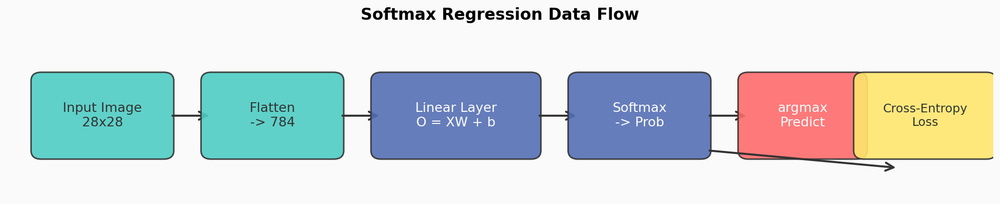
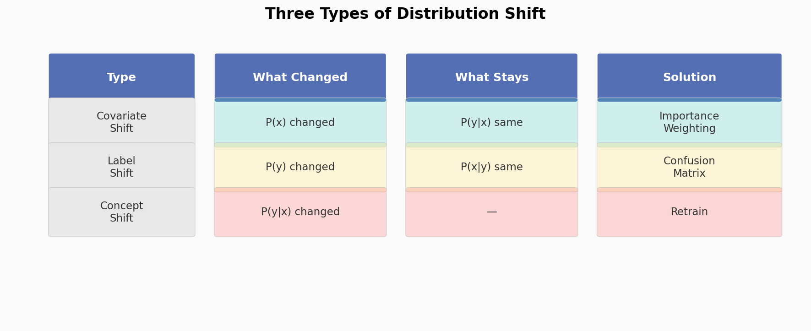

# 第4章 线性分类 — 学习笔记

**参考 Notebooks：**
- [softmax-regression.ipynb](softmax-regression.ipynb) — Softmax 回归
- [image-classification-dataset.ipynb](image-classification-dataset.ipynb) — 图像分类数据集
- [softmax-regression-scratch.ipynb](softmax-regression-scratch.ipynb) — Softmax 回归从零实现
- [softmax-regression-concise.ipynb](softmax-regression-concise.ipynb) — Softmax 回归简洁实现
- [classification.ipynb](classification.ipynb) — 基础分类模型
- [environment-and-distribution-shift.ipynb](environment-and-distribution-shift.ipynb) — 环境与分布偏移
- [generalization-classification.ipynb](generalization-classification.ipynb) — 分类中的泛化

---
---

# 原理篇

---

## 一、Softmax 回归 <sub>([softmax-regression.ipynb](softmax-regression.ipynb))</sub>

### 1.1 从回归到分类：任务变了，思路没变

上一章做的是回归——给定一套房子的特征，预测一个数字（房价）。这一章做的是分类——给定一张图片，判断它属于哪个类别（T恤、裤子、运动鞋……）。

表面上看，回归和分类完全不同：一个输出连续数值，一个输出离散类别。但实际上，模型的"前半段"完全一样——都是对输入做加权求和。区别只在"最后一步"：

- **回归**：加权求和的结果直接就是预测值
- **分类**：加权求和的结果是每个类别的"原始分数"（叫 logit），然后再转化成概率

总结一下两者的关键区别：

| | 回归 | 分类 |
|---|---|---|
| 预测什么 | 连续数值 | 离散类别 |
| 输出维度 | 1 | $q$（类别数） |
| 损失函数 | MSE | 交叉熵 |

### 1.2 标签表示：为什么不能直接用数字编码类别

如果有三个类别（猫、狗、鸟），最自然的想法是编码成 1、2、3。但这样做有一个致命问题：数字有大小关系，会暗示"鸟比狗大，狗比猫大"——但类别之间根本没有这种关系。

解决方案是**独热编码**（One-Hot）：用一个长度等于类别数的向量表示标签，只有对应类别的位置为一，其余为零。比如"猫"是 (1,0,0)，"狗"是 (0,1,0)，"鸟"是 (0,0,1)。这样每个类别都是平等的，不存在"大小"关系。

写成数学：

$$\mathbf{y} \in \{(1,0,\ldots,0),\ (0,1,\ldots,0),\ \ldots,\ (0,0,\ldots,1)\} \tag{1.1}$$

> 长度为 $q$ 的向量，真实类别的位置为 1，其余为 0。这样类别之间没有"大小"关系，也不暗示任何排序。

### 1.3 网络结构：多个线性回归并排

分类模型的结构其实就是**把多个线性回归并排放在一起**。如果有十个类别，就有十组权重，每组权重各自独立地对输入做加权求和，输出该类别的原始分数。每组权重学到的东西不同——第一组可能学到"领口是圆的、袖子短"这样的特征组合代表 T恤，第二组可能学到"长筒、紧贴腿"代表裤子。

跟线性回归一样是**单层全连接网络**，只是输出从 1 个变成了 $q$ 个：

$$\mathbf{o} = \mathbf{W}\mathbf{x} + \mathbf{b} \tag{1.2}$$

> $\mathbf{W}$ 是 $q \times d$ 的权重矩阵（$q$ 类别、$d$ 特征），$\mathbf{b}$ 是 $q$ 维偏置向量。输出 $\mathbf{o}$ 是 $q$ 维向量，每个元素 $o_j$ 是"属于第 $j$ 类的原始分数"（logit）。

如果有一批样本要一起算，摞成矩阵一次搞定：

$$\mathbf{O} = \mathbf{X}\mathbf{W}^\top + \mathbf{b} \tag{1.3}$$

> $\mathbf{X}$ 是 $n \times d$，$\mathbf{W}^\top$ 是 $d \times q$，乘出来 $\mathbf{O}$ 是 $n \times q$——每行是一个样本对应 $q$ 个类别的分数。

这十个原始分数（logit）本身不是概率——它们可以是任何实数，可以是负数，也不保证加起来等于一。我们需要一个额外步骤把它们变成概率。

来看看和上一章线性回归有什么不同：

| | 线性回归 | Softmax 回归 |
|---|---|---|
| **权重形状** | $\mathbf{w} \in \mathbb{R}^{d}$（向量） | $\mathbf{W} \in \mathbb{R}^{q \times d}$（矩阵） |
| **偏置形状** | $b \in \mathbb{R}$（标量） | $\mathbf{b} \in \mathbb{R}^{q}$（向量） |
| **输出** | 1 个数 | $q$ 个数（每类的 logit） |
| **本质** | 1 组权重 | $q$ 组权重并排，每组对应一个类别 |

### 1.4 Softmax 函数：把分数变成概率

Softmax 做了两件事：

1. **取指数**：把每个原始分数通过指数函数变成正数（指数函数的结果永远大于零）
2. **归一化**：除以所有指数的总和，让结果加起来等于一

效果是：原始分数最高的类别获得最大的概率，分数最低的类别获得最小的概率，而且所有概率加起来恰好等于一——形成一个合法的概率分布。

$$\hat{y}_j = \text{softmax}(\mathbf{o})_j = \frac{\exp(o_j)}{\sum_{k=1}^{q}\exp(o_k)} \tag{1.4}$$

> 对每个 logit 取指数（保证非负），再除以所有类别的指数之和（保证总和为 1）。结果：logit 变成概率分布。

三个关键性质：
- $\hat{y}_j \geq 0$（$\exp$ 恒正）
- $\sum_j \hat{y}_j = 1$（归一化）
- $\arg\max_j \hat{y}_j = \arg\max_j o_j$（$\exp$ 单调递增，不改变排序）

第三点很重要：Softmax 不改变排名。原始分数最高的类别，Softmax 后概率也最高。所以在预测时（只需要知道哪个类别概率最大），其实可以直接看原始分数，不用真的算 Softmax。但在训练时（需要用概率计算损失），必须算 Softmax。

另外，Softmax 会"放大差距"——原始分数相差不大时，概率也差不大；但如果原始分数差距很大，Softmax 会让高分数类别的概率接近一、其他类别接近零。后面的数值示例会清楚地展示这一点。

### 1.5 损失函数：交叉熵

分类任务不用均方误差，而用**交叉熵损失**。为什么？

想象两个场景：
- 场景 A：真实类别是猫，模型预测猫的概率 0.9 → 不错，应该给低损失
- 场景 B：真实类别是猫，模型预测猫的概率 0.01 → 很差，应该给高损失

交叉熵做的就是：取"模型对正确类别给出的概率"的负对数。概率越高，负对数越小（损失低）；概率越低，负对数越大（损失高）。而且这个惩罚是非线性的——概率从 0.9 降到 0.8 损失增加不多，但从 0.1 降到 0.01 损失急剧增加。这很合理：模型已经很自信时，"更自信一点"不值得太多奖励；但模型非常不自信时，"更不自信一点"应该受到严厉惩罚。

完整公式：

$$l(\mathbf{y}, \hat{\mathbf{y}}) = -\sum_{j=1}^{q} y_j \log \hat{y}_j \tag{1.5}$$

> $y_j$ 是独热标签的第 $j$ 个元素，$\hat{y}_j$ 是预测的第 $j$ 类概率。因为独热编码只有一个位置为 1，实际只有真实类别那一项有贡献。

所以简化为：

$$l = -\log \hat{y}_c = -\log P(\text{正确类别}) \tag{1.6}$$

> $c$ 是真实类别的索引。概率越高 → 损失越小。预测概率 = 1 时损失 = 0；概率趋近 0 时损失趋近 $+\infty$。

**为什么不用均方误差？** 因为独热编码标签是 (1,0,0) 这样的向量，用均方误差的话，模型把正确类别的概率从 0.8 提高到 0.9 和把错误类别的概率从 0.2 降到 0.1 受到同样的"奖励"。但交叉熵只关注正确类别的概率——更加聚焦、梯度信号更清晰。

### 1.6 交叉熵的梯度：优美的统一形式

一个令人惊讶的结果：Softmax 回归的梯度形式和线性回归一模一样——都是"预测值减去真实值"。对于分类来说就是"预测的概率分布减去独热编码的真实标签"。

将 Softmax (1.4) 代入交叉熵 (1.5)，对 logit $o_j$ 求导：

$$\frac{\partial l}{\partial o_j} = \text{softmax}(\mathbf{o})_j - y_j = \hat{y}_j - y_j \tag{1.7}$$

> 梯度 = 预测概率 - 真实标签。真实类别 $c$：梯度 = $\hat{y}_c - 1$（负数，要推高分数）；非真实类别 $j \neq c$：梯度 = $\hat{y}_j - 0$（正数，要压低分数）。形式上和线性回归的梯度 $(\hat{y} - y)$ 完全一致。

拆开来看：
- 对正确类别：梯度 = 预测概率 - 1（负数，说明要增大这个类别的分数）
- 对错误类别：梯度 = 预测概率 - 0（正数，说明要减小这个类别的分数）

这个优雅的形式意味着梯度计算非常高效，也说明线性回归和 Softmax 回归在数学上是一脉相承的。

### 1.7 信息论视角

交叉熵还有一个来自信息论的深刻解释。

**熵**衡量一个概率分布的"不确定性"。抛硬币（正反各百分之五十）熵最大——你完全猜不到结果；确定事件（百分之百正面）熵为零——结果已知。

$$H[P] = -\sum_{j} P(j)\log P(j) \tag{1.8}$$

> 衡量分布 $P$ 的不确定性。均匀分布时熵最大，确定分布时熵为 0。

**交叉熵**衡量的是"用预测分布去编码真实分布所需的额外信息量"。预测分布和真实分布越接近，交叉熵越小。最小值在两个分布完全一致时取到，此时交叉熵等于真实分布的熵。

$$H(P, Q) = -\sum_{j} P(j)\log Q(j) \tag{1.9}$$

> 用预测分布 $Q$ 编码真实分布 $P$ 的平均信息量。$Q$ 越接近 $P$，交叉熵越小。当 $P = Q$ 时交叉熵等于熵（最小值）。

**因此：最小化交叉熵 $\Leftrightarrow$ 让预测分布尽量接近真实分布。** 这正是我们想要的。

### 1.8 数值稳定性：LogSumExp 技巧

直接计算 Softmax 有严重的数值问题：

- 如果原始分数很大（比如 1000），指数函数会爆炸成无穷大（**上溢**）
- 如果原始分数很小（比如 -1000），指数函数会变成零，然后取对数得到负无穷（**下溢**）

解决方案是 **LogSumExp 技巧**：不要分别计算 Softmax 和对数，而是把两者合并在一起计算。先把所有原始分数减去最大值（防止指数爆炸），然后在对数域内直接计算结果。

$$\log \hat{y}_j = o_j - \bar{o} - \log\left(\sum_{k=1}^{q} \exp(o_k - \bar{o})\right) \tag{1.10}$$

> 其中 $\bar{o} = \max_k o_k$。先减去最大值防止 $\exp$ 上溢，然后在 $\log$ 域内计算，避免先算出极小的概率再取 $\log$ 导致下溢。这就是 PyTorch 的 `CrossEntropyLoss` 内部做的事情。

**规则：永远把原始 logits 传给 `CrossEntropyLoss`，不要自己先过 `Softmax`！**

---

### 场景走查：从头到尾走一遍衣服分类

假设我们要训练一个模型，判断一张 28x28 的灰度图片是十种衣服中的哪一种。

**第一步：准备数据。** 拿到 Fashion-MNIST 数据集，包含六万张训练图片和一万张测试图片。每张图片是 28x28 像素的灰度图，对应十个类别之一。

**第二步：图片变成数字。** 把 28x28 的图片展平成一个 784 维的向量——就像把一张照片拆成 784 个像素值，排成一排。每个像素值在零到一之间。

**第三步：模型打分。** 这个 784 维向量通过十组权重（每组 784 个权重加一个偏置），得到十个原始分数（公式 1.3）。比如模型算出 T恤的分数最高、裤子的分数第二、其他很低。

**第四步：Softmax 转概率。** 把十个分数通过 Softmax（公式 1.4）变成十个概率。比如 T恤 0.7、裤子 0.15、其他各自很小，总和为一。

**第五步：计算损失。** 假设真实标签是"T恤"。交叉熵损失（公式 1.6）只看 T恤的概率：损失 = 负对数(0.7)。概率越高损失越低。

**第六步：梯度更新。** 梯度（公式 1.7）告诉每组权重该怎么调：T恤那组权重应该被调整以增大 T恤的分数，其他九组权重应该被调整以减小各自的分数。

**第七步：重复。** 取下一个 mini-batch，重复第三到第六步。每个 epoch 后在测试集上评估准确率。

**训练结束后：** 模型学到的十组权重，每一组相当于一个"模板"——如果一张新图片和某个模板最匹配，就被分到对应类别。



---

### 📌 完整数值示例：从输入到梯度（猫/狗/鸟分类）

用一个 3 类分类（猫、狗、鸟）的例子，走一遍 **(1.3) → (1.4) → (1.5)/(1.6) → (1.7)** 的完整流程，让每个公式都落地为具体数字。

**第 ① 步：线性层输出 logits (1.3)**

假设图片经过 $\mathbf{O} = \mathbf{X}\mathbf{W}^\top + \mathbf{b}$ 后，得到：

$$\mathbf{o} = [2.0,\ 1.0,\ 0.1] \quad \text{(猫=2.0, 狗=1.0, 鸟=0.1)}$$

> 这些原始分数没有范围限制，可以是任意实数。猫的分数最高，说明模型"倾向于"认为这是猫。

**第 ② 步：Softmax → 概率 (1.4)**

$$\exp(\mathbf{o}) = [\exp(2.0),\ \exp(1.0),\ \exp(0.1)] = [7.39,\ 2.72,\ 1.11]$$

$$\text{总和} = 7.39 + 2.72 + 1.11 = 11.22$$

$$\hat{\mathbf{y}} = \left[\frac{7.39}{11.22},\ \frac{2.72}{11.22},\ \frac{1.11}{11.22}\right] = [0.66,\ 0.24,\ 0.10]$$

> Softmax 把任意实数映射为概率分布：猫 66%，狗 24%，鸟 10%，总和 = 100%。注意原始分数差 2 倍（2.0 vs 1.0），概率差近 3 倍（0.66 vs 0.24）——Softmax 会拉大差距。

**第 ③ 步：交叉熵损失 (1.5 → 1.6)**

真实标签：猫，即 $\mathbf{y} = (1, 0, 0)$。

用完整公式 (1.5)：

$$l = -(1 \cdot \log 0.66 + 0 \cdot \log 0.24 + 0 \cdot \log 0.10)$$

简化为 (1.6)：

$$l = -\log(0.66) = 0.42$$

> 参考：概率 0.99 → 损失 0.01；概率 0.01 → 损失 4.6。所以 0.42 表示"方向对了，但还不够自信"。

**第 ④ 步：梯度 (1.7)**

$$\nabla_{\mathbf{o}} l = \hat{\mathbf{y}} - \mathbf{y} = [0.66,\ 0.24,\ 0.10] - [1,\ 0,\ 0] = [-0.34,\ +0.24,\ +0.10]$$

> - 猫：$-0.34$ → 概率不够高，增大 $o_\text{猫}$（梯度为负 → 更新时减去负数 = 增大）
> - 狗：$+0.24$ → 概率该降低，减小 $o_\text{狗}$
> - 鸟：$+0.10$ → 同理，减小 $o_\text{鸟}$
>
> 梯度下降沿**负梯度方向**更新，效果：正确类别分数升高，错误类别分数降低。

---

## 二、环境与分布偏移 <sub>([environment-and-distribution-shift.ipynb](environment-and-distribution-shift.ipynb))</sub>

### 2.1 分布偏移是什么

前面一直假设训练数据和测试数据来自同一个分布（IID 假设）。但在真实世界中，这个假设经常被打破。

比如你用白天拍的照片训练了一个自动驾驶模型，部署到夜间——光照完全不同，模型可能失败。或者你用年轻人的体检数据训练了一个疾病预测模型，部署给老年人——年龄分布变了，模型的判断可能不可靠。

分布偏移的核心问题是：**模型在训练环境中学到的规律，在部署环境中可能不成立。**

要理解"偏移"有多大的危害，先搞清楚我们到底在优化什么。训练时我们只能算**经验风险**——训练集上的平均损失：

$$R_{\text{emp}}[f] = \frac{1}{n}\sum_{i=1}^{n} l\left(f(\mathbf{x}^{(i)}),\ y^{(i)}\right) \tag{2.1}$$

> 模型 $f$ 在 $n$ 个训练样本上的平均损失。这个值我们可以直接算出来。

但我们真正关心的是**总体风险**——在真实数据分布上的期望损失：

$$R[f] = E_{(\mathbf{x},y) \sim P}\left[l\left(f(\mathbf{x}),\ y\right)\right] \tag{2.2}$$

> 模型 $f$ 在整个数据分布 $P$ 上的期望损失。这个值我们永远无法精确得到——只能用测试集近似。

如果训练分布和测试分布相同，那经验风险趋近总体风险（数据够多的话）。但如果分布偏移了，经验风险再低也不能保证总体风险低。

### 2.2 三种分布偏移

| 类型 | 什么变了 | 什么没变 | 典型例子 |
|------|---------|---------|---------|
| **协变量偏移** | 输入的分布变了 | 输入到标签的映射没变 | 训练用真实照片，测试用卡通画 |
| **标签偏移** | 标签的分布变了 | 给定标签后输入的分布没变 | 训练时猫狗各半，部署时猫占九成 |
| **概念偏移** | 标签的含义变了 | — | "时尚"的定义随时间变化 |



**协变量偏移**是最常见的。解决思路是**重要性加权**：给每个训练样本分配一个权重，让训练分布"看起来"像测试分布。比如测试数据中老年人多，就给训练数据中的老年人样本更高的权重。

数学上，训练分布 $q(\mathbf{x})$ 与测试分布 $p(\mathbf{x})$ 不同，但 $P(y|\mathbf{x})$ 不变。通过重要性加权校正：

$$\min_f \frac{1}{n}\sum_{i=1}^{n} \beta_i\, l\left(f(\mathbf{x}^{(i)}),\ y^{(i)}\right) \tag{2.3}$$

$$\beta_i = \frac{p(\mathbf{x}^{(i)})}{q(\mathbf{x}^{(i)})} \tag{2.4}$$

> 给每个训练样本加权 $\beta_i$。如果某个样本在测试分布中出现概率高但在训练分布中出现概率低，就给它更大的权重——相当于"弥补"训练数据中该区域的不足。

**标签偏移**的解决思路类似：如果测试数据中某类比例变了，就用混淆矩阵来估计新的类别比例，然后调整训练样本的权重。$P(\mathbf{x}|y)$ 不变但 $P(y)$ 变了，利用混淆矩阵 $\mathbf{C}$ 估计测试分布的标签比例：

$$\mathbf{C}\, p(y) = \mu(\hat{y}) \tag{2.5}$$

> $\mathbf{C}_{ij}$ 是真实类别为 $j$ 时模型预测为 $i$ 的概率（从验证集估计），$\mu(\hat{y})$ 是测试数据上预测标签的分布（可直接统计）。解这个线性方程组得到 $p(y)$，进而算出权重 $\beta_i = p(y^{(i)}) / q(y^{(i)})$。

**概念偏移**最难处理——标签本身的含义变了，没有简单的数学修正方法。通常只能重新收集数据、重新训练。

### 2.3 反馈循环与公平性

一个容易被忽视的问题：模型的预测会改变现实，从而改变未来的数据分布，形成**反馈循环**。

经典例子：预测性警务。模型预测某个社区犯罪率高 → 警察在那里巡逻更多 → 发现更多犯罪（因为巡逻多了） → 数据显示该社区犯罪率确实高 → 模型更确信预测正确。这不是模型在发现真相，而是模型在创造"真相"。

这类问题没有纯技术解决方案——需要结合领域知识和伦理判断来审视模型的部署方式。

### 2.4 学习问题的分类

| 类型 | 数据特点 | 例子 |
|------|---------|------|
| **批量学习** | 一次拿到所有数据，训练完部署 | 图像分类 |
| **在线学习** | 数据按顺序到达，模型持续更新 | 新闻推荐 |
| **多臂赌博机** | 有限个动作，观察奖励 | A/B 测试 |
| **强化学习** | 智能体与环境交互，有状态记忆 | 游戏 AI |

---

## 三、分类中的泛化 <sub>([generalization-classification.ipynb](generalization-classification.ipynb))</sub>

### 3.1 测试集有多可靠：经验误差与总体误差

测试集上的准确率是泛化性能的近似。但"近似"有多精确？

先定义清楚。**经验误差**就是在有限数据集上算出的错误率：

$$\epsilon_{\mathcal{D}}(f) = \frac{1}{n}\sum_{i=1}^{n} \mathbf{1}\left(f(\mathbf{x}^{(i)}) \neq y^{(i)}\right) \tag{3.1}$$

> $\mathbf{1}(\cdot)$ 是指示函数：预测错误时为 1，正确时为 0。经验误差就是错误率。

我们真正关心的是**总体误差**——在所有可能数据上的期望错误率：

$$\epsilon(f) = E_{(\mathbf{x},y) \sim P}\left[\mathbf{1}\left(f(\mathbf{x}) \neq y\right)\right] \tag{3.2}$$

关键在于测试集大小。由中心极限定理，测试集上的错误率以 $O(1/\sqrt{n})$ 的速率收敛到总体错误率。更精确地说，**Hoeffding 不等式**给出了严格的置信界：

$$P\left(\epsilon_{\mathcal{D}}(f) - \epsilon(f) \geq t\right) \leq \exp(-2nt^2) \tag{3.3}$$

> 以 95% 的置信度要求误差不超过 $\pm 0.01$，需要约 $n = 15000$ 个测试样本。要让误差控制在百分之一以内，测试集不能太小。

### 3.2 多次使用测试集的风险

如果你训练了一个模型，在测试集上评估后发现准确率不够好，于是调整模型再测、再调、再测……经过多轮之后，测试准确率终于令人满意了。但这个准确率可信吗？

不可信。每次你根据测试结果调整模型，就相当于把测试集的信息"泄露"给了训练过程。最终的测试准确率不再是泛化性能的无偏估计——它被高估了。

这就是**自适应过拟合**：你没有在数据上过拟合，而是在测试集上过拟合了。

正确的做法是：只用验证集来指导模型调整，测试集留到最后只用一次。

### 3.3 VC 维与经典学习理论

**VC 维**（Vapnik-Chervonenkis 维度）是衡量模型复杂度的经典指标。直觉上，它衡量的是"模型能完美分类的最大数据点数"。比如一条二维直线的 VC 维是 3——最多能把 3 个点完美分成两类，但对 4 个点就不一定行了。

**定义**：模型类 $\mathcal{F}$ 的 VC 维是能被 $\mathcal{F}$ **打散**（shatter）的最大数据点数——即对这些点的任意二分类标注，$\mathcal{F}$ 中都存在某个函数能正确分类。

**线性模型**：$d$ 维空间中的线性分类器，VC 维 = $d + 1$。

经典学习理论给出**泛化界**：

$$P\left(\epsilon(f) - \epsilon_{\mathcal{D}}(f) \geq t\right) \lesssim O\left(\frac{\text{VC}(\mathcal{F})}{n}\right) \tag{3.4}$$

> 泛化差距和 VC 维成正比、和样本数成反比。VC 维越大（模型越复杂）或样本越少，泛化差距越大。

但这套理论在深度学习中遇到了困难：深度神经网络的参数量（以及 VC 维）远超训练样本数，按理说应该严重过拟合——但实际上它们泛化得很好。这是深度学习理论中最大的谜题之一，至今没有完全令人满意的解释。

---

## 关键概念串联表

| 维度 | Softmax 回归 |
|------|-------------|
| **模型** | $\mathbf{O} = \mathbf{X}\mathbf{W}^\top + \mathbf{b}$，$\hat{\mathbf{Y}} = \text{softmax}(\mathbf{O})$ |
| **损失函数** | 交叉熵：$-\log \hat{y}_c$ |
| **概率解释** | 最大似然 → 交叉熵 |
| **梯度** | $\hat{y}_j - y_j$（与线性回归形式相同） |
| **优化** | Mini-batch SGD |
| **数值稳定性** | LogSumExp 合并 softmax + log + 交叉熵 |
| **分布偏移** | 协变量偏移（重要性加权）、标签偏移（混淆矩阵）、概念偏移 |
| **泛化** | 经验误差 → 总体误差，Hoeffding 界，VC 维 |

---

### 两种任务的对比

| | 线性回归（第3章） | Softmax 回归（第4章） |
|---|---|---|
| **任务** | 预测一个数字 | 预测属于哪个类别 |
| **输出** | 一个数 | 每类的概率（共 q 个） |
| **最后一步** | 直接输出 | Softmax 转概率 |
| **损失函数** | MSE（均方误差） | 交叉熵 |
| **梯度** | 预测值 - 真实值 | 预测概率 - 真实标签（形式一样！） |
| **正则化** | 权重衰减 | 权重衰减 |

**下一章预告：** 这两章的模型都只有一层——输入直接到输出，没有中间层。加上隐藏层和激活函数，就变成了**多层感知机（MLP）**——真正的"深度"学习的起点。

---
---

# 第三部分：代码实现篇

---

## 一、基础分类模型 <sub>([classification.ipynb](classification.ipynb))</sub>

### 1.1 Classifier 基类

```python
class Classifier(d2l.Module):
    """分类模型的通用基类"""

    def validation_step(self, batch):
        Y_hat = self(*batch[:-1])
        self.plot('loss', self.loss(Y_hat, batch[-1]), train=False)
        self.plot('acc', self.accuracy(Y_hat, batch[-1]), train=False)

    def accuracy(self, Y_hat, Y, averaged=True):
        """计算预测正确的比例"""
        Y_hat = Y_hat.reshape((-1, Y_hat.shape[-1]))
        preds = Y_hat.argmax(axis=1).type(Y.dtype)  # 取概率最大的类别
        compare = (preds == Y.reshape(-1)).type(torch.float32)
        return compare.mean() if averaged else compare
```

> **要点：** 准确率不可导，所以不能用来做训练的损失函数。训练时优化交叉熵损失，评估时报告准确率。

### 1.2 通用优化器配置

```python
@d2l.add_to_class(d2l.Module)
def configure_optimizers(self):
    return torch.optim.SGD(self.parameters(), lr=self.lr)
```

---

## 二、图像分类数据集 <sub>([image-classification-dataset.ipynb](image-classification-dataset.ipynb))</sub>

### 2.1 Fashion-MNIST

```python
class FashionMNIST(d2l.DataModule):
    def __init__(self, batch_size=64, resize=(28, 28)):
        super().__init__()
        self.save_hyperparameters()
        trans = transforms.Compose([transforms.Resize(resize),
                                    transforms.ToTensor()])
        self.train = torchvision.datasets.FashionMNIST(
            root=self.root, train=True, transform=trans, download=True)
        self.val = torchvision.datasets.FashionMNIST(
            root=self.root, train=False, transform=trans, download=True)
```

### 2.2 数据集关键信息

| 属性 | 值 |
|------|---|
| 类别数 | 10（T恤、裤子、套衫、连衣裙、外套、凉鞋、衬衫、运动鞋、包、短靴） |
| 训练集大小 | 60,000 张 |
| 测试集大小 | 10,000 张 |
| 图片尺寸 | 1 × 28 × 28（灰度） |
| 像素值范围 | [0, 1]（经过 `ToTensor()` 归一化） |

### 2.3 为什么用 Fashion-MNIST 而不是 MNIST

MNIST 手写数字太简单——简单的线性模型就能达到 95% 以上准确率。Fashion-MNIST 更具挑战性，同时保持了相同的数据格式和大小。

### 2.4 DataLoader 配置

```python
def get_dataloader(self, train):
    data = self.train if train else self.val
    return torch.utils.data.DataLoader(data, self.batch_size,
                                        shuffle=train,
                                        num_workers=self.num_workers)
```

> **关键参数：** `shuffle=True` 只用于训练集（打乱顺序防止模型学到数据顺序的假规律），测试集不打乱。

---

## 三、Softmax 回归从零实现 <sub>([softmax-regression-scratch.ipynb](softmax-regression-scratch.ipynb))</sub>

### 3.1 参数初始化

```python
class SoftmaxRegressionScratch(d2l.Classifier):
    def __init__(self, num_inputs, num_outputs, lr, sigma=0.01):
        super().__init__()
        self.save_hyperparameters()
        self.W = torch.normal(0, sigma, size=(num_inputs, num_outputs),
                              requires_grad=True)
        self.b = torch.zeros(num_outputs, requires_grad=True)
```

> 784 个输入（28×28 展平），10 个输出（10 个类别），权重矩阵 $784 \times 10$。

### 3.2 手写 Softmax

```python
def softmax(X):
    X_exp = torch.exp(X)
    partition = X_exp.sum(1, keepdims=True)  # 每行求和，保持维度用于广播
    return X_exp / partition
```

> ⚠️ **数值不稳定！** 这个实现仅用于理解原理。`exp` 对大数会溢出，对很小的负数会下溢。

### 3.3 模型前向传播

```python
def forward(self, X):
    X = X.reshape((-1, self.W.shape[0]))  # 展平：(batch, 1, 28, 28) → (batch, 784)
    return softmax(torch.matmul(X, self.W) + self.b)
```

### 3.4 交叉熵损失

```python
def cross_entropy(y_hat, y):
    return -torch.log(y_hat[range(len(y_hat)), y]).mean()
```

> **技巧：** `y_hat[range(n), y]` 用花式索引一次取出每个样本的真实类别对应的预测概率。`y` 是整数标签（不是独热编码），所以可以直接当索引用。

### 3.5 训练

```python
data = d2l.FashionMNIST(batch_size=256)
model = SoftmaxRegressionScratch(num_inputs=784, num_outputs=10, lr=0.1)
trainer = d2l.Trainer(max_epochs=10)
trainer.fit(model, data)
```

---

## 四、Softmax 回归简洁实现 <sub>([softmax-regression-concise.ipynb](softmax-regression-concise.ipynb))</sub>

### 从零实现 vs 框架 API 对比

| 组件 | 从零实现 | PyTorch API |
|------|---------|------------|
| 展平 | `X.reshape((-1, 784))` | `nn.Flatten()` |
| 线性层 | `torch.matmul(X, W) + b` | `nn.LazyLinear(10)` |
| Softmax | 手写 `softmax()` | 集成在 `CrossEntropyLoss` 中 |
| 损失 | 手写 `cross_entropy()` | `F.cross_entropy()` |

### 完整代码

```python
class SoftmaxRegression(d2l.Classifier):
    def __init__(self, num_outputs, lr):
        super().__init__()
        self.save_hyperparameters()
        self.net = nn.Sequential(nn.Flatten(), nn.LazyLinear(num_outputs))

    def forward(self, X):
        return self.net(X)

# 损失函数（定义在 Classifier 基类上）
@d2l.add_to_class(d2l.Classifier)
def loss(self, Y_hat, Y, averaged=True):
    Y_hat = Y_hat.reshape((-1, Y_hat.shape[-1]))
    Y = Y.reshape((-1,))
    return F.cross_entropy(Y_hat, Y,
                           reduction='mean' if averaged else 'none')
```

### ⚠️ 最大的坑：CrossEntropyLoss 的输入

| ❌ 错误做法 | ✅ 正确做法 |
|---|---|
| `net` 最后加 `nn.Softmax` | `net` 最后是 `nn.Linear`，输出 logits |
| 先 `softmax(output)` 再传给 loss | 直接把 logits 传给 `F.cross_entropy` |

> **原因：** `F.cross_entropy` 内部用 LogSumExp 技巧合并计算 softmax + log + 交叉熵，避免数值溢出。如果你提前做了 softmax，它会对概率再做一次 log-softmax，结果完全错误。

---

## 五、分布偏移实践 <sub>([environment-and-distribution-shift.ipynb](environment-and-distribution-shift.ipynb))</sub>

### 5.1 协变量偏移检测

用一个二分类器判断样本来自训练集还是测试集：

```python
# 概念：训练一个 logistic 回归
# 输入：特征向量
# 标签：0 = 来自训练集，1 = 来自测试集
# 如果能高准确率区分 → 分布偏移严重
# 权重 β_i = exp(h(x_i)) 用于重要性加权
```

### 5.2 标签偏移校正

```python
# 1. 用验证集估计混淆矩阵 C
# 2. 统计测试数据的预测标签分布 μ(ŷ)
# 3. 解线性方程 C · p(y) = μ(ŷ) 得到 p(y)
# 4. 权重 β_i = p(y_i) / q(y_i)
# 5. 用加权损失训练
```

### 实践建议

1. **永远检查训练集和测试集的分布差异**——简单的统计量（均值、方差、直方图）就能发现很多问题
2. **定期用新数据更新模型**——防止概念偏移导致模型过时
3. **对高风险应用，建立分布监控机制**——检测输入分布何时偏离训练分布
4. **警惕反馈循环**——模型的预测会改变未来的数据分布

---

## 六、分类泛化实践 <sub>([generalization-classification.ipynb](generalization-classification.ipynb))</sub>

### 6.1 测试集大小的经验法则

| 目标精度 | 所需测试样本数（95% 置信度） |
|---------|--------------------------|
| ±5% | ~600 |
| ±1% | ~15,000 |
| ±0.1% | ~1,500,000 |

### 6.2 多次测试的陷阱

```python
# 危险模式（自适应过拟合）：
for attempt in range(100):
    model = train_model(hyperparams[attempt])
    acc = evaluate(model, test_set)  # ← 每次都看测试集！
    if acc > best:
        best = acc
        best_model = model
# 最终的 best acc 被高估了

# 正确做法：
for attempt in range(100):
    model = train_model(hyperparams[attempt])
    acc = evaluate(model, val_set)   # ← 用验证集选模型
    if acc > best:
        best = acc
        best_model = model
final_acc = evaluate(best_model, test_set)  # ← 测试集只用一次
```

### 关键要点

- **测试集是"一次性"的**：每多用一次，它的可信度就下降一点
- **多重假设检验问题**：测试 20 个模型，至少一个"偶然"表现好的概率很高
- **深度学习的泛化悖论**：经典理论（VC 维）预测应该严重过拟合，但实际泛化很好——这是当前理论研究的前沿问题
