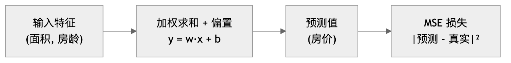
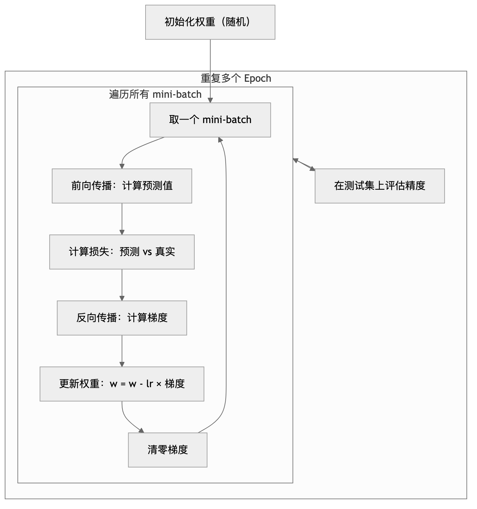

# 第3章 线性回归 — 学习笔记

**参考 Notebooks：**
- [linear-regression.ipynb](linear-regression.ipynb) — 线性回归
- [oo-design.ipynb](oo-design.ipynb) — 面向对象的实现设计
- [synthetic-regression-data.ipynb](synthetic-regression-data.ipynb) — 合成回归数据
- [linear-regression-scratch.ipynb](linear-regression-scratch.ipynb) — 线性回归从零实现
- [linear-regression-concise.ipynb](linear-regression-concise.ipynb) — 线性回归简洁实现
- [generalization.ipynb](generalization.ipynb) — 泛化
- [weight-decay.ipynb](weight-decay.ipynb) — 权重衰减

---
---

# 原理篇

---

## 一、线性回归 <sub>([linear-regression.ipynb](linear-regression.ipynb))</sub>

### 1.1 模型在做什么

假设你是一个房产中介，工作了很多年，积累了大量成交记录——每一条记录包含房子的特征（面积、房龄、楼层等）以及最终的成交价格。现在有个新客户来问："我这套 80 平、10 年房龄的房子值多少？"

你会怎么估价？凭经验，你大概知道：面积越大，价格越高；房龄越老，价格越低。更精确地说，你脑子里有一个"模型"：**每个特征对价格有各自的影响力，把这些影响加起来，再加上一个基准价，就是估价。**

这就是线性回归在做的事情。它的核心假设是：**结果可以被写成各个特征的加权总和加上一个常数。** 为什么叫"线性"？因为预测值和每个特征之间的关系是一条直线——一个特征增大一点，预测值就增大（或减小）固定的一点。

写成数学公式就是：

$$\hat{y} = \mathbf{w}^\top \mathbf{x} + b = w_1 x_1 + w_2 x_2 + \cdots + w_d x_d + b \tag{1.1}$$

> $x_1, x_2, \ldots$ 是输入特征（如面积、房龄），$w_1, w_2, \ldots$ 是对应的权重（这个特征有多重要），$b$ 是偏置（底数）。公式就是：**每个特征乘上权重，加起来，再加个底数 → 得到预测值 $\hat{y}$**。

如果有 $n$ 个样本要一起算，可以把它们摞成一个矩阵，一次矩阵乘法全搞定：

$$\hat{\mathbf{y}} = \mathbf{X}\mathbf{w} + b \tag{1.2}$$

> 把 $n$ 个样本的特征摞成一个 $n \times d$ 的矩阵 $\mathbf{X}$（每行是一个样本，每列是一个特征），一次矩阵乘法就把所有样本的预测全算出来了，不需要 for 循环。

这是一个**仿射变换** = 线性变换（乘权重）+ 平移（加偏置）。线性回归属于**回归**任务——输出是一个连续数值（比如价格、温度），而不是一个类别标签。

### 1.2 怎么衡量预测的好坏：损失函数

有了模型，怎么知道它预测得准不准？需要一个"打分标准"来衡量预测值和真实值之间的差距——这就是**损失函数**。

最直觉的想法：预测值减去真实值，差得越多越差。但直接相减有个问题——正偏差和负偏差会互相抵消（高估 10 万和低估 10 万加起来误差为 0，但模型显然不好）。解决办法是**把差值平方**：不管高估还是低估，平方后都是正数，而且差得越大，平方后的惩罚越重。

单个样本的损失：

$$l^{(i)}(\mathbf{w}, b) = \frac{1}{2}\left(\hat{y}^{(i)} - y^{(i)}\right)^2 \tag{1.3}$$

> $\hat{y}^{(i)}$ 是第 $i$ 个样本的预测值，$y^{(i)}$ 是真实值。两者之差的平方就是"错得有多离谱"。前面的 $\frac{1}{2}$ 纯粹为了求导方便（导数会出来个 2，$\frac{1}{2} \times 2 = 1$ 刚好消掉）。

整个数据集上的平均损失——这就是**均方误差（MSE）**：

$$L(\mathbf{w}, b) = \frac{1}{n}\sum_{i=1}^{n} l^{(i)} = \frac{1}{n}\sum_{i=1}^{n}\frac{1}{2}\left(\mathbf{w}^\top\mathbf{x}^{(i)} + b - y^{(i)}\right)^2 \tag{1.4}$$

> 把所有 $n$ 个样本的误差加起来再除以 $n$，得到平均误差。这就是我们要最小化的目标。

训练的目标：

$$\mathbf{w}^*, b^* = \arg\min_{\mathbf{w},b} L(\mathbf{w}, b) \tag{1.5}$$

> $\arg\min$ 的意思是"让 $L$ 最小的那组 $\mathbf{w}$ 和 $b$ 的值"。也就是找到最好的权重和偏置。

为什么选平方，而不是绝对值或者四次方？绝对值在零点不可导，梯度计算会有麻烦；四次方对大误差的惩罚过于极端；平方误差让优化问题变成一个"碗状"曲面，只有一个最低点。而且后面会看到，MSE 对应高斯噪声假设，有严格的概率论支撑。

### 1.3 一步到位的解法：解析解

线性回归有一个特殊的福利：因为模型是线性的、损失是平方的，所以损失函数的形状就像一个碗——碗的最低点就是最优解。最低点的特征是"斜率为零"，也就是"损失对每个权重的导数都等于零"。因为模型是线性的，这组方程可以直接解出来：

$$\mathbf{w}^* = (\mathbf{X}^\top\mathbf{X})^{-1}\mathbf{X}^\top\mathbf{y} \tag{1.6}$$

> 令"损失对 $\mathbf{w}$ 的导数 = 0"，直接解方程得到最优权重。$\mathbf{X}^\top\mathbf{X}$ 是特征矩阵和自己转置相乘（$d \times d$ 的方阵），取逆再乘 $\mathbf{X}^\top\mathbf{y}$。意思是：**不用迭代，一步算出最优解。** 但只有线性回归能这么做——复杂模型没这个福利。

深度学习中几乎用不到，因为稍微复杂一点的模型（加一个非线性激活函数），那组方程就解不出来了。所以我们需要一个通用的方法——梯度下降。

### 1.4 走一步看一步的解法：梯度下降 (Mini-batch SGD)

#### 前置概念：导数、偏导数与梯度

核心直觉：想象你站在一座山上，眼睛被蒙住了，想走到谷底。你能做的唯一事情是用脚试探四周的坡度——哪个方向最陡就往哪里走。每一步都往最陡的下坡方向迈出一小步。

"试探坡度"在数学上就是**求导数**。

**导数（单变量）**

对于只有一个变量的函数 $f(x)$，导数描述的是：**$x$ 变化一点点时，$f$ 变化多少。**

$$f'(x) = \frac{df}{dx} = \lim_{h \to 0} \frac{f(x+h) - f(x)}{h} \tag{1.7}$$

> $h$ 是一个无穷小的增量。分子是函数值的变化量，分母是自变量的变化量，相除就是变化率。几何上，导数就是曲线在该点的**切线斜率**。

例子：$f(x) = x^2$，则 $f'(x) = 2x$。在 $x = 3$ 处，斜率 = 6，说明 $x$ 增大一点点，$f$ 会增大约 6 倍那么多。

**偏导数（多变量）**

损失函数 $L$ 同时依赖于多个参数 $w_1, w_2, \ldots, w_d, b$。偏导数就是把多变量函数当作"一次只看一个变量的单变量函数"来求导：

$$\frac{\partial L}{\partial w_1} = \lim_{h \to 0} \frac{L(w_1 + h, w_2, \ldots, b) - L(w_1, w_2, \ldots, b)}{h} \tag{1.8}$$

> **固定其他所有参数不动**，只看 $L$ 随 $w_1$ 变化的速率。符号 $\partial$（读作"partial"）区别于单变量的 $d$，提醒你"还有其他变量，但我暂时不管它们"。

**梯度 = 所有偏导数打包成向量**

$$\nabla_{\mathbf{w}} L = \left(\frac{\partial L}{\partial w_1}, \frac{\partial L}{\partial w_2}, \ldots, \frac{\partial L}{\partial w_d}\right) \tag{1.9}$$

> 梯度是一个向量，每个分量告诉你"沿这个参数方向，损失变化有多快"。**梯度指向损失增长最快的方向**，所以往**梯度的反方向**走一步，损失就会下降——这就是梯度下降的核心思想。

**为什么偏导数在深度学习中极其重要？**

深度学习模型有成千上万甚至上亿个参数。训练的本质就是：对每个参数算出偏导数（= 这个参数该往哪个方向调），然后同时更新所有参数。PyTorch 的 `backward()` 做的就是自动算出所有参数的偏导数。

> **🤓 Fun Fact：autograd 是真的在求导，不是"用极限蒙出来的"**
>
> 导数的**数学定义**是极限：$f'(x) = \lim_{h→0} \frac{f(x+h)-f(x)}{h}$。但数学家早已从这个定义**推导出**了一整套公式规则（$x^2→2x$、链式法则等）。PyTorch 的 autograd 把这些**解析规则编程实现**了——前向传播时记录每一步运算（乘法、加法、ReLU……），反向传播时对每一步**查表套公式**，再用链式法则乘起来。全程精确计算，没有近似。
>
> 那 d2l 里 `numerical_lim` 那个让 $h$ 越来越小的实验是什么？那叫**数值微分**——直接用极限定义暴力近似，只是用来**验证**解析求导的结果对不对（gradient check）。如果真用这种方式训练：100 万个参数就要算 100 万次前向传播，而且还有浮点误差。autograd 一次反向传播就搞定所有参数的精确梯度。
>
> | 方式 | 怎么做 | 精确？ | 速度 | 实际用途 |
> |---|---|---|---|---|
> | 数值微分 | 取很小的 $h$，算 $\frac{f(x+h)-f(x)}{h}$ | 近似 | 极慢（每个参数算一次前向） | 仅用于 gradient check |
> | 自动微分 (autograd) | 记录计算图 + 逐步套解析公式 + 链式法则 | 精确 | 快（一次反向传播算所有参数） | **实际训练用这个** |

#### SGD 更新公式

但如果每走一步都要看完所有训练数据（计算全部样本的梯度），那数据量大的时候会非常慢。解决方案是**小批量随机梯度下降**（Mini-batch SGD）：每次随机抽一小批样本估算梯度，按照这个近似梯度更新参数。为什么可行？因为随机抽样的平均值是全体数据的无偏估计——虽然每一步的方向不太准，但平均下来是朝着正确方向走的。

$$(\mathbf{w}, b) \leftarrow (\mathbf{w}, b) - \frac{\eta}{|\mathcal{B}|}\sum_{i \in \mathcal{B}} \partial_{(\mathbf{w},b)} l^{(i)}(\mathbf{w}, b) \tag{1.10}$$

> $\mathcal{B}$ 是随机抽出的一小批样本（比如 256 个），$|\mathcal{B}|$ 是这批的大小。$\eta$ 是学习率（步长）。$l^{(i)}$ 是第 $i$ 个样本的损失（见公式 1.3）。$\partial_{(\mathbf{w},b)} l^{(i)}$ 是损失对参数 $(\mathbf{w}, b)$ 的偏导数（见公式 1.8），表示"调整这些参数能让第 $i$ 个样本的损失变化多少"。$\leftarrow$ 表示"用右边的值更新左边"。整体含义：**算出这一小批样本的平均梯度，然后让参数往梯度的反方向走一小步。**

展开后：

$$\mathbf{w} \leftarrow \mathbf{w} - \frac{\eta}{|\mathcal{B}|}\sum_{i \in \mathcal{B}} \mathbf{x}^{(i)}\left(\mathbf{w}^\top\mathbf{x}^{(i)} + b - y^{(i)}\right) \tag{1.11}$$

$$b \leftarrow b - \frac{\eta}{|\mathcal{B}|}\sum_{i \in \mathcal{B}}\left(\mathbf{w}^\top\mathbf{x}^{(i)} + b - y^{(i)}\right) \tag{1.12}$$

> 括号里的 $\mathbf{w}^\top\mathbf{x}^{(i)} + b - y^{(i)}$ 就是"预测值 - 真实值"（= 偏差有多大）。对 $\mathbf{w}$ 求导多乘了一个 $\mathbf{x}^{(i)}$（链式法则）。对 $b$ 求导就只剩偏差本身。然后用学习率 $\eta$ 控制每一步走多远。

关键超参数：

| 超参数 | 含义 | 太大了会怎样 | 太小了会怎样 |
|--------|------|-------------|-------------|
| $\eta$（学习率） | 每步走多远 | 震荡不收敛 | 收敛太慢 |
| $|\mathcal{B}|$（批量大小） | 每次看多少样本 | 更新太慢（但梯度更准） | 梯度噪音太大 |
| 训练轮数（epochs） | 整个数据集看几遍 | 过拟合 | 还没学到规律 |

### 1.5 为什么选均方误差：概率的视角

前面说"损失函数选平方误差"似乎是拍脑袋决定的，但其实背后有严格的概率论支撑。

真实世界的数据不完美。即使模型完全正确（知道真正的权重），观测到的数据也有噪声——测量误差、遗漏特征的影响等等。最常见的假设是这些噪声服从**正态分布**（也叫高斯分布）：

$$y = \mathbf{w}^\top\mathbf{x} + b + \epsilon, \quad \epsilon \sim \mathcal{N}(0, \sigma^2) \tag{1.13}$$

> $\epsilon$ 代表随机噪声，它服从均值为 0、方差为 $\sigma^2$ 的正态分布（$\mathcal{N}$ = Normal）。意思是：大部分噪声很小，偶尔有较大的噪声，正负噪声出现的概率相同。真实值 = 线性预测 + 随机干扰。

在这个假设下，"找到最好的权重"等价于"找到让观测数据出现概率最大的权重"——这就是**最大似然估计**。每个样本观测到 $y$ 的概率为：

$$P(y|\mathbf{x}) = \frac{1}{\sqrt{2\pi\sigma^2}}\exp\left(-\frac{(y - \mathbf{w}^\top\mathbf{x} - b)^2}{2\sigma^2}\right) \tag{1.14}$$

> $P(y|\mathbf{x})$ 是"给定输入 $\mathbf{x}$ 时，观测到 $y$ 的概率"。这就是正态分布的概率密度公式，钟形曲线的中心在预测值 $\mathbf{w}^\top\mathbf{x} + b$ 处，预测越准（$y$ 越靠近中心），概率越高。

对所有样本取负对数似然：

$$-\log P(\mathbf{y}|\mathbf{X}) = \sum_{i=1}^{n} \frac{1}{2\sigma^2}\left(y^{(i)} - \mathbf{w}^\top\mathbf{x}^{(i)} - b\right)^2 + \text{常数} \tag{1.15}$$

> 取对数是为了把连乘变成求和（好算），加负号是为了把"最大化概率"变成"最小化损失"。结果发现：去掉常数项，这个公式和 MSE 的形式一模一样！

> **结论：最小化 MSE ⟺ 高斯噪声假设下的最大似然估计。** MSE 不是拍脑袋选的，它有概率论支撑。如果噪声不是正态分布（比如有很多极端异常值），MSE 就不一定是最好的损失函数了。

### 1.6 矢量化：为什么不用循环

如果有 1000 个样本、100 个特征，最自然的写法是用两层循环。但矢量化（一次矩阵乘法算出所有预测）比 for 循环快 **~400 倍**——因为矩阵运算可以利用底层 BLAS 库和 GPU 并行，而循环只能串行。这是深度学习中的铁律：**能用矩阵运算就绝不用循环。**

### 1.7 预测与评估：训练完怎么用

训练的目标是找到一组 $\mathbf{w}, b$，让训练集上的损失尽量小。训练完以后，你拿到一条新的样本 $\mathbf{x}_{\text{new}}$，预测就很简单：把它代回模型，算出 $\hat{y}_{\text{new}}$。

$$\hat{y}_{\text{new}} = \mathbf{w}^\top \mathbf{x}_{\text{new}} + b \tag{1.16}$$
> 这条式子就是“用训练好的参数做推理（inference）”：$\mathbf{x}_{\text{new}}$ 是新样本的特征，$\mathbf{w}, b$ 是训练得到的权重和偏置，输出 $\hat{y}_{\text{new}}$ 是预测值。很多新手会把“训练（调整参数）”和“预测（用参数算输出）”混在一起：训练时 $\mathbf{w}, b$ 会变；预测时它们是固定的，只做一次前向计算。

评估模型时，我们通常还是用损失来衡量，比如均方误差（MSE）。如果你更想要一个“和原目标同量纲”的指标，可以用均方根误差（RMSE），它等于 MSE 开根号：

$$\operatorname{RMSE} = \sqrt{\frac{1}{n}\sum_{i=1}^{n}\left(\hat{y}^{(i)} - y^{(i)}\right)^2} \tag{1.17}$$
> 这条式子把平均平方误差再开根号，让结果回到和 $y$ 相同的单位（比如房价就是“元”）。$\hat{y}^{(i)}$ 是第 $i$ 个样本预测，$y^{(i)}$ 是真实值，$n$ 是样本数。常见误解是“RMSE 越小就一定更好”——它确实越小越好，但在不同数据集/不同量纲之间不能直接横向比较（例如一个任务的 $y$ 是价格，一个任务的 $y$ 是温度）。

### 1.8 线性回归也是神经网络（单层线性层）

从“神经网络”的角度看，线性回归就是一个最简单的网络：**输入 $d$ 个特征 → 经过一层线性层（linear layer）→ 输出 1 个数**。在 PyTorch 里它几乎就对应 `nn.Linear(d, 1)`：权重矩阵就是 $\mathbf{w}$（或展开后的 $W$），偏置就是 $b$。

原文还提到一个很形象的类比：如果你把每个特征当作一个“输入神经元”的激活值，那么权重就是“连接强度”，偏置就是“基础兴奋水平”。这不是在说它真的像生物神经元那么复杂，而是帮你记住：**线性回归本质上就是“加权求和 + 偏置”**，它也是深度学习里各种更复杂网络的基本积木之一。



---

## 二、泛化 <sub>([generalization.ipynb](generalization.ipynb))</sub>

### 2.1 训练误差与泛化误差

在训练集上表现好，不代表在新数据上也表现好。想象一个学生准备考试：他把往年真题全背下来了，每一道都能做对。但考试出了一道新题，他完全不会。这就是**过拟合**——记住了训练数据的所有细节（包括噪声），但没有学到真正的规律。

**训练误差（经验风险）**就是模型在训练数据上的平均损失：

$$R_{\text{emp}}[f] = \frac{1}{n}\sum_{i=1}^{n} l\left(f(\mathbf{x}^{(i)}),\ y^{(i)}\right) \tag{2.1}$$

> 模型 $f$ 在 $n$ 个训练样本上的平均损失。这个值我们可以直接算出来。

**泛化误差（总体风险）**是在所有可能数据上的期望损失——我们真正关心的目标：

$$R[f] = E_{(\mathbf{x}, y) \sim P}\left[l\left(f(\mathbf{x}),\ y\right)\right] \tag{2.2}$$

> 模型 $f$ 在整个数据分布 $P$ 上的期望损失。这个值我们永远无法精确得到——只能用测试集近似。

两者之间的差距叫**泛化差距**。关键假设：训练数据和测试数据来自同一个分布（叫**独立同分布**假设，简称 IID）。如果这个假设不成立（比如用夏天的数据预测冬天），那训练误差再低也没意义。

### 2.2 模型复杂度：多项式拟合示例

模型越复杂，越容易过拟合。但模型太简单，又可能**欠拟合**——连训练数据中的基本规律都学不到。一个经典的例子是多项式拟合：

$$\hat{y} = \sum_{i=0}^{d} w_i x^i \tag{2.3}$$

> 当 $d=1$ 是直线，$d=2$ 是抛物线，$d$ 越大函数越复杂。用一条直线拟合数据可能太简单（欠拟合），用一个高次多项式可以完美穿过每个数据点但在数据点之间疯狂波动（过拟合），用一个恰当次数的多项式才能学到真正的趋势。如果 $d \geq n$（多项式次数不小于样本数），可以完美拟合任何数据点——但这只是在"背答案"。

### 2.3 过拟合与欠拟合的判断

| 指标 | 欠拟合 | 合适 | 过拟合 |
|------|--------|------|--------|
| 训练误差 | 高 | 适中 | 很低 |
| 验证误差 | 高 | 适中 | 高 |
| 泛化差距 | 小 | 小 | 大 |
| 处方 | 增加模型复杂度 | 维持 | 正则化 / 增加数据 |

一个有意思的现象：深度学习中的模型往往参数量远超训练样本数（理论上严重过拟合），但实际泛化效果却很好。这是现代深度学习理论中尚未完全解释清楚的谜题之一。

### 2.4 数据集大小：数据越多越不容易过拟合

同样的模型复杂度下，数据集越大，通常越不容易过拟合。直觉很像“刷题”：你只刷了 20 道题，很容易把题型细节背下来；你刷了 2 万道题，想靠背细节就很难了，反而更容易逼迫你学到通用规律。

所以当你看到“训练误差很低但验证误差很高”时，除了加正则化/减小模型，你也应该想到一个非常直接的解法：**更多、更干净、更接近真实分布的数据**。

### 2.5 模型选择与交叉验证

**三路拆分**：训练集 / 验证集 / 测试集。训练集拟合模型参数，验证集选择超参数和模型架构，测试集只在最后用一次来报告最终性能。为什么不能用测试集来选模型？因为一旦你根据测试集的表现调整了模型，测试集就不再是"未见过的新数据"了。

**K 折交叉验证**：当数据量太少时，将数据分成 $K$ 份，轮流以其中一份为验证集、其余为训练集，重复 $K$ 次取平均。每个样本恰好做一次验证。

---

## 三、权重衰减 <sub>([weight-decay.ipynb](weight-decay.ipynb))</sub>

### 3.1 为什么需要正则化

模型太复杂会过拟合。一个直接的想法是减少参数数量，但对深度学习来说往往不太可行。另一个思路是：**不减少参数数量，而是限制参数的大小。** 直觉上，如果权重都很小、接近零，那模型就接近一个常数函数（最简单的函数）。权重越大，模型越"剧烈"——对输入的微小变化产生过大的反应。

具体做法是在原来的损失函数后面加一个"惩罚项"——**所有权重的平方和**：

$$L_{\text{reg}}(\mathbf{w}, b) = L(\mathbf{w}, b) + \frac{\lambda}{2}\|\mathbf{w}\|^2 \tag{3.1}$$

> $\|\mathbf{w}\|^2 = \sum_{j} w_j^2$ 是权重的 L2 范数平方。$\lambda \geq 0$ 是正则化系数：$\lambda = 0$ 时退化为无正则化；$\lambda$ 越大，权重被压得越小。除以 2 同样是为了求导方便。注意**偏置 $b$ 通常不加正则化**——偏置只是整体平移预测值，不影响模型对输入变化的敏感程度。

### 3.2 带权重衰减的 SGD 更新

对公式 (3.1) 求梯度后，$\mathbf{w}$ 的更新变为：

$$\mathbf{w} \leftarrow (1 - \eta\lambda)\,\mathbf{w} - \frac{\eta}{|\mathcal{B}|}\sum_{i \in \mathcal{B}} \mathbf{x}^{(i)}\left(\mathbf{w}^\top\mathbf{x}^{(i)} + b - y^{(i)}\right) \tag{3.2}$$

> 与公式 (1.11) 相比，多了一个 $(1 - \eta\lambda)$ 的系数乘在 $\mathbf{w}$ 前面。因为 $\eta\lambda > 0$，所以 $(1 - \eta\lambda) < 1$，每一步更新都会让 $\mathbf{w}$ 稍微"缩小"一点——这就是"权重衰减"这个名字的来历。

效果：训练误差会变高（模型被限制了），但验证误差会变低（模型变"规矩"了，不再记住噪声）。这就是正则化的权衡：牺牲训练集上的表现，换取在新数据上的表现。

### 3.3 L2 vs L1 正则化

$$\text{L2 惩罚：}\quad \frac{\lambda}{2}\|\mathbf{w}\|^2 = \frac{\lambda}{2}\sum_j w_j^2 \tag{3.3}$$

$$\text{L1 惩罚：}\quad \lambda\|\mathbf{w}\|_1 = \lambda\sum_j |w_j| \tag{3.4}$$

| | L2（Ridge） | L1（Lasso） |
|---|---|---|
| 惩罚项 | $\sum w_j^2$ | $\sum \|w_j\|$ |
| 梯度 | $2w_j$（平滑） | $\text{sign}(w_j)$（在零点不可导） |
| 效果 | 权重均匀缩小 | 权重变稀疏（很多直接变零） |
| 几何直觉 | 把权重限制在一个"球"里 | 把权重限制在一个"菱形"里 |
| 用途 | 深度学习中的默认选择 | 特征选择 |

### 3.4 概率视角

L2 正则化对应**高斯先验** $\mathbf{w} \sim \mathcal{N}(0, 1/\lambda)$ 下的最大后验估计（MAP）。L1 正则化对应**拉普拉斯先验**。

---

## 关键概念串联表

| 维度 | 线性回归 |
|------|---------|
| **模型** | $\hat{y} = \mathbf{w}^\top\mathbf{x} + b$ |
| **损失函数** | MSE：$\frac{1}{2}(\hat{y} - y)^2$ |
| **概率解释** | 高斯噪声假设 → MLE = 最小化 MSE |
| **解析解** | $\mathbf{w}^* = (\mathbf{X}^\top\mathbf{X})^{-1}\mathbf{X}^\top\mathbf{y}$ |
| **优化** | Mini-batch SGD |
| **梯度** | $\hat{y} - y$（乘特征向量） |
| **正则化** | L2 权重衰减：$(1-\eta\lambda)\mathbf{w}$ |
| **泛化** | 训练/验证/测试三路拆分 + 交叉验证 |

---

### 📌 数值走查示例：从数据到梯度

用一个最简单的例子：2 个特征（面积 $x_1$、房龄 $x_2$），1 个样本。

**已知：**
- 输入特征：$\mathbf{x} = (80, 10)$（80 平米，10 年房龄）
- 真实房价：$y = 300$（万元）
- 当前权重：$\mathbf{w} = (1.5, -0.5)$，偏置 $b = 100$
- 学习率：$\eta = 0.001$

**第 ① 步：前向传播 (1.1)**

$$\hat{y} = 1.5 \times 80 + (-0.5) \times 10 + 100 = 120 - 5 + 100 = 215$$

**第 ② 步：计算损失 (1.3)**

$$l = \frac{1}{2}(\hat{y} - y)^2 = \frac{1}{2}(215 - 300)^2 = \frac{1}{2} \times 7225 = 3612.5$$

> 预测 215 万，实际 300 万，差了 85 万。损失 3612.5 很大，说明当前权重很不靠谱。

**第 ③ 步：计算梯度 (1.11, 1.12)**

残差：$\hat{y} - y = 215 - 300 = -85$

$$\frac{\partial l}{\partial w_1} = x_1 \cdot (\hat{y} - y) = 80 \times (-85) = -6800$$

$$\frac{\partial l}{\partial w_2} = x_2 \cdot (\hat{y} - y) = 10 \times (-85) = -850$$

$$\frac{\partial l}{\partial b} = \hat{y} - y = -85$$

> 梯度为负，说明这三个参数都应该增大（梯度下降是减去梯度，减去负数 = 增大）。

**第 ④ 步：更新参数 (1.10)**

$$w_1 \leftarrow 1.5 - 0.001 \times (-6800) = 1.5 + 6.8 = 8.3$$

$$w_2 \leftarrow -0.5 - 0.001 \times (-850) = -0.5 + 0.85 = 0.35$$

$$b \leftarrow 100 - 0.001 \times (-85) = 100 + 0.085 = 100.085$$

> 更新后预测：$8.3 \times 80 + 0.35 \times 10 + 100.085 = 767.6$，过冲了！这是因为学习率太大了。实际训练中会用小批量平均来稳定梯度，并仔细调整学习率。

**下一章预告：** 这一章我们学了线性回归这个最简单的预测模型。下一章，我们将把同样的思路用到分类任务上——不是预测一个数字，而是预测一张图片属于哪个类别。这就引出了 Softmax 回归。

---
---

# 第三部分：代码实现篇

---

## 一、面向对象设计 <sub>([oo-design.ipynb](oo-design.ipynb))</sub>

本书定义了三个核心类，贯穿所有后续章节：

| 类 | 职责 | 关键方法 |
|---|---|---|
| `Module` | 模型（网络结构 + 训练/验证步骤） | `forward`, `loss`, `training_step`, `configure_optimizers` |
| `DataModule` | 数据（加载、预处理、分批） | `train_dataloader`, `val_dataloader` |
| `Trainer` | 编排训练循环 | `fit(model, data)`, `fit_epoch` |

### 1.1 核心设计模式

```python
# 1. add_to_class 装饰器：允许在类定义之外往类里添加方法
@d2l.add_to_class(A)
def do(self):
    print('Class A', self.x)

# 2. HyperParameters 基类：自动把 __init__ 的所有参数存为属性
class MyClass(d2l.HyperParameters):
    def __init__(self, a, b):
        self.save_hyperparameters()  # 自动创建 self.a = a, self.b = b
```

### 1.2 Trainer 训练循环（所有模型通用）

```python
@d2l.add_to_class(d2l.Trainer)
def fit_epoch(self):
    self.model.train()
    for batch in self.train_dataloader:
        loss = self.model.training_step(self.prepare_batch(batch))
        self.optim.zero_grad()
        with torch.no_grad():
            loss.backward()
            self.optim.step()
        self.train_batch_idx += 1
    if self.val_dataloader is None:
        return
    self.model.eval()
    for batch in self.val_dataloader:
        with torch.no_grad():
            self.model.validation_step(self.prepare_batch(batch))
        self.val_batch_idx += 1
```

> 这个训练循环从线性回归到 Transformer 都是一样的。变的只是 `model`（不同网络）和 `loss`（不同损失函数）。

---

## 二、合成回归数据 <sub>([synthetic-regression-data.ipynb](synthetic-regression-data.ipynb))</sub>

```python
class SyntheticRegressionData(d2l.DataModule):
    def __init__(self, w, b, noise=0.01, num_train=1000, num_val=1000, batch_size=32):
        super().__init__()
        self.save_hyperparameters()
        n = num_train + num_val
        self.X = torch.randn(n, len(w))           # 标准正态分布的随机特征
        noise = torch.randn(n, 1) * noise
        self.y = torch.matmul(self.X, w.reshape((-1, 1))) + b + noise
```

> **要点：** 因为真实参数已知（$\mathbf{w}$ 和 $b$ 是我们自己设定的），所以可以在训练后检验模型是否学对了。噪声标准差 0.01 很小，正常训练后学到的参数应该非常接近真值。

### DataLoader：手写 vs 框架

```python
# 手写版（教学用）
@d2l.add_to_class(SyntheticRegressionData)
def get_dataloader(self, train):
    i = slice(0, self.num_train) if train else slice(self.num_train, None)
    return self.get_tensorloader((self.X, self.y), train, i)

# 框架版（实际用）：内部使用 TensorDataset + DataLoader，
# 自动处理打乱、分批、多线程预读
```

---

## 三、线性回归从零实现 <sub>([linear-regression-scratch.ipynb](linear-regression-scratch.ipynb))</sub>

### 3.1 模型 + 损失

```python
class LinearRegressionScratch(d2l.Module):
    def __init__(self, num_inputs, lr, sigma=0.01):
        super().__init__()
        self.save_hyperparameters()
        self.w = torch.normal(0, sigma, size=(num_inputs, 1), requires_grad=True)
        self.b = torch.zeros(1, requires_grad=True)

    def forward(self, X):
        return torch.matmul(X, self.w) + self.b  # 公式 (1.2)

    def loss(self, y_hat, y):
        l = (y_hat - y) ** 2 / 2                 # 公式 (1.3)
        return l.mean()
```

### 3.2 手写 SGD

```python
class SGD(d2l.HyperParameters):
    def __init__(self, params, lr):
        self.save_hyperparameters()

    def step(self):
        for param in self.params:
            param -= self.lr * param.grad         # 公式 (1.10)

    def zero_grad(self):
        for param in self.params:
            if param.grad is not None:
                param.grad.zero_()
```

### 3.3 训练

```python
model = LinearRegressionScratch(2, lr=0.03)
data = SyntheticRegressionData(w=torch.tensor([2, -3.4]), b=4.2)
trainer = d2l.Trainer(max_epochs=3)
trainer.fit(model, data)
```

### 注意事项

- **权重初始化**：用小的随机数（标准差 0.01），不用零——全零初始化在对称网络中会导致所有神经元学到相同的东西
- **`requires_grad=True`**：告诉 PyTorch 跟踪该张量上的所有运算，以便 `backward()` 自动求梯度
- **`l.mean().backward()`**：损失必须是标量才能反向传播，所以先取平均
- **`grad.zero_()`**：每次更新后必须清零梯度，否则 PyTorch 会累加梯度

---

## 四、线性回归简洁实现 <sub>([linear-regression-concise.ipynb](linear-regression-concise.ipynb))</sub>

### 从零实现 vs 框架 API 对比

| 组件 | 从零实现 | PyTorch API |
|------|---------|------------|
| 模型 | `torch.matmul(X, w) + b` | `nn.LazyLinear(1)` |
| 损失 | 手写 `(y_hat - y)**2 / 2` | `nn.MSELoss()` |
| 优化器 | 手写 SGD | `torch.optim.SGD(net.parameters(), lr=...)` |
| 参数初始化 | `torch.normal(...)` | `net.weight.data.normal_(0, 0.01)` |

### 完整代码

```python
class LinearRegression(d2l.Module):
    def __init__(self, lr):
        super().__init__()
        self.save_hyperparameters()
        self.net = nn.LazyLinear(1)                # 自动推断输入维度
        self.net.weight.data.normal_(0, 0.01)
        self.net.bias.data.fill_(0)

    def forward(self, X):
        return self.net(X)

    def loss(self, y_hat, y):
        fn = nn.MSELoss()
        return fn(y_hat, y)

    def configure_optimizers(self):
        return torch.optim.SGD(self.parameters(), self.lr)
```

### 关键 API

- **`nn.LazyLinear(out)`**：延迟初始化的全连接层，第一次 `forward` 时自动推断输入维度
- **`nn.MSELoss()`**：返回平均值（不带 $\frac{1}{2}$，但不影响优化）
- **`self.parameters()`**：返回所有可学习参数的迭代器
- **`_` 结尾方法**（`normal_`, `fill_`, `zero_`）：原地操作，不创建新张量

---

## 五、权重衰减实现 <sub>([weight-decay.ipynb](weight-decay.ipynb))</sub>

### 5.1 实验设置

```python
# 高维线性回归：200 个特征，但只有 20 个训练样本 → 严重过拟合
# 真实参数：w_i = 0.01, b = 0.05
data = d2l.SyntheticRegressionData(
    w=torch.ones((200, 1)) * 0.01, b=0.05,
    num_train=20, num_val=100)
```

### 5.2 从零实现

```python
def l2_penalty(w):
    return (w ** 2).sum() / 2

class WeightDecayScratch(d2l.LinearRegressionScratch):
    def __init__(self, num_inputs, lambd, lr, sigma=0.01):
        super().__init__(num_inputs, lr, sigma)
        self.save_hyperparameters()

    def loss(self, y_hat, y):
        return (super().loss(y_hat, y) +       # 原始 MSE
                self.lambd * l2_penalty(self.w)) # + λ × L2 惩罚
```

### 5.3 框架实现

```python
class WeightDecay(d2l.LinearRegression):
    def __init__(self, wd, lr):
        super().__init__(lr)
        self.save_hyperparameters()
        self.wd = wd

    def configure_optimizers(self):
        return torch.optim.SGD([
            {'params': self.net.weight, 'weight_decay': self.wd},  # 权重有衰减
            {'params': self.net.bias}],                            # 偏置无衰减
            lr=self.lr)
```

### 5.4 实验结果

| | 无正则化 ($\lambda = 0$) | 有正则化 ($\lambda = 3$) |
|---|---|---|
| 训练误差 | 接近 0（记住了训练数据） | 较高（被限制了） |
| 验证误差 | 很高（过拟合） | 较低（泛化好） |
| 权重 L2 范数 | 较大 | 很小 |

### ⚠️ 常见坑

1. **偏置不要加正则化**：框架中需要用参数组分别设置 `weight_decay`
2. **`weight_decay` 参数直接传给优化器**：不需要手动在损失中加惩罚项
3. **$\lambda$ 需要调参**：太小没效果，太大欠拟合——用验证集选最佳值


