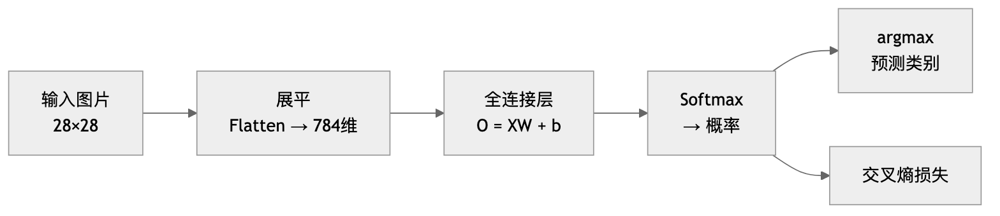

# 第2章 线性神经网络 — 学习笔记

**参考 Notebooks：**
- [linear-regression.ipynb](linear-regression.ipynb) — 线性回归
- [linear-regression-scratch.ipynb](linear-regression-scratch.ipynb) — 线性回归从零实现
- [linear-regression-concise.ipynb](linear-regression-concise.ipynb) — 线性回归简洁实现
- [softmax-regression.ipynb](softmax-regression.ipynb) — Softmax 回归
- [image-classification-dataset.ipynb](image-classification-dataset.ipynb) — 图像分类数据集
- [softmax-regression-scratch.ipynb](softmax-regression-scratch.ipynb) — Softmax 回归从零实现
- [softmax-regression-concise.ipynb](softmax-regression-concise.ipynb) — Softmax 回归简洁实现

---

# 第一部分：概览篇

---

## 这一章在干什么？

这一章解决两个最基本的问题：

1. **回归**：给一堆数据，预测一个数字（比如房价）
2. **分类**：给一张图片，判断它是什么类别（比如 T恤还是裤子）

两者的思路其实完全一样，只是最后一步不同。

---

## 线性回归：预测一个数字

想象你是一个房产中介，客户问你："这套 80 平米、10 年房龄的房子值多少钱？"

你脑子里的模型大概是这样的：

```
房价 ≈ 某个系数 × 面积 + 某个系数 × 房龄 + 一个基础价
```

这就是线性回归。整个流程：


但系数（权重）是多少呢？这就需要**训练**：

```
1. 先随便猜一组权重
2. 用这组权重预测所有训练数据的房价
3. 跟真实房价比一比，算出误差（损失）
4. 调整权重，让误差变小一点
5. 重复 2-4，直到误差足够小
```

第 4 步"调整权重"用的方法叫**梯度下降**——沿着误差下降最快的方向走一小步。

为了不用每次遍历所有数据，我们每次只看一小批（mini-batch），这就是**小批量随机梯度下降（SGD）**。

---

## Softmax 回归：判断属于哪个类别

现在换一个问题：给你一张 28×28 的灰度图片，判断它是 10 种衣服中的哪一种。

**前半段和线性回归一模一样**——把图片展平成 784 个数字，做加权求和。不同的是：

- 线性回归输出**1 个数**（房价）
- 分类要输出**10 个数**（每个类别的分数）

然后多了一步：用 **softmax** 把 10 个分数变成 10 个概率（加起来等于 1）。



训练时用**交叉熵损失**代替了均方误差，意思就是：你对正确答案越有信心（概率越高），损失越小。

---

## 训练的通用流程（两种任务完全相同）

不管是回归还是分类，训练都是这个循环：


每一步对应的具体技术：

| 步骤 | 做什么 | 线性回归 | Softmax 回归 |
|------|--------|---------|-------------|
| **① 取数据** | 从数据集取一个 mini-batch | DataLoader 随机采样 | DataLoader 随机采样 |
| **② 前向传播** | 输入 → 模型 → 输出 | `ŷ = Xw + b` | `o = XW + b` → **softmax** → 概率 |
| **③ 算损失** | 预测和真实值比较 | **均方误差 (MSE)** | **交叉熵 (Cross-Entropy)** |
| **④ 反向传播** | 自动求所有参数的梯度 | `l.backward()` | `l.backward()` |
| **⑤ 更新参数** | 梯度下降走一步 | **Mini-batch SGD** | **Mini-batch SGD** |
| **⑥ 清零梯度** | 防止梯度累加 | `zero_grad()` | `zero_grad()` |

这个流程从最简单的线性回归到最复杂的 GPT，**本质上都是一样的**。变的只是第 ② 步的模型和第 ③ 步的损失函数。

---

## 两种任务的对比

| | 线性回归 | Softmax 回归 |
|---|---|---|
| **任务** | 预测一个数字 | 预测属于哪个类别 |
| **输出** | 1 个数 | 每类的概率（q 个） |
| **最后一步** | 直接输出 | softmax → 概率 |
| **损失函数** | MSE（均方误差） | 交叉熵 |
| **梯度** | ŷ - y | ŷ - y（一样！） |

**下一章预告：** 这两种模型都只有一层（输入直接到输出）。加上隐藏层和激活函数，就变成了**多层感知机 (MLP)**——真正的"深度"学习的起点。

---
---

# 第二部分：原理篇

---

## 一、线性回归 <sub>([linear-regression.ipynb](linear-regression.ipynb))</sub>

### 1.1 模型

给定 $d$ 个特征，线性回归的预测为：

$$\hat{y} = \mathbf{w}^\top \mathbf{x} + b = w_1 x_1 + w_2 x_2 + \cdots + w_d x_d + b \tag{1.1}$$

> $x_1, x_2, \ldots$ 是输入特征（如面积、房龄），$w_1, w_2, \ldots$ 是对应的权重（这个特征有多重要），$b$ 是偏置（底数）。公式就是：**每个特征乘上权重，加起来，再加个底数 → 得到预测值 $\hat{y}$**。

对 $n$ 个样本的小批量矩阵形式：

$$\hat{\mathbf{y}} = \mathbf{X}\mathbf{w} + b \tag{1.2}$$

> 把 $n$ 个样本的特征摞成一个 $n \times d$ 的矩阵 $\mathbf{X}$（每行是一个样本，每列是一个特征），一次矩阵乘法就把所有样本的预测全算出来了，不需要 for 循环。

这是一个**仿射变换** = 线性变换（乘权重）+ 平移（加偏置）。

### 1.2 损失函数：均方误差

单个样本的损失：

$$l^{(i)}(\mathbf{w}, b) = \frac{1}{2}\left(\hat{y}^{(i)} - y^{(i)}\right)^2 \tag{1.3}$$

> $\hat{y}^{(i)}$ 是第 $i$ 个样本的预测值，$y^{(i)}$ 是真实值。两者之差的平方就是"错得有多离谱"。前面的 $\frac{1}{2}$ 纯粹为了求导方便（导数会出来个 2，$\frac{1}{2} \times 2 = 1$ 刚好消掉）。

整个数据集上的平均损失：

$$L(\mathbf{w}, b) = \frac{1}{n}\sum_{i=1}^{n} l^{(i)} = \frac{1}{n}\sum_{i=1}^{n}\frac{1}{2}\left(\mathbf{w}^\top\mathbf{x}^{(i)} + b - y^{(i)}\right)^2 \tag{1.4}$$

> 把所有 $n$ 个样本的误差加起来再除以 $n$，得到平均误差。这就是我们要最小化的目标。

目标：$\mathbf{w}^*, b^* = \arg\min_{\mathbf{w},b} L(\mathbf{w}, b)$

> $\arg\min$ 的意思是"让 $L$ 最小的那组 $\mathbf{w}$ 和 $b$ 的值"。也就是找到最好的权重和偏置。

### 1.3 解析解

线性回归的特殊福利——令导数 = 0 直接得到闭式解：

$$\mathbf{w}^* = (\mathbf{X}^\top\mathbf{X})^{-1}\mathbf{X}^\top\mathbf{y} \tag{1.5}$$

> 令"损失对 $\mathbf{w}$ 的导数 = 0"，直接解方程得到最优权重。$\mathbf{X}^\top\mathbf{X}$ 是特征矩阵和自己转置相乘（$d \times d$ 的方阵），取逆再乘 $\mathbf{X}^\top\mathbf{y}$。意思是：**不用迭代，一步算出最优解。** 但只有线性回归能这么做——复杂模型没这个福利。

深度学习中几乎用不到，因为复杂模型没有解析解。

### 1.4 小批量随机梯度下降 (Mini-batch SGD)

#### 前置概念：导数、偏导数与梯度

**导数（单变量）**

对于只有一个变量的函数 $f(x)$，导数描述的是：**$x$ 变化一点点时，$f$ 变化多少。**

$$f'(x) = \frac{df}{dx} = \lim_{h \to 0} \frac{f(x+h) - f(x)}{h} \tag{1.6}$$

> $h$ 是一个无穷小的增量。分子是函数值的变化量，分母是自变量的变化量，相除就是变化率。几何上，导数就是曲线在该点的**切线斜率**。

例子：$f(x) = x^2$，则 $f'(x) = 2x$。在 $x = 3$ 处，斜率 = 6，说明 $x$ 增大一点点，$f$ 会增大约 6 倍那么多。

**偏导数（多变量）**

损失函数 $L$ 同时依赖于多个参数 $w_1, w_2, \ldots, w_d, b$。偏导数就是把多变量函数当作"一次只看一个变量的单变量函数"来求导：

$$\frac{\partial L}{\partial w_1} = \lim_{h \to 0} \frac{L(w_1 + h, w_2, \ldots, b) - L(w_1, w_2, \ldots, b)}{h} \tag{1.7}$$

> **固定其他所有参数不动**，只看 $L$ 随 $w_1$ 变化的速率。符号 $\partial$（读作"partial"）区别于单变量的 $d$，提醒你"还有其他变量，但我暂时不管它们"。

**梯度 = 所有偏导数打包成向量**

$$\nabla_{\mathbf{w}} L = \left(\frac{\partial L}{\partial w_1}, \frac{\partial L}{\partial w_2}, \ldots, \frac{\partial L}{\partial w_d}\right) \tag{1.8}$$

> 梯度是一个向量，每个分量告诉你"沿这个参数方向，损失变化有多快"。**梯度指向损失增长最快的方向**，所以往**梯度的反方向**走一步，损失就会下降——这就是梯度下降的核心思想。

**为什么偏导数在深度学习中极其重要？**

深度学习模型有成千上万甚至上亿个参数。训练的本质就是：对每个参数算出偏导数（= 这个参数该往哪个方向调），然后同时更新所有参数。PyTorch 的 `backward()` 做的就是自动算出所有参数的偏导数。

> **🤓 Fun Fact：autograd 是真的在求导，不是"用极限蒙出来的"**
>
> 导数的**数学定义**是极限：$f'(x) = \lim_{h→0} \frac{f(x+h)-f(x)}{h}$。但数学家早已从这个定义**推导出**了一整套公式规则（$x^2→2x$、链式法则等）。PyTorch 的 autograd 把这些**解析规则编程实现**了——前向传播时记录每一步运算（乘法、加法、ReLU……），反向传播时对每一步**查表套公式**，再用链式法则乘起来。全程精确计算，没有近似。
>
> 那 d2l 里 `numerical_lim` 那个让 $h$ 越来越小的实验是什么？那叫**数值微分**——直接用极限定义暴力近似，只是用来**验证**解析求导的结果对不对（gradient check）。如果真用这种方式训练：100 万个参数就要算 100 万次前向传播，而且还有浮点误差。autograd 一次反向传播就搞定所有参数的精确梯度。
>
> | 方式 | 怎么做 | 精确？ | 速度 | 实际用途 |
> |---|---|---|---|---|
> | 数值微分 | 取很小的 $h$，算 $\frac{f(x+h)-f(x)}{h}$ | 近似 | 极慢（每个参数算一次前向） | 仅用于 gradient check |
> | 自动微分 (autograd) | 记录计算图 + 逐步套解析公式 + 链式法则 | 精确 | 快（一次反向传播算所有参数） | **实际训练用这个** |

---

每次随机抽一小批样本 $\mathcal{B}$，按梯度反方向更新：

$$(\mathbf{w}, b) \leftarrow (\mathbf{w}, b) - \frac{\eta}{|\mathcal{B}|}\sum_{i \in \mathcal{B}} \partial_{(\mathbf{w},b)} l^{(i)}(\mathbf{w}, b) \tag{1.9}$$

> $\mathcal{B}$ 是随机抽出的一小批样本（比如 256 个），$|\mathcal{B}|$ 是这批的大小。$\eta$ 是学习率（步长）。$l^{(i)}$ 是第 $i$ 个样本的损失（见公式 1.3）。$\partial_{(\mathbf{w},b)} l^{(i)}$ 是损失对参数 $(\mathbf{w}, b)$ 的偏导数（见公式 1.7），表示"调整这些参数能让第 $i$ 个样本的损失变化多少"。$\leftarrow$ 表示"用右边的值更新左边"。整体含义：**算出这一小批样本的平均梯度，然后让参数往梯度的反方向走一小步。**

展开后：

$$\mathbf{w} \leftarrow \mathbf{w} - \frac{\eta}{|\mathcal{B}|}\sum_{i \in \mathcal{B}} \mathbf{x}^{(i)}\left(\mathbf{w}^\top\mathbf{x}^{(i)} + b - y^{(i)}\right) \tag{1.10}$$

$$b \leftarrow b - \frac{\eta}{|\mathcal{B}|}\sum_{i \in \mathcal{B}}\left(\mathbf{w}^\top\mathbf{x}^{(i)} + b - y^{(i)}\right) \tag{1.11}$$

> 括号里的 $\mathbf{w}^\top\mathbf{x}^{(i)} + b - y^{(i)}$ 就是"预测值 - 真实值"（= 偏差有多大）。对 $\mathbf{w}$ 求导多乘了一个 $\mathbf{x}^{(i)}$（链式法则）。对 $b$ 求导就只剩偏差本身。然后用学习率 $\eta$ 控制每一步走多远。

关键超参数：
- $\eta$（学习率）：步子迈多大。太大 → 震荡，太小 → 太慢
- $|\mathcal{B}|$（批量大小）：每次看多少样本。太大 → 慢，太小 → 噪音大

### 1.5 概率视角：为什么用 MSE？

假设观测含高斯噪声：

$$y = \mathbf{w}^\top\mathbf{x} + b + \epsilon, \quad \epsilon \sim \mathcal{N}(0, \sigma^2) \tag{1.12}$$

> 真实世界的数据不完美。$\epsilon$ 代表随机噪声，它服从均值为 0、方差为 $\sigma^2$ 的正态分布（$\mathcal{N}$ = Normal）。意思是：真实值 = 线性预测 + 随机干扰。

则似然函数为：

$$P(y|\mathbf{x}) = \frac{1}{\sqrt{2\pi\sigma^2}}\exp\left(-\frac{(y - \mathbf{w}^\top\mathbf{x} - b)^2}{2\sigma^2}\right) \tag{1.13}$$

> $P(y|\mathbf{x})$ 是"给定输入 $\mathbf{x}$ 时，观测到 $y$ 的概率"。这就是正态分布的概率密度公式，钟形曲线的中心在预测值 $\mathbf{w}^\top\mathbf{x} + b$ 处，预测越准（$y$ 越靠近中心），概率越高。

取负对数似然：

$$-\log P(\mathbf{y}|\mathbf{X}) = \sum_i \frac{1}{2\sigma^2}(y^{(i)} - \mathbf{w}^\top\mathbf{x}^{(i)} - b)^2 + \text{常数} \tag{1.14}$$

> 取对数是为了把连乘变成求和（好算），加负号是为了把"最大化概率"变成"最小化损失"。结果发现：去掉常数项，这个公式和 MSE 的形式一模一样！

> **结论：最小化 MSE ⟺ 高斯噪声假设下的最大似然估计。** MSE 不是拍脑袋选的，它有概率论支撑。

### 1.6 矢量化

for 循环 vs 矢量化运算：速度差 **~400 倍**。原因是矢量化操作可以利用底层 BLAS 库和 GPU 并行。

---

## 二、Softmax 回归（分类） <sub>([softmax-regression.ipynb](softmax-regression.ipynb))</sub>

### 2.1 从回归到分类

| | 回归 | 分类 |
|---|---|---|
| 预测什么 | 连续数值 | 离散类别 |
| 输出维度 | 1 | $q$（类别数） |
| 损失函数 | MSE | 交叉熵 |

### 2.2 标签表示：独热编码 (One-Hot)

$$y \in \{(1,0,0),\ (0,1,0),\ (0,0,1)\} \tag{2.1}$$

> 假设有 3 个类别。如果样本属于第 2 类，标签就是 $(0,1,0)$——只有对应位置是 1，其余全是 0。这样类别之间没有"谁比谁大"的关系（不像 1,2,3 有大小之分）。

### 2.3 网络结构

跟线性回归一样是**单层全连接网络**，只是输出有 $q$ 个：

$$\mathbf{o} = \mathbf{W}\mathbf{x} + \mathbf{b} \tag{2.2}$$

> 跟线性回归几乎一样，区别是：$\mathbf{W}$ 是一个 $q \times d$ 的矩阵（$q$ = 类别数，$d$ = 特征数），输出 $\mathbf{o}$ 是一个长度为 $q$ 的向量。每个元素 $o_j$ 代表"属于第 $j$ 类的原始分数"（叫 logit）。这时候还不是概率。

小批量矩阵形式：

$$\mathbf{O} = \mathbf{X}\mathbf{W} + \mathbf{b} \tag{2.3}$$

> $\mathbf{X}$ 是 $n \times d$（$n$ 个样本，$d$ 个特征），$\mathbf{W}$ 是 $d \times q$，乘出来 $\mathbf{O}$ 是 $n \times q$——每个样本对应 $q$ 个类别的分数，一次矩阵乘法全部算完。

**与线性回归 (1.1–1.2) 的对比：**

| | 线性回归 | Softmax 回归 |
|---|---|---|
| **公式** | $\hat{y} = \mathbf{w}^\top\mathbf{x} + b$ | $\mathbf{o} = \mathbf{W}\mathbf{x} + \mathbf{b}$ |
| **权重形状** | $\mathbf{w} \in \mathbb{R}^{d}$（向量） | $\mathbf{W} \in \mathbb{R}^{d \times q}$（矩阵） |
| **偏置形状** | $b \in \mathbb{R}$（标量） | $\mathbf{b} \in \mathbb{R}^{q}$（向量） |
| **输出** | 1 个数（预测值） | $q$ 个数（每类的 logit） |
| **本质区别** | 只有 1 组权重 | 每个类别各有 1 组权重，共 $q$ 组 |

可以把 Softmax 回归理解成 **$q$ 个线性回归并排放在一起**，各自独立地打分，然后再用 softmax 统一变成概率。

### 2.4 Softmax 函数：logits → 概率

$$\hat{y}_j = \text{softmax}(\mathbf{o})_j = \frac{\exp(o_j)}{\sum_{k=1}^{q}\exp(o_k)} \tag{2.4}$$

> $\exp$ 是 $e$ 的指数函数。对每个类别的原始分数取 $\exp$（保证非负），然后除以所有类别的 $\exp$ 之和（保证总和为 1）。结果：**原始分数 → 概率分布。** 分数越高的类别，概率越大。

性质：
- 所有输出 $\geq 0$（因为 $\exp$ 恒正）
- 所有输出之和 $= 1$（因为除以了总和）
- 不改变大小排序：$\arg\max_j \hat{y}_j = \arg\max_j o_j$（$\exp$ 是单调递增函数）

### 2.5 损失函数：交叉熵

$$l(\mathbf{y}, \hat{\mathbf{y}}) = -\sum_{j=1}^{q} y_j \log \hat{y}_j \tag{2.5}$$

> $y_j$ 是独热标签的第 $j$ 个元素（只有真实类别为 1，其余为 0），$\hat{y}_j$ 是模型预测属于第 $j$ 类的概率。求和看起来遍历所有类别，但因为独热编码，只有真实类别那一项不为零。

因此简化为：

$$l = -\log \hat{y}_c = -\log P(\text{正确类别}) \tag{2.6}$$

> $\hat{y}_c$ 是模型对正确类别 $c$ 给出的概率。概率越高 → $\log$ 越大 → 加负号后损失越小。极端情况：预测概率 = 1 时损失 = 0，预测概率趋近 0 时损失趋近无穷。

### 2.6 交叉熵的梯度（非常优雅）

将 softmax 代入交叉熵，对 logit $o_j$ 求导：

$$\partial_{o_j} l = \text{softmax}(\mathbf{o})_j - y_j = \hat{y}_j - y_j \tag{2.7}$$

> 损失对第 $j$ 个 logit 的梯度 = 该类别的预测概率减去真实标签（0 或 1）。如果真实类别是 $j$，梯度 = $\hat{y}_j - 1$（概率不够高就往上推）；如果不是，梯度 = $\hat{y}_j - 0$（有概率就往下压）。形式上跟线性回归的梯度完全一致！

---

#### 📌 完整数值示例：从输入到梯度（猫/狗/鸟分类）

用一个 3 类分类（猫、狗、鸟）的例子，走一遍 **(2.3) → (2.4) → (2.5)/(2.6) → (2.7)** 的完整流程。

**第 ① 步：线性层输出 logits (2.3)**

假设图片经过 $\mathbf{O} = \mathbf{X}\mathbf{W} + \mathbf{b}$ 后，得到一组原始分数（logits）：

$$\mathbf{o} = [2.0,\ 1.0,\ 0.1] \quad \text{(猫=2.0, 狗=1.0, 鸟=0.1)}$$

> 这些数字**没有范围限制**，可以是任意实数。2.0 > 1.0 > 0.1 说明模型觉得"猫"最可能，但还不是概率。

**第 ② 步：Softmax → 概率 (2.4)**

$$\exp(\mathbf{o}) = [\exp(2.0),\ \exp(1.0),\ \exp(0.1)] = [7.39,\ 2.72,\ 1.11]$$

$$\sum = 7.39 + 2.72 + 1.11 = 11.22$$

$$\hat{\mathbf{y}} = \left[\frac{7.39}{11.22},\ \frac{2.72}{11.22},\ \frac{1.11}{11.22}\right] = [0.66,\ 0.24,\ 0.10]$$

> softmax 把任意实数映射成了概率分布：**猫 66%，狗 24%，鸟 10%，总和 = 100%。** 注意 softmax 会拉大差距——原始分数差 2 倍（2.0 vs 1.0），概率差了近 3 倍（0.66 vs 0.24）。

**第 ③ 步：交叉熵损失 (2.5 → 2.6)**

假设真实标签是**猫**，即 $\mathbf{y} = (1, 0, 0)$。

先用完整公式 (2.5)：

$$l = -(1 \cdot \log 0.66 + 0 \cdot \log 0.24 + 0 \cdot \log 0.10)$$

因为独热编码，只有猫那一项不为零，简化为 (2.6)：

$$l = -\log(0.66) = 0.42$$

> 损失 0.42 是什么水平？如果模型预测猫的概率是 0.99，损失只有 $-\log(0.99) = 0.01$（很小）。如果概率只有 0.01，损失高达 $-\log(0.01) = 4.6$（很大）。所以 0.42 表示"方向对了，但还不够自信"。

**第 ④ 步：梯度 (2.7)**

$$\nabla_{\mathbf{o}} l = \hat{\mathbf{y}} - \mathbf{y} = [0.66,\ 0.24,\ 0.10] - [1,\ 0,\ 0] = [-0.34,\ +0.24,\ +0.10]$$

> 梯度的含义：
> - 猫：$-0.34$ → 概率还不够高，应该**增大** $o_\text{猫}$（梯度为负，参数更新时减去负数 = 增大）
> - 狗：$+0.24$ → 不该有这么高概率，应该**减小** $o_\text{狗}$
> - 鸟：$+0.10$ → 同理，减小 $o_\text{鸟}$
>
> 梯度下降会沿**负梯度方向**更新，效果就是：正确类别的分数升高，错误类别的分数降低。训练多轮后，猫的概率会趋近 1，损失趋近 0。

---

### 2.7 信息论视角

- **熵**：$H[P] = -\sum_j P(j)\log P(j)$

  > 衡量分布 $P$ 的不确定性。抛硬币（0.5/0.5）的熵最大，确定事件（1/0）的熵为 0。

- **交叉熵**：$H(P, Q) = -\sum_j P(j)\log Q(j)$

  > 用预测分布 $Q$ 去编码真实分布 $P$ 的数据，所需的平均信息量。$Q$ 离 $P$ 越远，交叉熵越大（编码越浪费）。

- $P = Q$ 时交叉熵最小，等于熵。所以**最小化交叉熵 ⟺ 让预测分布尽量接近真实分布**。

### 2.8 数值稳定性问题（重要！）

**问题：** 直接算 $\exp(o_j)$ 容易溢出

**上溢：** $o_j$ 很大 → $\exp(o_j) = \inf$

**下溢：** 减去 $\max$ 后 $\exp(\text{负很大}) \approx 0$ → $\log(0) = -\inf$

**解决：** 将 softmax + log + 交叉熵合在一起计算（LogSumExp 技巧）：

$$\log(\hat{y}_j) = o_j - \max_k(o_k) - \log\left(\sum_k \exp(o_k - \max_k(o_k))\right) \tag{2.8}$$

> 先把所有 logit 减去最大值 $\max_k(o_k)$，这样 $\exp$ 里面的数最大为 0，不会上溢。然后在 $\log$ 域内直接算出 $\log \hat{y}_j$，避免先算出很小的概率再取 $\log$ 导致下溢。这就是 PyTorch `CrossEntropyLoss` 内部做的事。

> **规则：永远把原始 logits 传给 CrossEntropyLoss，不要自己先过 softmax！**

---

## 三、关键概念串联

| | 线性回归 | Softmax 回归 |
|---|---|---|
| **模型** | $\hat{y} = \mathbf{X}\mathbf{w} + b$ | $\mathbf{O} = \mathbf{X}\mathbf{W} + \mathbf{b}$，$\hat{\mathbf{Y}} = \text{softmax}(\mathbf{O})$ |
| **损失函数** | MSE（均方误差） | 交叉熵 |
| **概率解释** | 高斯噪声假设 → MLE = MSE | 最大似然 → 交叉熵 |
| **梯度** | $\hat{y} - y$ | $\hat{y} - y$（形式相同！） |
| **优化** | Mini-batch SGD | Mini-batch SGD |

两者都是**单层神经网络**，共享同一套训练流程。下一章加上隐藏层 + 激活函数 → 多层感知机 (MLP)。

---
---

# 第三部分：代码实现篇

---

## 一、线性回归从零实现 <sub>([linear-regression-scratch.ipynb](linear-regression-scratch.ipynb))</sub>

### 1.1 造数据
```python
def synthetic_data(w, b, num_examples):
    """生成 y = Xw + b + 噪声"""
    X = torch.normal(0, 1, (num_examples, len(w)))
    y = torch.matmul(X, w) + b
    y += torch.normal(0, 0.01, y.shape)
    return X, y.reshape((-1, 1))

true_w = torch.tensor([2, -3.4])
true_b = 4.2
features, labels = synthetic_data(true_w, true_b, 1000)
```

### 1.2 数据迭代器（手写）
```python
def data_iter(batch_size, features, labels):
    n = len(features)
    indices = list(range(n))
    random.shuffle(indices)                          # 打乱顺序
    for i in range(0, n, batch_size):
        batch_idx = torch.tensor(indices[i:min(i+batch_size, n)])
        yield features[batch_idx], labels[batch_idx] # 每次吐出一个小批量
```

### 1.3 初始化参数
```python
w = torch.normal(0, 0.01, size=(2, 1), requires_grad=True)
b = torch.zeros(1, requires_grad=True)
```
`requires_grad=True` → PyTorch 会跟踪这些张量上的所有运算，以便自动求梯度。

### 1.4 模型、损失、优化器
```python
def linreg(X, w, b):
    return torch.matmul(X, w) + b       # 前向传播

def squared_loss(y_hat, y):
    return (y_hat - y.reshape(y_hat.shape)) ** 2 / 2  # 注意 reshape 防止形状 bug

def sgd(params, lr, batch_size):
    with torch.no_grad():               # 更新参数时不跟踪梯度
        for param in params:
            param -= lr * param.grad / batch_size
            param.grad.zero_()           # 清零！否则梯度会累加
```

### 1.5 训练循环
```python
lr = 0.03
num_epochs = 3
for epoch in range(num_epochs):
    for X, y in data_iter(batch_size, features, labels):
        l = squared_loss(linreg(X, w, b), y)
        l.sum().backward()               # 反向传播
        sgd([w, b], lr, batch_size)      # 更新参数
    # 每个 epoch 结束后打印损失
    with torch.no_grad():
        train_l = squared_loss(linreg(features, w, b), labels)
        print(f'epoch {epoch+1}, loss {float(train_l.mean()):f}')
```

### 关键注意事项
- `l.sum().backward()`：损失是向量，要先求和变成标量才能反向传播
- `param.grad.zero_()`：每次更新后必须清零梯度
- `with torch.no_grad()`：评估时不需要计算梯度，节省内存

---

## 二、线性回归简洁实现（PyTorch API） <sub>([linear-regression-concise.ipynb](linear-regression-concise.ipynb))</sub>

### 从零实现 vs 框架 API 对比

| 组件 | 从零实现 | PyTorch API |
|------|---------|------------|
| 数据迭代器 | 手写 `data_iter` | `data.DataLoader(TensorDataset(...))` |
| 模型 | `torch.matmul(X, w) + b` | `nn.Sequential(nn.Linear(2, 1))` |
| 损失 | 手写 `squared_loss` | `nn.MSELoss()` |
| 优化器 | 手写 `sgd` | `torch.optim.SGD(net.parameters(), lr=...)` |
| 参数初始化 | `torch.normal(...)` | `net[0].weight.data.normal_(0, 0.01)` |

### 完整代码
```python
from torch import nn
from torch.utils import data

# 数据
dataset = data.TensorDataset(features, labels)
data_iter = data.DataLoader(dataset, batch_size=10, shuffle=True)

# 模型 & 初始化
net = nn.Sequential(nn.Linear(2, 1))
net[0].weight.data.normal_(0, 0.01)
net[0].bias.data.fill_(0)

# 损失 & 优化器
loss = nn.MSELoss()
trainer = torch.optim.SGD(net.parameters(), lr=0.03)

# 训练
for epoch in range(3):
    for X, y in data_iter:
        l = loss(net(X), y)
        trainer.zero_grad()    # 清零梯度
        l.backward()           # 反向传播
        trainer.step()         # 更新参数
```

### 要记住的 API
- `nn.Sequential`：把层像积木一样串起来
- `net[0]`：访问第 0 层
- `net.parameters()`：返回所有可学习参数的迭代器
- `_` 结尾的方法（`normal_`, `fill_`, `zero_`）：**原地操作**，不创建新张量

---

## 三、Fashion-MNIST 数据集 <sub>([image-classification-dataset.ipynb](image-classification-dataset.ipynb))</sub>

```python
import torchvision
from torchvision import transforms

trans = transforms.ToTensor()  # PIL → Tensor，像素值归一化到 [0, 1]
mnist_train = torchvision.datasets.FashionMNIST(
    root="../data", train=True, transform=trans, download=True)
mnist_test = torchvision.datasets.FashionMNIST(
    root="../data", train=False, transform=trans, download=True)
```
- 10 个类别：T恤/裤子/套衫/连衣裙/外套/凉鞋/衬衫/运动鞋/包/短靴
- 训练集 60000 张，测试集 10000 张
- 每张图：1 x 28 x 28（灰度图）

### 封装好的加载函数（后续章节反复用）
```python
def load_data_fashion_mnist(batch_size, resize=None):
    trans = [transforms.ToTensor()]
    if resize:
        trans.insert(0, transforms.Resize(resize))
    trans = transforms.Compose(trans)
    train = torchvision.datasets.FashionMNIST(root="../data", train=True, transform=trans, download=True)
    test  = torchvision.datasets.FashionMNIST(root="../data", train=False, transform=trans, download=True)
    return (data.DataLoader(train, batch_size, shuffle=True, num_workers=4),
            data.DataLoader(test,  batch_size, shuffle=False, num_workers=4))
```

---

## 四、Softmax 回归从零实现 <sub>([softmax-regression-scratch.ipynb](softmax-regression-scratch.ipynb))</sub>

### 4.1 参数
```python
num_inputs = 784     # 28*28 展平
num_outputs = 10     # 10 个类别
W = torch.normal(0, 0.01, size=(784, 10), requires_grad=True)
b = torch.zeros(10, requires_grad=True)
```

### 4.2 手写 softmax
```python
def softmax(X):
    X_exp = torch.exp(X)
    partition = X_exp.sum(1, keepdim=True)  # 每行求和，保持维度用于广播
    return X_exp / partition
```
⚠️ 这个实现有数值溢出风险，仅用于理解原理。

### 4.3 模型
```python
def net(X):
    return softmax(torch.matmul(X.reshape((-1, W.shape[0])), W) + b)
```
`X.reshape((-1, 784))`：把 28x28 图像展平成 784 维向量。

### 4.4 交叉熵损失
```python
def cross_entropy(y_hat, y):
    return -torch.log(y_hat[range(len(y_hat)), y])
```
技巧：`y_hat[range(n), y]` 用花式索引一次取出每个样本对应真实类别的概率。

### 4.5 精度计算
```python
def accuracy(y_hat, y):
    if len(y_hat.shape) > 1 and y_hat.shape[1] > 1:
        y_hat = y_hat.argmax(axis=1)       # 取概率最大的类别
    cmp = y_hat.type(y.dtype) == y
    return float(cmp.type(y.dtype).sum())
```

### 4.6 训练框架（后续章节反复使用）
```python
def train_ch3(net, train_iter, test_iter, loss, num_epochs, updater):
    for epoch in range(num_epochs):
        for X, y in train_iter:
            y_hat = net(X)
            l = loss(y_hat, y)
            l.sum().backward()
            updater(batch_size)    # 用自定义的 sgd 或框架优化器
        test_acc = evaluate_accuracy(net, test_iter)
```

---

## 五、Softmax 回归简洁实现 <sub>([softmax-regression-concise.ipynb](softmax-regression-concise.ipynb))</sub>

```python
# 模型：Flatten + 全连接层
net = nn.Sequential(nn.Flatten(), nn.Linear(784, 10))

def init_weights(m):
    if type(m) == nn.Linear:
        nn.init.normal_(m.weight, std=0.01)
net.apply(init_weights)

# 损失：传入 logits，内部自动做 softmax + log + 交叉熵
loss = nn.CrossEntropyLoss(reduction='none')

# 优化器
trainer = torch.optim.SGD(net.parameters(), lr=0.1)

# 训练
num_epochs = 10
for epoch in range(num_epochs):
    for X, y in train_iter:
        l = loss(net(X), y)       # net(X) 输出 logits，不是概率！
        trainer.zero_grad()
        l.mean().backward()
        trainer.step()
```

### ⚠️ 最大的坑：CrossEntropyLoss 的输入

| ❌ 错误做法 | ✅ 正确做法 |
|---|---|
| `net` 最后加 `nn.Softmax` | `net` 最后是 `nn.Linear`，输出 logits |
| 先 `softmax(output)` 再传给 loss | 直接把 logits 传给 `nn.CrossEntropyLoss` |

原因：`CrossEntropyLoss` 内部用 LogSumExp 技巧合并计算，避免数值溢出。

---

## 六、通用训练循环模板

```python
# 这个模板从线性回归到 Transformer 都是一样的！
for epoch in range(num_epochs):
    for X, y in data_iter:
        y_hat = model(X)          # 1. 前向传播
        l = loss(y_hat, y)        # 2. 计算损失
        optimizer.zero_grad()     # 3. 清零梯度
        l.backward()              # 4. 反向传播
        optimizer.step()          # 5. 更新参数
    # 评估
    test_acc = evaluate(model, test_iter)
```

**注意顺序：** `zero_grad()` 放在 `backward()` 前面！否则会把上一轮的梯度累加进来。
