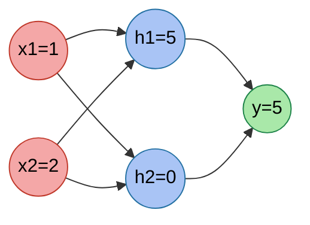
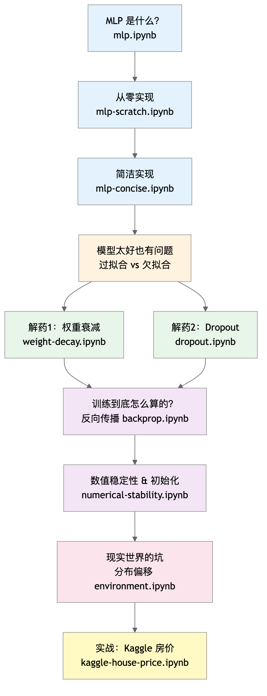

# 第3章 多层感知机 — 学习笔记

**参考 Notebooks：**
- [index.ipynb](index.ipynb) — 本章索引
- [mlp.ipynb](mlp.ipynb) — 多层感知机（原理）
- [mlp-implementation.ipynb](mlp-implementation.ipynb) — 多层感知机实现
- [generalization-deep.ipynb](generalization-deep.ipynb) — 深度网络的泛化
- [dropout.ipynb](dropout.ipynb) — 暂退法（Dropout）
- [backprop.ipynb](backprop.ipynb) — 前向传播、反向传播与计算图
- [numerical-stability-and-init.ipynb](numerical-stability-and-init.ipynb) — 数值稳定性与初始化
- [kaggle-house-price.ipynb](kaggle-house-price.ipynb) — 实战：Kaggle 房价预测

---
---

# 原理篇

---

## 一、多层感知机 <sub>([mlp.ipynb](mlp.ipynb))</sub>

### 1.1 线性模型的天花板

上一章的 softmax 回归和线性回归都做同一件事：**把输入做一次仿射变换，再得到输出**。这个假设隐含了一个强约束：只要输入增大一点，输出就只能单调地增大或减小。现实里很多规律不是单调的。

想象一个简单任务：根据体温判断危险程度。体温太低危险、太高也危险，中间最安全。你需要一个 **U 型曲线**，而不是一条直线。线性模型做不到，因为它只能画直线或平面。

### 1.2 只堆线性层没用

如果你在输入和输出之间硬塞一层线性变换：

$$\mathbf{H} = \mathbf{X}\mathbf{W}^{(1)} + \mathbf{b}^{(1)},\quad \mathbf{O} = \mathbf{H}\mathbf{W}^{(2)} + \mathbf{b}^{(2)} \tag{1.1}$$

> $\mathbf{X}$ 是输入，$\mathbf{W}^{(1)}, \mathbf{b}^{(1)}$ 是第一层参数，$\mathbf{H}$ 是隐藏层输出，$\mathbf{W}^{(2)}, \mathbf{b}^{(2)}$ 是第二层参数，$\mathbf{O}$ 是输出。把 $\mathbf{H}$ 代回去后仍然是 $\mathbf{O}=\mathbf{X}\mathbf{W}+\mathbf{b}$，所以多加一层线性变换本质没变。

**结论：线性层叠加还是线性。** 这就是为什么需要激活函数。

### 1.3 关键一步：激活函数

在隐藏层输出后加一个逐元素非线性：

$$\mathbf{H} = \sigma(\mathbf{X}\mathbf{W}^{(1)} + \mathbf{b}^{(1)}),\quad \mathbf{O} = \mathbf{H}\mathbf{W}^{(2)} + \mathbf{b}^{(2)} \tag{1.2}$$

> $\sigma$ 是激活函数（如 ReLU、sigmoid、tanh）。它让 $\mathbf{H}$ 不再是 $\mathbf{X}$ 的线性函数，模型才有能力表达非线性关系。

这个改动看似小，结果却是质变：**只要隐藏层足够宽，单隐层 MLP 理论上可以逼近任意连续函数。**

### 1.4 三种常用激活函数

**ReLU：**

$$\operatorname{ReLU}(x) = \max(0, x) \tag{1.3}$$

> $x$ 是线性变换结果。正数原样输出，负数直接归零。计算快、梯度稳定，是隐藏层的默认选择。

**Sigmoid：**

$$\operatorname{sigmoid}(x) = \frac{1}{1 + \exp(-x)} \tag{1.4}$$

> 输出范围 $(0, 1)$，适合二分类输出层。但两端饱和，梯度会衰减，隐藏层不常用。

**Tanh：**

$$\operatorname{tanh}(x) = \frac{1 - \exp(-2x)}{1 + \exp(-2x)} \tag{1.5}$$

> 输出范围 $(-1, 1)$，以 0 为中心，比 sigmoid 好，但仍有饱和问题。

**激活函数对比：**

| 维度 | ReLU | Sigmoid | Tanh |
|---|---|---|---|
| 输出范围 | $[0, +\infty)$ | $(0, 1)$ | $(-1, 1)$ |
| 梯度饱和 | 少 | 严重 | 中等 |
| 计算代价 | 极低 | 中 | 中 |
| 典型用途 | 隐藏层 | 输出层（二分类） | 隐藏层（少见） |

### 1.5 多分类输出层

隐藏层学到非线性特征后，输出层通常仍是线性变换，再接 softmax 变成概率分布：

$$\hat{\mathbf{y}} = \operatorname{softmax}(\mathbf{H}\mathbf{W}^{(2)} + \mathbf{b}^{(2)}) \tag{1.6}$$

> $\hat{\mathbf{y}}$ 是各类别的预测概率向量，softmax 把任意实数映射成和为 1 的概率分布。

### 1.6 数值走查示例：一条数据跑完整链路

我们用一个极简网络做一次从前向到梯度的完整计算。



设输入 $\mathbf{x} = [1, 2]$，隐藏层 2 个神经元，输出 1 个回归值。参数如下：

$\mathbf{W}^{(1)} = \begin{bmatrix}1 & -1\\ 2 & 0\end{bmatrix}$，$\mathbf{b}^{(1)} = [0, 1]$，激活函数用 ReLU。

输出层参数：$\mathbf{W}^{(2)} = [1, -2]^\top$，$b^{(2)} = 0$。

**前向：**

$$\mathbf{z}^{(1)} = \mathbf{x}\mathbf{W}^{(1)} + \mathbf{b}^{(1)} \tag{1.7}$$

> 这一步把输入线性变换到隐藏层，得到每个神经元激活（activation）前的原始得分。$\mathbf{x}=[1,2]$ 是这条样本的输入特征，$\mathbf{W}^{(1)}$（$2\times2$）是权重矩阵（weight matrix），每一列对应一个隐藏神经元，控制各输入对该神经元的贡献强度，$\mathbf{b}^{(1)}$ 是偏置（bias），给每个神经元加一个与输入无关的固定基准。

计算得到 $\mathbf{z}^{(1)} = [1\cdot1 + 2\cdot2 + 0,\ 1\cdot(-1) + 2\cdot0 + 1] = [5, 0]$。

$$\mathbf{h} = \operatorname{ReLU}(\mathbf{z}^{(1)}) \tag{1.8}$$

> 对上一步的线性得分 $\mathbf{z}^{(1)}$ 逐元素做非线性截断：正数原样保留，负数或零归零。$\mathbf{h}$ 是激活后的隐藏层输出（hidden layer output），这里第二个神经元得分恰好为 0，激活值也是 0，对后续输出没有贡献。

得到 $\mathbf{h} = [5, 0]$。

$$\hat{y} = \mathbf{h}\mathbf{W}^{(2)} + b^{(2)} \tag{1.9}$$

> 把隐藏层激活 $\mathbf{h}=[5,0]$ 线性组合成标量预测值。$\mathbf{W}^{(2)}=[1,-2]^\top$ 决定每个隐藏神经元对最终预测的贡献方向和大小，$b^{(2)}$ 是偏置，$\hat{y}$ 是最终输出。因为 $h_2=0$，第二个神经元这次对预测没有贡献。

得到 $\hat{y} = 5\cdot1 + 0\cdot(-2) + 0 = 5$。

**损失：** 设真实值 $y=3$，用平方损失：

$$L = \frac{1}{2}(\hat{y} - y)^2 \tag{1.10}$$

> 衡量预测值 $\hat{y}$ 与真实值 $y$ 之间的误差：$(\hat{y}-y)^2$ 对正负误差一视同仁，且越大惩罚越重；前面的 $\frac{1}{2}$ 纯粹是求导方便——平方求导带出的 2 刚好和它抵消，导数变成干净的 $\hat{y}-y$。

数值为 $L=\frac{1}{2}(5-3)^2=2$。

**反向：**

先对输出层求导：

$$\frac{\partial L}{\partial \hat{y}} = \hat{y} - y \tag{1.11}$$

> 反向传播（backpropagation）的起点：$\frac{\partial L}{\partial \hat{y}}$ 表示预测值增大一点点时损失的变化速率，结果就是预测误差 $\hat{y}-y$ 本身。这里等于 2，说明预测偏高了，后续梯度（gradient）会让参数往降低预测值的方向走。

> $\partial$（读作"偏"）是偏导数（partial derivative）符号，用来描述"固定其他变量不动，只让这一个变量变化时，函数的变化速率"。$\frac{\partial L}{\partial \hat{y}}$ 就是"只让 $\hat{y}$ 动，$L$ 变化多快"。和普通导数 $\frac{d}{dx}$ 的区别只在于：偏导数用于多变量函数，强调只对其中一个变量求导。写成分数形式是一种记法习惯，分子 $\partial L$ 是"损失的微小变化量"，分母 $\partial \hat{y}$ 是"预测值的微小变化量"，两者之比就是变化的速率。

得到 $\partial L/\partial \hat{y} = 2$。

输出层权重梯度：

$$\frac{\partial L}{\partial \mathbf{W}^{(2)}} = \mathbf{h}^\top \frac{\partial L}{\partial \hat{y}} \tag{1.12}$$

> 输出层权重的梯度由链式法则（chain rule）得出：$\mathbf{h}^\top$ 是该层的输入，激活值越大的神经元对应权重的梯度幅度也越大；乘上从上游传来的误差信号 $\frac{\partial L}{\partial \hat{y}}=2$，得到每个权重应调整的方向和幅度。

> 链式法则说的是：如果 $L$ 依赖 $\hat{y}$，$\hat{y}$ 又依赖 $\mathbf{W}^{(2)}$，那么 $L$ 对 $\mathbf{W}^{(2)}$ 的偏导数就等于"$L$ 对 $\hat{y}$ 的偏导数"乘以"$\hat{y}$ 对 $\mathbf{W}^{(2)}$ 的偏导数"——也就是把中间每一段的变化速率连乘起来。用中学数学的语言说：$y=f(g(x))$，则 $\frac{dy}{dx}=\frac{dy}{dg}\cdot\frac{dg}{dx}$，把导数像分数一样"约分"传下去。这里 $\hat{y}=\mathbf{h}\mathbf{W}^{(2)}+b^{(2)}$ 对 $\mathbf{W}^{(2)}$ 求导得 $\mathbf{h}^\top$，再乘上上游的 $\frac{\partial L}{\partial \hat{y}}=2$，就得到了 1.12 右边的结果。

数值为 $\partial L/\partial \mathbf{W}^{(2)} = [5, 0]^\top \cdot 2 = [10, 0]^\top$。

> **这里需要注意的是：1.11 和 1.12 都在对输出层的量求导，但目标不同。** 1.11 求的是损失对**输出值** $\hat{y}$ 的梯度，1.12 求的是损失对**输出层权重** $\mathbf{W}^{(2)}$ 的梯度。两者的关系是：1.11 是 1.12 的上游信号，1.12 直接复用了 1.11 的结果。反向传播沿 $L \to \hat{y} \to \mathbf{W}^{(2)} \to \mathbf{h} \to \mathbf{z}^{(1)} \to \mathbf{W}^{(1)}$ 逐步往前，**直到 1.13 左边出现 $\frac{\partial L}{\partial \mathbf{h}}$，梯度才第一次跨过输出层、真正传进隐藏层。**

隐藏层梯度先传回去：

$$\frac{\partial L}{\partial \mathbf{h}} = \mathbf{W}^{(2)} \frac{\partial L}{\partial \hat{y}} \tag{1.13}$$

> 把输出层的误差信号按权重 $\mathbf{W}^{(2)}$ 分配回隐藏层：权重绝对值越大，该神经元收到的梯度幅度越大。结果 $[2,-4]^\top$ 中负号表示第二个神经元的激活值需要增大（梯度为负时参数朝反方向更新）。

得到 $\partial L/\partial \mathbf{h} = [1, -2]^\top \cdot 2 = [2, -4]^\top$。

ReLU 的梯度只在正区间为 1：

$$\frac{\partial L}{\partial \mathbf{z}^{(1)}} = \mathbb{1}(\mathbf{z}^{(1)} > 0) \odot \frac{\partial L}{\partial \mathbf{h}} \tag{1.14}$$

> 梯度穿过 ReLU 时需要"问"前向传播：那个神经元当时有没有被激活？$\mathbb{1}(\mathbf{z}^{(1)}>0)$ 是指示函数（indicator function），逐元素输出 0 或 1——激活了就是 1，没激活就是 0。$\odot$ 是逐元素乘法（element-wise multiplication），意思是两个向量对应位置相乘，而不是矩阵乘法：$[a_1, a_2] \odot [b_1, b_2] = [a_1 b_1,\ a_2 b_2]$。把这个开关向量和上游梯度 $\frac{\partial L}{\partial \mathbf{h}}$ 逐元素相乘，激活的神经元梯度原样通过，没激活的直接归零。用本例的数字走一遍：$\mathbf{z}^{(1)}=[5,0]$，所以开关向量是 $[1, 0]$（$5>0$ 为 1，$0$ 不满足严格大于为 0）；上游梯度是 $[2,-4]^\top$；逐元素相乘得 $[1\times2,\ 0\times(-4)]=[2,0]^\top$——第二个神经元的梯度被彻底截断，它对应的权重本次不会更新。

因为 $\mathbf{z}^{(1)}=[5,0]$，得到 $\partial L/\partial \mathbf{z}^{(1)} = [2, 0]^\top$。

最后得到第一层权重梯度：

$$\frac{\partial L}{\partial \mathbf{W}^{(1)}} = \mathbf{x}^\top \left(\frac{\partial L}{\partial \mathbf{z}^{(1)}}\right)^\top \tag{1.15}$$

> 链式法则的终点，得到第一层权重矩阵的梯度。$\mathbf{x}^\top=[1,2]^\top$ 是这一层的输入，输入越大对应权重的梯度幅度越大；$\left(\frac{\partial L}{\partial \mathbf{z}^{(1)}}\right)^\top=[2,0]$ 是穿过 ReLU 后的上游梯度。两者做外积（outer product）得到 $2\times2$ 梯度矩阵，第二列全为 0——因为第二个神经元的门在反向传播中已经关闭，它对应的全部权重本次不更新。

数值为 $\partial L/\partial \mathbf{W}^{(1)} = [1,2]^\top [2,0] = \begin{bmatrix}2 & 0\\4 & 0\end{bmatrix}$。

这个走查展示了一个核心事实：**反向传播不是“魔法”，就是链式法则把误差一级一级传回去。**


---

## 二、深度网络的泛化 <sub>([generalization-deep.ipynb](generalization-deep.ipynb))</sub>

### 2.1 训练好 ≠ 泛化好

深度网络的表达力极强，足以把训练集记得一清二楚。如果模型把噪声也背下来，就会出现训练误差很低但测试误差很高的过拟合。

经验风险：

$$R_{\text{emp}}[f] = \frac{1}{n}\sum_{i=1}^{n} l\left(f(\mathbf{x}^{(i)}), y^{(i)}\right) \tag{2.1}$$
> 这条式子定义了“经验风险”（empirical risk）：也就是**模型在训练集上平均有多错**。$f$ 是你的模型（model），把输入 $\mathbf{x}$ 映射到预测；$n$ 是训练样本数；$i$ 是样本索引；$\mathbf{x}^{(i)}$、$y^{(i)}$ 分别是第 $i$ 个样本的输入与标签；$l(\cdot,\cdot)$ 是单样本损失函数（loss function），比如分类常用交叉熵、回归常用平方损失。求和把每个样本的损失加起来，再除以 $n$ 取平均——所以它衡量的是“训练集上的平均表现”，不保证在新数据上也同样好。

总体风险：

$$R[f] = \mathbb{E}_{(\mathbf{x},y) \sim P}\left[l\left(f(\mathbf{x}), y\right)\right] \tag{2.2}$$
> 这条式子定义了“总体风险/真实风险”（population risk）：也就是**在真实世界的数据分布上，模型平均会错多少**。$P$ 表示真实数据分布（data distribution），$(\mathbf{x},y)\sim P$ 表示样本来自这个分布；$\mathbb{E}[\cdot]$ 是期望（expectation），可以把它理解成“把所有可能样本按出现概率加权平均”；里面的 $l(f(\mathbf{x}),y)$ 仍是单样本损失。我们真正想优化的是 $R[f]$，但因为 $P$ 不可知、也不可能拿到“无限多”真实样本，所以训练时通常只能最小化训练集上的 $R_{\text{emp}}[f]$，这就引出了“泛化”（generalization）问题：训练好不等于在新数据上也好。

**因果链：** 表达力太强 → 训练误差下降到极低 → 学到训练噪声 → 泛化误差升高。

### 2.2 欠拟合 vs 过拟合的诊断

| 现象 | 训练误差 | 测试误差 | 结论 | 常见对策 |
|---|---|---|---|---|
| 欠拟合 | 高 | 高 | 模型太弱或训练不够 | 更大模型、训练更久、调学习率 |
| 过拟合 | 低 | 高 | 模型太强或数据太少 | 正则化、更多数据、早停 |

一个你在实验里很常见、但容易“只看曲线不懂名字”的概念是 **泛化间隙（generalization gap）**：同一个模型，在训练集上看起来很好，但在没见过的数据上表现变差，两者之间的差距就是“间隙”。在真实风险 $R[f]$ 不可见时，我们通常用训练集/验证集（或测试集）上的指标差来近似它：

$$\widehat{\text{gap}} = R_{\text{val}}[f] - R_{\text{emp}}[f] \tag{2.3}$$
> 这条式子用来“估计泛化间隙”：$R_{\text{emp}}[f]$ 是训练集上的经验风险（越小越好），$R_{\text{val}}[f]$ 是验证集（或测试集）上的风险（越小越好），两者相减得到 $\widehat{\text{gap}}$。如果这个差很大，通常意味着过拟合更严重；常见误解是把“验证误差大”完全归咎于模型太弱，但当训练误差已经很低时，验证误差大更可能是在提示你需要正则化、更多数据或更合适的训练策略。

### 2.3 深度网络为什么也会“反常地不容易过拟合”

在深度学习里，一个常见现象是：即使参数数量远大于样本数量，模型仍然能泛化得不错。原因并不是“模型变小”，而是**隐式正则化**：

- 随机梯度下降偏向“简单解”
- 早停让模型没机会彻底记住噪声
- 数据增强让模型看到更多变化

这些机制把“能记住”变成了“更倾向去概括”，所以深度模型不总是灾难性过拟合。

从原文的视角再补一块“更像研究综述但很有用的地图”：深度网络本身带有 **归纳偏置（inductive bias）**，也就是“它更偏好学成什么样的函数”。比如深的 MLP 更倾向于用很多层的组合去表达复杂函数；不同结构偏好不同的解。原文也提到一个更反直觉的经验现象：当模型足够大时，很多任务上训练误差可以轻松到 0，但继续加深/加宽模型反而可能先变差再变好，出现所谓 **双降（double descent）** 的模式——这也是为什么“只用经典的复杂度-泛化直觉”在深度学习里经常会失灵。

---

## 三、暂退法 Dropout <sub>([dropout.ipynb](dropout.ipynb))</sub>

Dropout 的直觉很像“团队轮岗”：训练时随机让一部分神经元休假，迫使剩下的神经元学会独立完成任务，最终减少对某个局部特征的依赖。

训练时的 Dropout：

$$\tilde{\mathbf{h}} = \frac{\mathbf{m} \odot \mathbf{h}}{1-p},\quad m_j \sim \text{Bernoulli}(1-p) \tag{3.1}$$
> 这条式子描述训练时的 Dropout（暂退法）：把隐藏层激活 $\mathbf{h}$ 里的一部分随机“掐掉”，得到新的激活 $\tilde{\mathbf{h}}$，从而减少神经元之间的“共适应”。$\mathbf{h}$ 是原始隐藏层输出；$\mathbf{m}$ 是掩码向量（mask），第 $j$ 个位置的 $m_j$ 来自伯努利分布（Bernoulli）：以概率 $1-p$ 取 1（保留），以概率 $p$ 取 0（丢弃）；$\odot$ 是逐元素乘法，所以被丢弃的位置会变成 0。最后除以 $1-p$ 是“反向缩放”（inverted dropout）：它让 $\tilde{\mathbf{h}}$ 的期望尺度和原来的 $\mathbf{h}$ 接近，避免训练时输出整体变小——常见误解是“测试时也要除以 $1-p$”，其实用这种写法时测试阶段（`eval()`）直接不用 Dropout、也不需要再缩放。

测试时不用 Dropout，直接用完整网络（等价于把所有子网络集成平均）。

**Dropout 作用机理：**

- 训练时随机失活 → 网络被迫学鲁棒特征
- 相当于在训练大量“子网络” → 集成效应抑制过拟合

**和 L2 正则化对比：**

| 方法 | 作用位置 | 直觉 | 适用场景 |
|---|---|---|---|
| L2 权重衰减 | 权重 | 惩罚过大的参数 | 通用，稳定 |
| Dropout | 激活 | 防止共适应 | 大模型、数据偏少 |

---

## 四、前向传播、反向传播与计算图 <sub>([backprop.ipynb](backprop.ipynb))</sub>

### 4.1 链式法则是全部核心

反向传播的本质就是链式法则：

$$\frac{\partial L}{\partial x} = \frac{\partial L}{\partial y}\cdot \frac{\partial y}{\partial x} \tag{4.1}$$
> 这就是链式法则（chain rule）的“反向传播版本”：当 $y$ 是由 $x$ 计算出来的中间量时，损失 $L$ 想知道“改一点点 $x$ 会让 $L$ 变多少”，可以拆成两段连乘：先看“改一点点 $y$ 会让 $L$ 变多少”（$\frac{\partial L}{\partial y}$，上游梯度），再看“改一点点 $x$ 会让 $y$ 变多少”（$\frac{\partial y}{\partial x}$，本地导数）。反向传播做的事情就是：从最后的损失开始，把这个“上游梯度”沿着计算图一层层乘回去，最后得到每个参数该怎么更新。

对于一层线性变换 $\mathbf{y} = \mathbf{X}\mathbf{W} + \mathbf{b}$，梯度有明确的矩阵形式：

$$\frac{\partial L}{\partial \mathbf{W}} = \mathbf{X}^\top \frac{\partial L}{\partial \mathbf{y}} \tag{4.2}$$
> 这条式子是“线性层的权重梯度”（linear layer weight gradient）的矩阵写法：把一个 batch 的样本贡献一次性算出来。可以用形状来理解：$\mathbf{X}\in\mathbb{R}^{n\times d}$ 是输入（$n$ 个样本、每个 $d$ 维）；$\mathbf{W}\in\mathbb{R}^{d\times k}$ 是权重；$\mathbf{y}=\mathbf{X}\mathbf{W}+\mathbf{b}\in\mathbb{R}^{n\times k}$ 是输出；$\frac{\partial L}{\partial \mathbf{y}}\in\mathbb{R}^{n\times k}$ 是从上一层传回来的梯度。左乘 $\mathbf{X}^\top$（把形状变成 $d\times n$）本质是在对所有样本做“加权求和”：每个样本的输入向量都会按它的误差信号贡献一份外积，累加后就得到整块 $\frac{\partial L}{\partial \mathbf{W}}$。常见坑是把 $\mathbf{X}$ 的行列理解反了，导致维度对不上；对维度的直觉越稳，调网络就越不容易迷路。

### 4.2 计算图的意义

计算图把复杂函数拆成很多小操作，前向时记录每一步的中间值，反向时逐节点套用局部导数规则。这个机制让我们在有上百万参数时，仍能一次反向传播计算出全部梯度。

还有一个非常工程、但特别关键的结论：训练（training）比推理（inference）更“吃内存”。原因不是参数更多，而是反向传播要用到前向传播的中间结果（intermediate values），所以这些中间张量需要先存起来，直到反向传播结束才能释放。一般来说，网络越深、batch size 越大，中间结果就越多，就越容易遇到 OOM（out-of-memory）。

---

## 五、数值稳定性与初始化 <sub>([numerical-stability-and-init.ipynb](numerical-stability-and-init.ipynb))</sub>

### 5.1 梯度爆炸与消失

如果每一层的梯度都要和一个常数连乘，层数一深就会指数级放大或衰减。这就是梯度爆炸和消失。

这里的“常数连乘”**不是**指前向传播里“上一层输出 $x$ 乘上某一个权重 $w$”那种计算本身，而是指反向传播（backpropagation）里，梯度沿链式法则（chain rule）往回传时，每过一层都会再乘上这一层的“局部导数”。比如一层线性层（linear layer）$\mathbf{y}=\mathbf{X}\mathbf{W}+\mathbf{b}$，把梯度传回输入时会乘上权重矩阵的转置（粗略理解成“乘上 $\mathbf{W}$ 的尺度”）；再过激活函数（activation function）时，还会逐元素乘上 $\sigma'(\cdot)$（例如 ReLU 的导数是 0 或 1）。为了判断“整体趋势会不会消失/爆炸”，我们常把这些局部导数在**平均/期望意义下的缩放倍率**粗略近似成一个常数 $C$，于是传回 $L$ 层大概就会变成 $C^L$ 倍：$|C|>1$ 容易爆炸，$|C|<1$ 容易消失。比如对 ReLU，$\sigma'(z)=\mathbb{1}(z>0)$，如果在这一层/这一批数据里大约有 60% 的神经元满足 $z>0$，那就可以把 $\mathbb{E}[\sigma'(z)]\approx 0.6$ 当作一个直觉上的 $C$，于是梯度会倾向于一层层乘上 0.6 往回传 -> 梯度消失。

如果你想和原文的表述对齐得更紧一些：上面用“常数 $C$”讲的是最直观的简化版；更严格一点时，每一层反向传播其实对应一个雅可比矩阵（Jacobian matrix），深层网络的梯度会出现“很多矩阵连乘”的形式。直觉仍然一样：如果这些矩阵的尺度（可以粗略联想到特征值/奇异值的大小）整体偏大，就容易爆炸；整体偏小，就容易消失。

用方差传播来直观理解：

为什么这里改用“方差”（variance）来讲？因为我们想用一个很省事的数字来概括“这一层信号的整体尺度/波动幅度”，方差就像网络里的“信号强度仪表盘”：它不关心每个元素的具体值，只关心整体是偏大、偏小还是稳定。“方差传播”说的就是：上一层激活的方差，经过这一层的线性变换（以及后续激活）后，大概会变成多少——用它来判断初始化尺度是不是会让信号一层层越传越偏。

$$\operatorname{Var}(z^{(l)}) \approx n_{\text{in}} \operatorname{Var}(w^{(l)})\operatorname{Var}(h^{(l-1)}) \tag{5.1}$$
> 这条近似是在用“方差怎么在层间传播”来理解数值稳定性：第 $l$ 层线性输出 $z^{(l)}$ 的方差大致等于“输入维度 $n_{\text{in}}$”乘上“本层权重 $w^{(l)}$ 的方差”再乘上“上一层激活 $h^{(l-1)}$ 的方差”。这里 $\operatorname{Var}(\cdot)$ 是方差（variance），衡量数值波动大小；$\approx$ 表示这是在一些简化假设下（比如各维独立、均值接近 0）的粗略估算。它想告诉你：如果 $\operatorname{Var}(w^{(l)})$ 选得太大，方差会层层放大，容易导致激活/梯度爆炸；选得太小，方差会层层衰减，容易导致激活/梯度消失——初始化的目标就是把这种“越传越偏”的趋势压住。

### 5.2 Xavier 与 He 初始化

有了 5.1 的“方差传播”视角，我们就能把问题说得很具体：**我们希望前向的激活尺度、以及反向的梯度尺度，不要随着层数越来越大或越来越小**。而初始化（initialization）能直接控制的，就是每层权重 $w$ 一开始的尺度（scale），也就是 $\operatorname{Var}(w)$ 该取多大才合适。Xavier/He 初始化就是两套经典的“按层尺寸选尺度”的经验公式：它们的目标都是让信号在层与层之间传递时尽量稳定，只是针对的激活函数类型不同。

你可能会觉得公式里的“2”很像在“修修补补”。这个感觉没错：这里确实是在做统计意义下的尺度配平（不是精确物理定律）。直觉上，线性层把很多项加起来会改变信号强度；而像 ReLU 这样的激活函数会把一部分值直接变成 0（常常可以粗略理解为“有一半被砍掉”），于是信号的平方平均/方差会偏小一点。为了让“过完激活函数之后”的信号强度别系统性变小，He 初始化会用一个大约为 2 的补偿系数把尺度补回来；Xavier 初始化则更偏向在输入维度（$n_{\text{in}}$）和输出维度（$n_{\text{out}}$）之间做折中，从而同时照顾前向和反向的稳定性。

另外，这两种初始化确实是在“改 $W$ 本身”——更准确地说：它们规定了训练开始时权重矩阵 $W$ 的随机采样分布（例如均值为 0、方差按下面公式设定）。初始化只发生在训练前的起点；训练开始后，$W$ 会在反向传播和优化器更新中不断变化。

原文还强调了一个非常“新手但致命”的点：**打破对称性（breaking the symmetry）**。直觉上，如果你把同一层所有隐藏单元的权重都初始化成同一个常数（例如整块 $\mathbf{W}^{(1)}$ 都是 $c$），那前向传播时每个隐藏单元看到的输入与参数完全相同，输出就会一模一样；反向传播时它们收到的梯度也会一模一样；下一步更新后权重仍然一模一样——这样训练永远“分不开工”，这一层会退化得像只有 1 个隐藏单元一样。用随机初始化（哪怕很小）能给每个单元一个不同的起点，从而把对称性打破，网络才会真正用上多个隐藏单元的表达能力。

**Xavier 初始化：**

$$\operatorname{Var}(w) = \frac{2}{n_{\text{in}} + n_{\text{out}}} \tag{5.2}$$
> 这是 Xavier 初始化（Xavier initialization）的核心配方：把权重 $w$ 的方差设为输入维度 $n_{\text{in}}$ 和输出维度 $n_{\text{out}}$ 的函数，让信号在前向和反向传播时都不至于系统性放大或缩小。$n_{\text{in}}$、$n_{\text{out}}$ 分别是该层的输入/输出神经元个数；$\operatorname{Var}(w)$ 决定了权重随机初始化的**尺度**（scale，常见是均值为 0、但用方差/标准差来描述“典型幅度”有多大，而不是用均值）。它更适合 tanh/sigmoid 这类相对对称的激活函数；常见误解是“初始化随便就行”，但深层网络里初始化差一点，训练曲线可能就会完全不同。

**He 初始化：**

$$\operatorname{Var}(w) = \frac{2}{n_{\text{in}}} \tag{5.3}$$
> 这是 He 初始化（He initialization）的配方，专门为 ReLU 类激活设计：因为 ReLU 会把一部分（通常接近一半）输入截成 0，等价于“有效信号变稀疏/变小”，所以需要让初始权重的尺度稍大一些来补偿，使得激活与梯度的尺度在层间更稳定。这里 $n_{\text{in}}$ 是输入维度；把 $\operatorname{Var}(w)$ 设为 $\frac{2}{n_{\text{in}}}$ 的直觉就是“让每层输出的方差别越传越偏”。常见坑是：用 ReLU 却还用 Xavier，可能更容易出现深层训练不稳或收敛慢（当然也不是绝对）。

### 5.3 数值稳定性细节

这一节讲的“数值稳定性”（numerical stability）不是理论优雅，而是工程上避免训练突然“炸掉”的保命细节：比如损失突然变成 `inf`/`nan`、梯度变成 `nan`，很多时候不是模型思想错了，而是浮点数在做 `exp` / `log` / 除法时溢出（overflow）或下溢（underflow）了。

最典型的例子是 softmax。因为 $\exp(\cdot)$ 增长太快，只要 logits（未归一化得分）里有一个数比较大，$\exp(z)$ 就可能直接溢出。解决方法不是换公式，而是做一个**等价变形**：先减去最大值 $z_{\max}$，让指数的输入整体往 0 附近平移。

$$\operatorname{softmax}(\mathbf{z})_i = \frac{\exp(z_i - z_{\max})}{\sum_j \exp(z_j - z_{\max})},\quad z_{\max}=\max_j z_j \tag{5.4}$$
> 这条式子做的是“稳定版 softmax”：先把所有 $z_i$ 同时减去最大值 $z_{\max}$，不会改变 softmax 的结果（因为分子分母同时乘了同一个常数 $\exp(-z_{\max})$，会被约掉），但能把 $\exp(\cdot)$ 的输入压到不容易溢出的范围。这里 $\mathbf{z}$ 表示 softmax 之前的原始得分向量（logits）：$\mathbf{z}=[z_1,\dots,z_K]$，$K$ 是类别数，每个 $z_i$ 是模型对第 $i$ 类的“未归一化分数”，它不是概率、可以为负、也不要求和为 1；$i$ 是类别索引，$z_{\max}$ 是同一条样本的 logits 中的最大值 $z_{\max}=\max_j z_j$（不是全 batch 的最大值）。常见坑是手写 softmax 时忘了这一步，导致训练初期就出现 `inf/nan`。

如果你需要的是 $\log(\text{softmax})$（比如交叉熵里会出现），最稳的做法是用 log-sum-exp（log-sum-exp trick）把“先 exp 再 log”的不稳定过程合并成一个稳定计算：

$$\log\sum_j \exp(z_j) = z_{\max} + \log\sum_j \exp(z_j - z_{\max}),\quad z_{\max}=\max_j z_j \tag{5.5}$$
> 这条恒等式的意义是：把 $\log\sum\exp$ 的“巨大的指数项”先通过减去 $z_{\max}$ 压扁，再把 $z_{\max}$ 加回来，数值会稳定很多。$z_j$ 是第 $j$ 个 logit；右边的 $\exp(z_j-z_{\max})$ 至少有一个是 $\exp(0)=1$，其余都不超过 1，所以求和不会爆；常见误解是“softmax 稳定了就够了”，但真正容易炸的往往是后面紧跟着的 $\log(\cdot)$（尤其当概率非常接近 0 时）。

最后是梯度裁剪（gradient clipping），它处理的是另一类不稳定：反向传播时梯度范数突然变得很大，导致一步更新把参数直接推飞。裁剪的直觉很像“给每步更新加限速器”：

$$g \leftarrow g \cdot \min\left(1, \frac{\tau}{\lVert g\rVert_2}\right) \tag{5.6}$$
> 这条式子表示“按范数裁剪”：把所有参数的梯度拼成一个向量 $g$，算它的 $L_2$ 范数 $\lVert g\rVert_2$，阈值是 $\tau$。如果 $\lVert g\rVert_2\le\tau$，倍率是 1，不动；如果超过阈值，就整体按比例缩小，让裁剪后的范数刚好不超过 $\tau$。它不会修复“梯度为什么变大”的根因，但能防止一次更新把训练打崩，常和更好的初始化/学习率一起用。

**实用建议（写代码时最常用的三条）：**
- 分类用框架自带的 `cross_entropy`/`log_softmax`，不要自己手写 `softmax -> log -> NLL`（框架实现通常已经把上面的稳定技巧融进去了）
- 任何除法或 `log` 前都要防 0（比如加一个很小的 $\epsilon$），否则很容易出现 `log(0)` 或除以 0
- 训练中一旦出现 `nan/inf`，第一时间检查：学习率是否过大、是否忘了稳定 softmax/log、是否需要梯度裁剪

---

## 六、实战：Kaggle 房价预测 <sub>([kaggle-house-price.ipynb](kaggle-house-price.ipynb))</sub>

这部分更像完整工程任务（数据下载/读取、预处理、度量指标、模型选择与提交）。这里笔记不展开，直接见原文：`chapter_multilayer-perceptrons/kaggle-house-price.md`。



---

## 关键概念串联表

| 模块 | 关键组件 | 作用 | 常见问题 | 主要对策 |
|---|---|---|---|---|
| 模型 | 隐藏层 + 激活函数 | 表达非线性 | 只堆线性层无效 | 引入激活函数 |
| 损失 | 交叉熵 / MSE | 衡量预测好坏 | 损失难降 | 调学习率、初始化 |
| 梯度 | 反向传播 | 计算参数方向 | 梯度爆炸/消失 | Xavier/He、裁剪 |
| 优化 | SGD / Adam | 迭代更新参数 | 震荡或收敛慢 | 学习率调度 |
| 正则化 | L2、Dropout | 防止过拟合 | 训练-测试差距大 | 数据增强、早停 |
| 泛化 | 训练/测试误差 | 判断能力是否可迁移 | 过拟合 | 正则化、更多数据 |

**下一章预告：** MLP 是全连接，参数量随输入维度暴涨。卷积神经网络引入局部连接和共享权重，把“结构”编码进模型里，效率和效果都会更好。

---
---

# 代码实现篇

---

## 一、从零实现 MLP <sub>([mlp-implementation.ipynb](mlp-implementation.ipynb))</sub>

核心流程和线性模型一致，但多了隐藏层和激活函数。

```python
# 1) 初始化参数
W1 = torch.randn(num_inputs, num_hiddens, requires_grad=True) * 0.01
b1 = torch.zeros(num_hiddens, requires_grad=True)
W2 = torch.randn(num_hiddens, num_outputs, requires_grad=True) * 0.01
b2 = torch.zeros(num_outputs, requires_grad=True)

# 2) 前向传播
H = torch.relu(X @ W1 + b1)
Y_hat = H @ W2 + b2

# 3) 损失
loss = loss_fn(Y_hat, y)

# 4) 反向传播与更新
loss.backward()
with torch.no_grad():
    W1 -= lr * W1.grad
    b1 -= lr * b1.grad
    W2 -= lr * W2.grad
    b2 -= lr * b2.grad
    W1.grad.zero_()
    b1.grad.zero_()
    W2.grad.zero_()
    b2.grad.zero_()
```

**实现要点：**
- 参数必须 `requires_grad=True`
- ReLU 只在隐藏层
- 更新后一定清零梯度

---

## 二、简洁实现（`nn.Sequential`） <sub>([mlp-implementation.ipynb](mlp-implementation.ipynb))</sub>

```python
net = nn.Sequential(
    nn.Flatten(),
    nn.Linear(num_inputs, num_hiddens),
    nn.ReLU(),
    nn.Linear(num_hiddens, num_outputs)
)
```

**要点：**
- `nn.Linear` 自带权重初始化
- `nn.ReLU()` 作为模块插入
- 训练循环与线性模型完全一致

---

## 三、Dropout 的代码位置 <sub>([dropout.ipynb](dropout.ipynb))</sub>

Dropout 只在训练时开启，推理时关闭。

```python
net = nn.Sequential(
    nn.Flatten(),
    nn.Linear(num_inputs, num_hiddens),
    nn.ReLU(),
    nn.Dropout(p=0.5),
    nn.Linear(num_hiddens, num_outputs)
)
```

**常见坑：**
- 训练时 `net.train()`，评估时 `net.eval()`
- 不要在输出层用 Dropout

---

## 四、反向传播与计算图 <sub>([backprop.ipynb](backprop.ipynb))</sub>

```python
with torch.no_grad():
    for p in net.parameters():
        p -= lr * p.grad
```

**要点：**
- `loss.backward()` 会沿计算图自动求梯度
- `torch.no_grad()` 避免更新步骤被纳入计算图

---

## 五、初始化与数值稳定 <sub>([numerical-stability-and-init.ipynb](numerical-stability-and-init.ipynb))</sub>

```python
for m in net.modules():
    if isinstance(m, nn.Linear):
        nn.init.kaiming_normal_(m.weight)
```

**要点：**
- ReLU 网络用 He 初始化
- 如果用 tanh/sigmoid，可换 Xavier

---

## 六、Kaggle 房价预测流水线 <sub>([kaggle-house-price.ipynb](kaggle-house-price.ipynb))</sub>

```python
# 1) 合并训练与测试后统一做标准化
all_features = torch.cat((train_features, test_features), dim=0)
all_features = (all_features - all_features.mean(0)) / all_features.std(0)

# 2) k 折交叉验证
for train_idx, valid_idx in kfold.split(train_features):
    ...
```

**要点：**
- 对价格取对数再回归，评价更稳定
- 用 k 折验证挑超参数
- 最终用全量训练集训练再提交

---

## 七、深度泛化实验 <sub>([generalization-deep.ipynb](generalization-deep.ipynb))</sub>

**关注点：**
- 观察训练曲线与测试曲线
- 通过权重衰减和 Dropout 调节过拟合

---

**完成后自检清单：**
- 是否为每个公式添加了 `\tag{X.Y}` 并紧跟符号解释
- 是否包含数值走查示例
- 是否包含至少一张流程图与对比表
- 是否在原理篇末尾给出关键概念串联表
