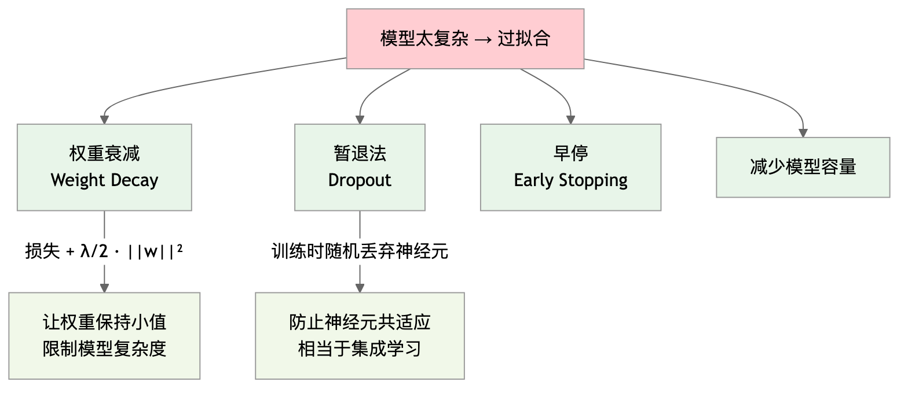
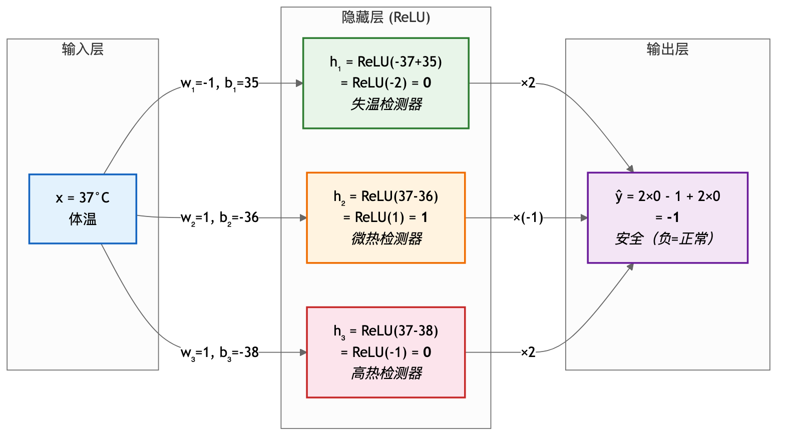

# 第3章 多层感知机 — 学习笔记

**参考 Notebooks：**
- [mlp.ipynb](mlp.ipynb) — 多层感知机（理论）
- [mlp-scratch.ipynb](mlp-scratch.ipynb) — 多层感知机从零实现
- [mlp-concise.ipynb](mlp-concise.ipynb) — 多层感知机简洁实现
- [underfit-overfit.ipynb](underfit-overfit.ipynb) — 模型选择、欠拟合和过拟合
- [weight-decay.ipynb](weight-decay.ipynb) — 权重衰减
- [dropout.ipynb](dropout.ipynb) — 暂退法（Dropout）
- [backprop.ipynb](backprop.ipynb) — 前向传播、反向传播和计算图
- [numerical-stability-and-init.ipynb](numerical-stability-and-init.ipynb) — 数值稳定性和模型初始化
- [environment.ipynb](environment.ipynb) — 环境和分布偏移
- [kaggle-house-price.ipynb](kaggle-house-price.ipynb) — 实战：Kaggle 房价预测

---

# 第一部分：概览篇

---

## 这一章在干什么？

上一章我们学了线性回归和 softmax 回归——输入直接到输出，一层搞定。但现实世界的问题不是线性的：

- "体温和死亡率"不是越高越危险（37°C 最安全，偏高偏低都不行）
- 一张图片里"猫"的概念，不可能用 784 个像素的加权求和来表达

所以这一章做的事情就是：**在输入和输出之间插入隐藏层 + 激活函数，让模型能学到非线性的关系。** 这就是多层感知机（MLP）。

但模型变复杂之后，新问题来了：
1. **过拟合**——模型太强，把训练数据的噪音也"背"下来了
2. **训练不稳定**——梯度可能爆炸或消失
3. **现实数据和训练数据不一样**——分布偏移

这一章围绕"怎么建 MLP → 出了什么问题 → 怎么解决"展开。

---

## 章节路线图


---

## MLP 的结构：和上一章只差一步


对比上一章的 softmax 回归：

| | Softmax 回归（第2章） | MLP（第3章） |
|---|---|---|
| **层数** | 1 层（输入 → 输出） | 2+ 层（输入 → 隐藏 → 输出） |
| **线性？** | 纯线性 | 隐藏层后加激活函数 → 非线性 |
| **能力** | 只能画直线/平面 | 理论上能拟合任意函数 |
| **新增组件** | 无 | 隐藏层 + 激活函数（ReLU/sigmoid/tanh） |
| **损失/优化** | 交叉熵 + SGD | 完全一样！ |

训练循环和上一章**完全相同**（前向 → 损失 → 反向 → 更新 → 清零），变的只是模型结构。

---

## 模型变强后的问题和解决方案



| 问题 | 现象 | 解决方案 |
|------|------|---------|
| **过拟合** | 训练误差低，测试误差高 | 权重衰减、Dropout、早停、更多数据 |
| **欠拟合** | 训练和测试误差都高 | 增加模型复杂度、训练更久 |
| **梯度消失** | 深层网络训练不动 | ReLU 替代 sigmoid、Xavier 初始化 |
| **梯度爆炸** | 损失/参数变成 NaN | 梯度裁剪、合理初始化 |
| **分布偏移** | 部署效果和测试不一样 | 重要性加权、领域适配 |

---

## 训练步骤细节

| 步骤 | MLP 具体做法 | 与第2章的区别 |
|------|------------|--------------|
| **① 取数据** | DataLoader 随机采样 | 完全相同 |
| **② 前向传播** | 输入 → 线性 → **ReLU** → 线性 → 输出 | 多了隐藏层+激活 |
| **③ 算损失** | CrossEntropyLoss（分类） / MSELoss（回归） | 完全相同 |
| **④ 反向传播** | `l.backward()` — 链式法则沿计算图反向求梯度 | 计算图更深，但 PyTorch 自动处理 |
| **⑤ 更新参数** | SGD / Adam，可加**权重衰减** | 可能加 L2 正则化 |
| **⑥ 清零梯度** | `zero_grad()` | 完全相同 |

**下一章预告：** MLP 把每个输入特征和每个隐藏神经元全连接（所以叫"全连接层"）。但对图像来说，这太浪费了——相邻像素有局部关系，远处像素关系弱。下一章的卷积神经网络（CNN）利用这种**局部结构**，大幅减少参数量。

---
---

# 第二部分：原理篇

---

## 一、多层感知机 <sub>([mlp.ipynb](mlp.ipynb))</sub>

### 1.1 为什么需要隐藏层？

线性模型**只用原始特征**时，只能表达单调关系。虽然你可以手动构造 $x^2$、$x_1 x_2$ 等特征来拟合非线性（第2章的多项式回归就是这么做的），但当特征有 784 个（图片像素）时，你根本不知道该加哪些交叉项——组合爆炸，不可能手动设计。

MLP 的意义：**隐藏层 + 激活函数自动学出需要的非线性特征变换**，不需要人工构造。

但仅仅叠加线性层是不够的。**线性层叠加还是线性：**

$$\mathbf{H} = \mathbf{X}\mathbf{W}^{(1)} + \mathbf{b}^{(1)}, \quad \mathbf{O} = \mathbf{H}\mathbf{W}^{(2)} + \mathbf{b}^{(2)} \tag{1.1}$$

> $\mathbf{X}$ 是输入数据矩阵（每行一个样本），$\mathbf{W}^{(1)}$ 和 $\mathbf{b}^{(1)}$ 是第一层（隐藏层）的权重和偏置，$\mathbf{H}$ 是隐藏层输出，$\mathbf{W}^{(2)}$ 和 $\mathbf{b}^{(2)}$ 是第二层（输出层）的权重和偏置，$\mathbf{O}$ 是最终输出。把 $\mathbf{H}$ 代入 $\mathbf{O}$：$\mathbf{O} = \mathbf{X}\mathbf{W}^{(1)}\mathbf{W}^{(2)} + \mathbf{b}^{(1)}\mathbf{W}^{(2)} + \mathbf{b}^{(2)}$。令 $\mathbf{W} = \mathbf{W}^{(1)}\mathbf{W}^{(2)}$，$\mathbf{b} = \mathbf{b}^{(1)}\mathbf{W}^{(2)} + \mathbf{b}^{(2)}$，就退化成了单层线性模型 $\mathbf{O} = \mathbf{X}\mathbf{W} + \mathbf{b}$。**加再多线性层也没用。**

### 1.2 解决方案：激活函数

在线性变换之后加一个**非线性函数** $\sigma$，打破线性叠加：

$$\mathbf{H} = \sigma(\mathbf{X}\mathbf{W}^{(1)} + \mathbf{b}^{(1)}), \quad \mathbf{O} = \mathbf{H}\mathbf{W}^{(2)} + \mathbf{b}^{(2)} \tag{1.2}$$

> 和公式 (1.1) 相比，唯一的区别是给隐藏层套了一个 $\sigma$（激活函数，如 ReLU、sigmoid 等），逐元素作用在每个隐藏神经元上。加了 $\sigma$ 后，$\mathbf{H}$ 不再是 $\mathbf{X}$ 的线性函数，两层就不能合并了。**万有逼近定理**：只要隐藏层足够宽，单隐层 MLP 理论上可以逼近任意连续函数。

#### 直觉：隐藏层 + 激活函数为什么能拟合非线性？

以"体温 → 危险度"为例，用一个只有 2 个隐藏神经元的极简网络来理解。

每个隐藏神经元的计算是 $h = \operatorname{ReLU}(wx + b)$，其中 $w$（权重）和 $b$（偏置）都是**随机初始化**、然后由梯度下降自动学出来的参数。训练前模型不知道任何规律，训练后参数会收敛到能拟合数据的值。

假设训练完成后，三个神经元学到了：

- 神经元 1：$h_1 = \operatorname{ReLU}(-(x - 35))$ — 体温**低于** 35 时开始输出（$w_1=-1, b_1=35$，检测失温）
- 神经元 2：$h_2 = \operatorname{ReLU}(x - 36)$ — 体温超过 36 时开始输出（$w_2=1, b_2=-36$）
- 神经元 3：$h_3 = \operatorname{ReLU}(x - 38)$ — 体温超过 38 时开始输出（$w_3=1, b_3=-38$）

输出层把它们组合：$\hat{y} = 2h_1 - h_2 + 2h_3$（这些权重也是学出来的）

| 体温 $x$ | $h_1$ (失温检测) | $h_2$ | $h_3$ | $\hat{y} = 2h_1 - h_2 + 2h_3$ | 含义 |
|---|---|---|---|---|---|
| 31 | 4 | 0 | 0 | +8 | 严重失温，很危险 |
| 33 | 2 | 0 | 0 | +4 | 失温，危险 |
| 35 | 0 | 0 | 0 | 0 | 边界 |
| 37 | 0 | 1 | 0 | -1 | 正常，安全 |
| 39 | 0 | 3 | 1 | -1 | 开始发烧 |
| 41 | 0 | 5 | 3 | +1 | 高烧，危险 |

$\hat{y}$ 从左到右：高 → 低 → 低 → 高，两端都危险、中间安全——一个完整的 U 型曲线！

以 x = 37°C 为例，下图展示了数据在网络中的完整流动过程：



**本质：** 每个 ReLU 神经元是一个"折点"——在某个阈值处把直线折一下。3 个折点就拼出了两端翘起的 U 型。256 个折点能拼出极其复杂的曲线。**隐藏层提供足够多的折点，激活函数让每个折点生效，两者缺一不可。**

注意神经元 1 的权重 $w_1 = -1$（负数）：ReLU 内部是 $-x + 35$，所以 $x$ 越**小**于 35，输出越大。网络通过学习正负权重，自动覆盖了"太低也危险"的情况。

没有激活函数会怎样？$h_1 = -x+35$，$h_2 = x-36$，$h_3 = x-38$，组合后 $\hat{y} = 2(-x+35) - (x-36) + 2(x-38) = -x + 30$，还是关于 $x$ 的直线，永远单调——低温危险和高温危险不可能同时表达。

> 重要：$w=1, b=-36$ 这些值不是人设定的。训练前 $w$ 和 $b$ 是随机数，网络不知道 36°C 有任何意义。经过梯度下降反复调整后，网络从数据中自己"发现"了 36 是个转折点。这就是"学习"的含义。

#### 那机器怎么知道给每个神经元分配什么"角色"？

答案是：**机器不知道，也不需要知道。**

训练前三个神经元的 $w$ 和 $b$ 都是随机数（比如 $w_1 = 0.37, b_1 = -0.12$），没有任何功能。训练开始后，梯度下降每一步只做一件事：**"这个参数往哪个方向调一点，损失能变小？"** 它不管你是什么"检测器"，它只管让总损失减小。

但因为三个神经元的**随机初始值不同**，它们在同一批数据上产生了不同的输出，收到了不同的梯度，被推往不同的方向。假设 $h_1$ 碰巧初始 $w$ 是小负数（-0.2），那它在低温数据上恰好产生了一点有用信号，梯度下降就把 $w_1$ 推得更负 → 逐渐变成"失温检测器"。同时 $h_2$ 碰巧初始 $w$ 是正数，在高温数据上更有用，就被推向"热度检测器"。

这就是**对称性破缺**（详见第 6.2 节）：如果三个神经元初始值完全相同，它们会收到完全相同的梯度，永远同步更新，最终做一模一样的事——浪费了。**随机初始化是必须的，它给每个神经元不同的"起跑方向"。**

> "失温检测器"是我们事后看训练结果贴的标签，不是机器的目标。而且下次用不同的随机种子重新训练，可能 $h_3$ 变成失温检测器、$h_1$ 变成高热检测器——角色互换了，但最终效果一样好。

### 1.3 三种常用激活函数

**ReLU（修正线性单元）** — 最常用

$$\operatorname{ReLU}(x) = \max(0, x) \tag{1.3}$$

> $x$ 是神经元的线性变换输出（即 $wx + b$ 的结果）。$\max(0, x)$ 取 0 和 $x$ 中较大的那个：正数原样输出，负数变成 0。计算极快（只需判断正负），导数也简单：正数区导数 = 1，负数区导数 = 0。没有 sigmoid 那种导数衰减问题，所以深层网络几乎都用 ReLU。

变体 **pReLU**：负数不直接归零，而是乘以一个小系数 $\alpha$：

$$\operatorname{pReLU}(x) = \max(0, x) + \alpha \min(0, x) \tag{1.4}$$

> $\alpha$ 是可学习参数。好处是负数区间也有梯度，避免"死神经元"问题（某些神经元输出永远为 0，梯度永远为 0，再也学不动）。

**Sigmoid**

$$\operatorname{sigmoid}(x) = \frac{1}{1 + \exp(-x)} \tag{1.5}$$

> $x$ 是神经元的线性变换输出，$\exp(-x)$ 是 $e^{-x}$（自然指数）。当 $x$ 很大时 $\exp(-x) \to 0$，输出趋近 1；当 $x$ 很小（大负数）时 $\exp(-x) \to \infty$，输出趋近 0。整体把任意实数映射到 $(0, 1)$，形状像 S 型曲线。在输出层做二分类时仍然常用（输出可以解释为概率），但在隐藏层已被 ReLU 取代。

导数：$\operatorname{sigmoid}'(x) = \operatorname{sigmoid}(x)(1 - \operatorname{sigmoid}(x))$

> 导数最大值只有 **0.25**（在 $x=0$ 处）。如果网络有 $L$ 层，反向传播时梯度要连乘 $L$ 次，$0.25^L$ 会指数级衰减 → **梯度消失**。这是隐藏层不用 sigmoid 的根本原因。

**Tanh（双曲正切）**

$$\operatorname{tanh}(x) = \frac{1 - \exp(-2x)}{1 + \exp(-2x)} \tag{1.6}$$

> $x$ 是神经元的线性变换输出，$\exp(-2x)$ 是 $e^{-2x}$。tanh 和 sigmoid 本质是同族函数（$\tanh(x) = 2\operatorname{sigmoid}(2x) - 1$），但输出映射到 $(-1, 1)$，以 0 为中心对称。导数最大值为 1（在 $x=0$ 处），比 sigmoid 的 0.25 好很多，但仍然在两端饱和（趋近 ±1 时导数趋近 0）。

**三种激活函数对比：**

| | ReLU | Sigmoid | Tanh |
|---|---|---|---|
| **输出范围** | $[0, +\infty)$ | $(0, 1)$ | $(-1, 1)$ |
| **导数最大值** | 1 | 0.25 | 1 |
| **梯度消失？** | 正数区不会 | 严重 | 较轻 |
| **计算速度** | 最快 | 慢（exp） | 慢（exp） |
| **常用位置** | 隐藏层首选 | 二分类输出层 | RNN |

---

## 二、模型选择与过拟合/欠拟合 <sub>([underfit-overfit.ipynb](underfit-overfit.ipynb))</sub>

### 2.1 训练误差 vs 泛化误差

$$\text{训练误差} = \frac{1}{n_{\text{train}}} \sum_{i=1}^{n_{\text{train}}} l(f(\mathbf{x}_i), y_i) \tag{2.1}$$

> $n_{\text{train}}$ 是训练样本数量，$f$ 是模型，$\mathbf{x}_i$ 是第 $i$ 个样本的特征，$y_i$ 是真实标签，$l(\cdot, \cdot)$ 是损失函数（如 MSE 或交叉熵）。把每个样本的损失加起来取平均——这个值我们能精确算出来。

$$\text{泛化误差} = E_{(\mathbf{x},y) \sim P} [l(f(\mathbf{x}), y)] \tag{2.2}$$

> $P$ 是数据的真实分布（包含所有可能出现的样本），$E$ 是期望（对整个分布求平均）。泛化误差衡量的是模型在**所有可能数据**上的平均表现，包括没见过的。这个值永远无法精确计算（因为 $P$ 是无限的），只能用测试集/验证集去近似。**目标不是让训练误差最低，而是让泛化误差最低。**

**三个思维实验帮助理解为什么训练误差低 ≠ 模型好：**

1. **背题的学生：** 一个学生把往年考题的答案全背了下来，往年题得分 100%。但考试出了新题，他完全不会 → 训练误差 = 0，泛化误差极高。另一个学生理解了解题原理，往年题得分 85%，但新题也能拿 80% → 训练误差稍高，但泛化误差低得多。
2. **查表法：** 一个模型把每张训练图片和它的标签存进查找表，见过的图 100% 正确。但 $28 \times 28$ 灰度图有 $256^{784}$ 种可能（比宇宙中的原子还多），没见过的图只能瞎猜 → 记忆力再好也不可能穷举所有输入。
3. **公平硬币：** 对掷硬币结果做分类（正面/反面），不管用什么算法，泛化误差始终是 $\frac{1}{2}$。但如果手头的 6 次数据恰好是 {0,1,1,1,0,1}，模型会发现"1 比较多"，总预测 1 → 训练误差 = $\frac{1}{3}$，比泛化误差 $\frac{1}{2}$ 好看——这只是运气，不是本事。

> 核心教训：训练误差只反映"模型在见过的数据上表现如何"，我们真正关心的是它在**没见过的数据**上能不能泛化。

#### 训练误差为什么不是 0？

梯度下降不是万能的，训练误差通常不可能降到 0，原因有四：

1. **数据有噪声**：真实数据 = 规律 + 随机噪声（见公式 2.3 的 $\epsilon$），噪声不可预测，损失不可能为 0
2. **模型容量不够**：用直线拟合曲线（欠拟合），不管训练多少轮，直线永远弯不了
3. **优化的局限**：mini-batch 梯度是近似的、学习率不完美、可能卡在局部最小值——梯度下降只是"尽力往低处走"，不保证走到全局最低点
4. **正则化故意牺牲**：权重衰减、Dropout 的目标是最小化 $J = L + \text{正则项}$（公式 3.1），不是最小化 $L$ 本身——故意让训练误差高一点，换取泛化误差更低

#### 独立同分布假设 (i.i.d.)

上面的讨论隐含了一个重要假设：训练数据和测试数据都是从**同一个分布**中**独立**抽取的，即**独立同分布**（i.i.d., independently and identically distributed）。

- **同分布**：训练集和测试集来自同一个"世界"。如果用加州医院的数据训练，去预测马萨诸塞州医院的病人，分布可能不一样 → 模型会失效。
- **独立**：第 2 个样本和第 200 万个样本之间没有特殊关联。如果对微博话题分类，热点话题随时间变化 → 违反独立性。

> 现实中几乎不可能完全满足 i.i.d.，但轻微违反时模型通常仍然有效。严重违反（如训练用大学生人脸、部署去识别老人）则会彻底崩溃。分布偏移问题将在第七节详细讨论。

### 2.2 模型复杂性

什么决定了一个模型容不容易过拟合？原著列出了三个关键因素：

| 因素 | 影响 | 直觉 |
|---|---|---|
| **可调参数的数量** | 参数越多 → 模型自由度越大 → 越容易过拟合 | 20 次多项式比 3 次多项式灵活得多 |
| **参数的取值范围** | 权重可以很大 → 模型能拟合更极端的函数 → 越容易过拟合 | 这就是为什么后面要用权重衰减来限制 |
| **训练样本的数量** | 数据越少 → 模型越容易把噪音当规律 → 越容易过拟合 | 100 个数据拟合 20 次多项式 = 灾难 |

经验法则：参数数量不应大大超过训练样本数量。深度学习之所以需要海量数据，就是因为模型的参数量巨大。

> 波普尔的可证伪性标准：一个好的模型应该是"可以被证明是错的"。如果模型足够复杂，它可以拟合任何数据——那它什么都没说明。**能用简单模型解释的现象，就不要用复杂模型。**

### 2.3 欠拟合 vs 过拟合

| | 欠拟合 | 过拟合 |
|---|---|---|
| **训练误差** | 高 | 低 |
| **泛化误差** | 高 | 高（和训练误差差距大） |
| **原因** | 模型太简单，连训练数据都学不好 | 模型太复杂，把噪音也"背"下来了 |
| **比喻** | 用直线去拟合抛物线 | 考前只刷原题，换个题型就不会 |
| **解决方向** | 增加模型复杂度（更多层/更多神经元） | 降低复杂度 / 正则化 / 增加数据 |

### 2.4 模型选择：验证集与 K 折交叉验证

#### 前置概念：参数 vs 超参数

| | 参数（parameter） | 超参数（hyperparameter） |
|---|---|---|
| **是什么** | 模型内部的数字，如 $w$ 和 $b$ | 人在训练前手动设定的"配置项" |
| **谁决定的** | 梯度下降自动学出来的 | **人拍脑袋定的**，然后看效果调整 |
| **举例** | 每个神经元的权重、偏置 | 学习率 $\eta$、隐藏层数量、每层神经元数、dropout 率 $p$、正则化强度 $\lambda$、batch size |

超参数决定了模型长什么样、怎么训练，但它们不是从数据里学出来的——需要人去尝试不同的值，看哪组效果最好。这个过程就叫**调超参**（hyperparameter tuning）。

#### "用测试集选模型"是什么操作？为什么危险？

假设你在做一个分类任务，手上有三个方案要比较：

1. 隐藏层 128 个神经元，学习率 0.01
2. 隐藏层 256 个神经元，学习率 0.001
3. 隐藏层 64 个神经元，学习率 0.1

你把三个都训练好了，然后拿**测试集**分别跑一下，发现方案 2 测试准确率最高 → 选了方案 2 → 论文里报告"测试准确率 95%"。

**问题在哪？** 你试了 3 个方案，挑了测试集上表现最好的那个。这等于你用测试集的结果**反过来影响了你的选择**——测试集间接参与了"训练"过程。报告出来的 95% 是乐观的，换一批新数据可能只有 90%。

如果你试了 100 个方案呢？总有一个碰巧在测试集上表现好——这就是**对测试集过拟合**。更麻烦的是：过拟合训练集时，你还能用测试集来发现问题；但如果连测试集也过拟合了，你就**无从知晓**了。

#### 解决方案：三分法

把数据分成三份，各自职责分明：

| 数据集 | 用途 | 什么时候用 |
|---|---|---|
| **训练集**（~60-80%） | 训练模型参数（$w$, $b$） | 每个 epoch 都用 |
| **验证集**（~10-20%） | 比较不同超参组合，选最好的那组 | 每次调完超参后用 |
| **测试集**（~10-20%） | 最终报告泛化能力 | **只在最后用一次**，不能回头改模型 |

流程：在训练集上训练 → 在验证集上比较 → 选出最佳方案 → 最后在测试集上跑一次报告结果。测试集从头到尾只碰一次，所以它的评估是公正的。

> d2l 书中坦承：实际上书中实验报告的"测试准确度"严格来说应该叫"验证准确度"，因为并没有预留完全独立的测试集。

> **现实的矛盾：** "测试集只碰一次"在实践中很难做到——如果最终测试效果不好，你难免推翻重来，而你的大脑已经"记住"了测试集的结果，新方案会被那个记忆通过你的大脑”间接“影响，也就是你的大脑帮助深度学习”学习“了一次，加重了拟合，产生了过拟合。整个学术界也有同样的问题：几千篇论文在同一个 ImageNet 测试集上刷分，相当于整个领域在对这个测试集过拟合。当新的测试集出现时，所有模型的表现都下降，其实表现出的是所有模型都或多或少过拟合。这个矛盾没有完美解，三分法只是把问题**控制在可接受范围**——碰 2 次和碰 100 次，过拟合程度天差地别。

#### K 折交叉验证

数据量太小、分不出足够大的验证集时，用 K 折：把数据分成 $K$ 份，每次用 1 份做验证、其余 $K-1$ 份做训练，轮流 $K$ 次，取平均验证误差。

> 常用 $K = 5$ 或 $10$。计算成本高（训练 $K$ 次），但对小数据集的模型评估更可靠。

### 2.5 多项式回归实验（直觉理解）


用一个 3 次多项式生成数据：

$$y = 5 + 1.2x - 3.4\frac{x^2}{2!} + 5.6\frac{x^3}{3!} + \epsilon, \quad \epsilon \sim \mathcal{N}(0, 0.1^2) \tag{2.3}$$

> $x$ 是输入特征，$y$ 是标签。$5, 1.2, -3.4, 5.6$ 是真实的多项式系数（模型需要学出来的目标值）。$\frac{x^i}{i!}$ 中除以 $i!$（阶乘）是为了防止 $x^i$ 在大 $x$ 时数值爆炸。$\epsilon$ 是随机噪声，服从均值 0、标准差 0.1 的正态分布——模拟真实数据中的不完美。

> 这个实验用的是**多项式回归**（人手动构造 $x, x^2, x^3$ 等特征，再做线性回归），不是深度学习。原著用它是因为多项式的"次数"可以直观地控制模型复杂度，方便演示欠拟合和过拟合。在真正的深度学习中，特征由网络自动学习，不需要人去构造。

三种实验结果：

| 用几次多项式拟合 | 训练误差 | 测试误差 | 状态 |
|---|---|---|---|
| 3 次（正好） | 低 | 低 | ✅ 正常 |
| 1 次（太简单） | 高 | 高 | ❌ 欠拟合 |
| 20 次 + 少量数据 | 低 | 高 | ❌ 过拟合 |

---

## 三、权重衰减（L2 正则化） <sub>([weight-decay.ipynb](weight-decay.ipynb))</sub>

### 3.1 思路

过拟合的本质：模型自由度太大，权重可以"随便长"去拟合噪音。解决方案：**限制权重的大小。**

在损失函数后面加一个惩罚项：

$$L_{\text{reg}}(\mathbf{w}, b) = L(\mathbf{w}, b) + \frac{\lambda}{2}\|\mathbf{w}\|^2 \tag{3.1}$$

> $L(\mathbf{w}, b)$ 是原始损失（如 MSE），$\|\mathbf{w}\|^2 = \sum_j w_j^2$ 是所有权重的平方和。$\lambda > 0$ 控制惩罚力度：$\lambda$ 越大 → 权重越小 → 模型越简单。注意**偏置 $b$ 通常不正则化**，因为偏置不影响模型的"弯曲程度"。

### 3.2 对梯度更新的影响

把 (3.1) 对 $\mathbf{w}$ 求导，代入 SGD 参数更新公式（即第 2 章的公式 1.9：反向传播算出梯度后，用 $\mathbf{w} \leftarrow \mathbf{w} - \frac{\eta}{|\mathcal{B}|}\sum_{i \in \mathcal{B}} \nabla_{\mathbf{w}} l^{(i)}$ 更新参数）：

$$\mathbf{w} \leftarrow (1 - \eta\lambda)\mathbf{w} - \frac{\eta}{|\mathcal{B}|}\sum_{i \in \mathcal{B}} \nabla_{\mathbf{w}} l^{(i)} \tag{3.2}$$

> 和普通 SGD 相比，多了一个 $(1 - \eta\lambda)$ 的系数。每次更新前，权重先被缩小一点点。这就是"权重衰减"名字的来源。$\eta\lambda$ 是衰减率，比如 $\eta = 0.01$，$\lambda = 3$，则每步权重先缩小到原来的 $1 - 0.03 = 97\%$。

### 3.3 L1 vs L2 正则化

$$L_1: \quad L + \lambda\|\mathbf{w}\|_1 = L + \lambda\sum_j |w_j| \tag{3.3}$$

> $L$ 是原始损失，$\lambda$ 是正则化强度，$\|\mathbf{w}\|_1 = \sum_j |w_j|$ 是所有权重绝对值之和（L1 范数）。惩罚的是权重的"大小"，倾向于把一部分权重压到精确的 0 → 产生稀疏模型。

$$L_2: \quad L + \frac{\lambda}{2}\|\mathbf{w}\|^2 = L + \frac{\lambda}{2}\sum_j w_j^2 \tag{3.4}$$

> 和 (3.3) 的区别：用平方和 $\sum_j w_j^2$ 代替绝对值和。$\frac{1}{2}$ 是为了求导后系数简洁（见公式 3.1）。L2 不会把权重压到 0，而是让所有权重均匀变小。

| | L1（Lasso） | L2（Ridge / 权重衰减） |
|---|---|---|
| **惩罚** | 绝对值之和 | 平方和 |
| **效果** | 让部分权重**精确为 0** → 特征选择 | 让所有权重**均匀变小** → 平滑 |
| **几何直觉** | 菱形约束 → 容易碰到顶点 | 圆形约束 → 各方向均匀缩小 |
| **用途** | 想要稀疏模型 | 通用正则化 |

> **名词解释：**
> - **特征选择**：假设输入有 100 个特征，但其中只有 10 个真正有用。L1 会把那 90 个没用特征的权重压到精确的 0，等于自动帮你挑出了有用的特征。
> - **稀疏模型**：大部分权重为 0 的模型。好处是更简洁、更容易解释（"模型只看这 10 个特征"），坏处是可能丢掉一些有微弱贡献的特征。
> - **平滑**：L2 不会把任何权重压到 0，而是让所有权重都变小一点。结果是模型的输出曲线更"平缓"，不会出现剧烈的锯齿或极端值——对噪声的反应更温和。
> - **通用正则化**：L2 在绝大多数场景下都能用，不需要特别的理由。L1 更适合"我确定很多特征没用，想让模型自动筛掉"的场景。

### 3.4 概率视角

L2 正则化 ⟺ 对权重施加高斯先验 $w_j \sim \mathcal{N}(0, 1/\lambda)$，然后做最大后验估计（MAP）。

> 和第2章类似（MSE ⟺ 高斯噪声 + MLE），L2 正则化也有贝叶斯解释：我们事先相信权重应该接近 0（高斯先验），$\lambda$ 越大 → 先验越强 → 越相信"权重应该小"。

---

## 四、暂退法（Dropout） <sub>([dropout.ipynb](dropout.ipynb))</sub>

### 4.1 动机

权重衰减从**参数值**下手；Dropout 从**网络结构**下手。

核心思想：训练时**随机丢弃**一些神经元（输出置零），迫使网络不能过度依赖任何单个神经元。

### 4.2 数学定义

对于隐藏层的每个元素 $h$，以概率 $p$ 将其置零：

$$h' = \begin{cases} 0 & \text{以概率 } p \\ \frac{h}{1-p} & \text{以概率 } 1-p \end{cases} \tag{4.1}$$

> 关键：保留的元素要除以 $(1-p)$，这样 $E[h'] = p \cdot 0 + (1-p) \cdot \frac{h}{1-p} = h$。期望不变，所以测试时直接用原始值就行，不需要做任何调整。

### 4.3 为什么 Dropout 有效？

1. **防止共适应**：如果两个神经元总是"配合"工作，一旦其中一个被丢弃，另一个也废了。Dropout 迫使每个神经元独立地有用。
2. **隐式集成**：每次 dropout 产生一个不同的"子网络"，训练 $T$ 次相当于训练了 $T$ 个不同的模型，最终结果是它们的平均 → 类似集成学习。
3. **等价于噪声注入**：给隐藏层加了均值为 0 的乘性噪声，迫使模型对扰动鲁棒。

### 4.4 实践要点

- **只在训练时使用**，测试时关闭（`model.eval()`）
- 常见 dropout 率：输入层附近小（0.1~0.2），输出层附近大（0.5）
- 越靠近输入的层信息越原始，不能丢太多

---

## 五、反向传播与计算图 <sub>([backprop.ipynb](backprop.ipynb))</sub>

前面几节中，我们一直把 `l.backward()` 当作黑盒——调一下就能拿到所有参数的梯度。但这一行代码背后到底发生了什么？梯度是怎么从损失值一步一步传回每一层的权重的？

理解这件事之所以重要，是因为：
- 它解释了为什么**训练比推理占更多内存**（要存所有中间结果）
- 它解释了为什么 **sigmoid 会导致梯度消失**（每过一层梯度都要乘以导数，sigmoid 导数最大 0.25）
- 它直接引出第六节的"为什么需要 Xavier 初始化"

我们先把前向传播拆成一步一步的小公式，然后沿着这些步骤**倒着走回去**算梯度——这就是反向传播。

### 5.1 前向传播

以单隐层 + L2 正则化为例：

$$\mathbf{z} = \mathbf{W}^{(1)}\mathbf{x} \tag{5.1}$$

> $\mathbf{x}$ 是输入向量（单个样本），$\mathbf{W}^{(1)}$ 是隐藏层权重矩阵，$\mathbf{z}$ 是隐藏层的线性变换输出（未经激活）。这里省略了偏置 $\mathbf{b}^{(1)}$ 以简化符号。

$$\mathbf{h} = \phi(\mathbf{z}) \tag{5.2}$$

> $\phi$ 是激活函数（如 ReLU），逐元素作用在 $\mathbf{z}$ 上，$\mathbf{h}$ 是隐藏层的最终输出（激活后）。

$$\mathbf{o} = \mathbf{W}^{(2)}\mathbf{h} \tag{5.3}$$

> $\mathbf{W}^{(2)}$ 是输出层权重矩阵，$\mathbf{o}$ 是网络的最终输出（预测值）。

$$L = l(\mathbf{o}, y) \tag{5.4}$$

> $l$ 是损失函数（如 MSE 或交叉熵），$y$ 是真实标签，$L$ 是这个样本的损失值（标量）。

$$s = \frac{\lambda}{2}\left(\|\mathbf{W}^{(1)}\|_F^2 + \|\mathbf{W}^{(2)}\|_F^2\right) \tag{5.5}$$

> $s$ 是 L2 正则项，$\|\cdot\|_F^2$ 是 Frobenius 范数的平方（矩阵中所有元素的平方和），$\lambda$ 控制正则化强度。对两层的权重都做惩罚。

$$J = L + s \tag{5.6}$$

> $J$ 是最终要最小化的总目标：数据损失 $L$（"预测得准不准"）+ 正则项 $s$（"权重有没有太大"）。前向传播就是按 (5.1) → (5.2) → (5.3) → (5.4) → (5.5) → (5.6) 的顺序计算。**每一步的中间结果（$\mathbf{z}$、$\mathbf{h}$）都必须存下来**，因为反向传播时要用到它们。

### 5.2 反向传播（链式法则）

现在 $J$ 算出来了，我们需要知道"每个权重该怎么调才能让 $J$ 变小"——也就是求 $J$ 对每个权重的偏导数。方法是从 $J$ 出发，沿着前向传播的路径**倒着走回去**，每一步用链式法则把梯度"传"回上一层。

**直觉：** 链式法则就像问路。你不知道"改 $\mathbf{W}^{(1)}$ 会怎么影响 $J$"，但你知道：改 $\mathbf{W}^{(1)}$ → 影响 $\mathbf{z}$ → 影响 $\mathbf{h}$ → 影响 $\mathbf{o}$ → 影响 $L$ → 影响 $J$。把每一步的影响乘起来，就是总影响。

**第一步：求 $J$ 对输出层权重 $\mathbf{W}^{(2)}$ 的梯度**

$$\frac{\partial J}{\partial \mathbf{W}^{(2)}} = \frac{\partial J}{\partial \mathbf{o}} \cdot \mathbf{h}^\top + \lambda\mathbf{W}^{(2)} \tag{5.7}$$

> $\frac{\partial J}{\partial \mathbf{o}}$ 是"损失对网络输出的敏感度"（从损失函数直接算出来），$\mathbf{h}^\top$ 是前向传播时存下来的隐藏层输出的转置。两者相乘就是链式法则。$+ \lambda\mathbf{W}^{(2)}$ 是正则项 $s$ 对 $\mathbf{W}^{(2)}$ 的导数。

**第二步：把梯度"传"回隐藏层**

$$\frac{\partial J}{\partial \mathbf{h}} = {\mathbf{W}^{(2)}}^\top \frac{\partial J}{\partial \mathbf{o}} \tag{5.8}$$

> 已经知道了 $\frac{\partial J}{\partial \mathbf{o}}$（上一步算的），现在要把它传回 $\mathbf{h}$。因为前向时 $\mathbf{o} = \mathbf{W}^{(2)}\mathbf{h}$，反过来梯度就通过 $\mathbf{W}^{(2)}$ 的**转置**传播。

**第三步：穿过激活函数**

$$\frac{\partial J}{\partial \mathbf{z}} = \frac{\partial J}{\partial \mathbf{h}} \odot \phi'(\mathbf{z}) \tag{5.9}$$

> $\odot$ 是逐元素乘法。前向时 $\mathbf{h} = \phi(\mathbf{z})$，所以反向时梯度要乘以激活函数的导数 $\phi'(\mathbf{z})$。**这一步是梯度消失的根源**：如果用 sigmoid，$\phi'$ 最大只有 0.25，梯度每过一层就缩小到原来的 1/4；ReLU 的 $\phi'$ 在正数区 = 1，不衰减。

**第四步：求 $J$ 对隐藏层权重 $\mathbf{W}^{(1)}$ 的梯度**

$$\frac{\partial J}{\partial \mathbf{W}^{(1)}} = \frac{\partial J}{\partial \mathbf{z}} \cdot \mathbf{x}^\top + \lambda\mathbf{W}^{(1)} \tag{5.10}$$

> 和 (5.7) 形式完全一样：梯度 × 该层输入的转置 + 正则项。只不过这次"该层输入"是原始输入 $\mathbf{x}$，不是 $\mathbf{h}$。

至此，$\mathbf{W}^{(1)}$ 和 $\mathbf{W}^{(2)}$ 的梯度都算出来了，接下来交给 SGD 更新参数。

### 5.3 关键要点

- 前向传播和反向传播**互相依赖**：反向传播需要前向传播保存的中间变量（$\mathbf{z}$、$\mathbf{h}$）
- **训练比推理占更多内存**：需要存储所有中间激活值
- 层越深、batch 越大 → 内存消耗越大 → 可能 OOM

#### 📌 数值走查：一个极简网络的完整前向+反向过程

用一个 2 输入 → 2 隐藏（ReLU）→ 1 输出的网络，MSE 损失，不加正则化（$\lambda = 0$），手动走一遍全过程。

**假设的参数和数据：**

$$\mathbf{x} = \begin{pmatrix} 1 \\ 2 \end{pmatrix}, \quad y = 1, \quad \mathbf{W}^{(1)} = \begin{pmatrix} 0.5 & -0.3 \\ 0.2 & 0.8 \end{pmatrix}, \quad \mathbf{W}^{(2)} = \begin{pmatrix} 0.6 & -0.4 \end{pmatrix}$$

**前向传播：**

| 步骤 | 公式 | 计算 | 结果 |
|---|---|---|---|
| (5.1) | $\mathbf{z} = \mathbf{W}^{(1)}\mathbf{x}$ | $\begin{pmatrix} 0.5 \times 1 + (-0.3) \times 2 \\ 0.2 \times 1 + 0.8 \times 2 \end{pmatrix}$ | $\begin{pmatrix} -0.1 \\ 1.8 \end{pmatrix}$ |
| (5.2) | $\mathbf{h} = \operatorname{ReLU}(\mathbf{z})$ | $\begin{pmatrix} \max(0, -0.1) \\ \max(0, 1.8) \end{pmatrix}$ | $\begin{pmatrix} 0 \\ 1.8 \end{pmatrix}$ |
| (5.3) | $o = \mathbf{W}^{(2)}\mathbf{h}$ | $0.6 \times 0 + (-0.4) \times 1.8$ | $-0.72$ |
| (5.4) | $L = \frac{1}{2}(o - y)^2$ | $\frac{1}{2}(-0.72 - 1)^2$ | $1.4792$ |

**反向传播：**

| 步骤 | 公式 | 计算 | 结果 |
|---|---|---|---|
| 起点 | $\frac{\partial L}{\partial o} = o - y$ | $-0.72 - 1$ | $-1.72$ |
| (5.7) | $\frac{\partial L}{\partial \mathbf{W}^{(2)}} = \frac{\partial L}{\partial o} \cdot \mathbf{h}^\top$ | $-1.72 \times \begin{pmatrix} 0 & 1.8 \end{pmatrix}$ | $\begin{pmatrix} 0 & -3.096 \end{pmatrix}$ |
| (5.8) | $\frac{\partial L}{\partial \mathbf{h}} = {\mathbf{W}^{(2)}}^\top \cdot \frac{\partial L}{\partial o}$ | $\begin{pmatrix} 0.6 \\ -0.4 \end{pmatrix} \times (-1.72)$ | $\begin{pmatrix} -1.032 \\ 0.688 \end{pmatrix}$ |
| (5.9) | $\frac{\partial L}{\partial \mathbf{z}} = \frac{\partial L}{\partial \mathbf{h}} \odot \phi'(\mathbf{z})$ | $\begin{pmatrix} -1.032 \\ 0.688 \end{pmatrix} \odot \begin{pmatrix} 0 \\ 1 \end{pmatrix}$ | $\begin{pmatrix} 0 \\ 0.688 \end{pmatrix}$ |
| (5.10) | $\frac{\partial L}{\partial \mathbf{W}^{(1)}} = \frac{\partial L}{\partial \mathbf{z}} \cdot \mathbf{x}^\top$ | $\begin{pmatrix} 0 \\ 0.688 \end{pmatrix} \times \begin{pmatrix} 1 & 2 \end{pmatrix}$ | $\begin{pmatrix} 0 & 0 \\ 0.688 & 1.376 \end{pmatrix}$ |

> **注意 (5.9) 中 ReLU 导数的作用：** $z_1 = -0.1 < 0$，所以 $\phi'(z_1) = 0$，梯度直接被"杀死"——第一个隐藏神经元的梯度变成 0，它在这一步**学不到任何东西**。$z_2 = 1.8 > 0$，$\phi'(z_2) = 1$，梯度原样通过。这就是 ReLU 的"门控"效果：正数区开门放行，负数区关门挡住。

**参数更新（假设学习率 $\eta = 0.1$）：**

$$\mathbf{W}^{(2)} \leftarrow \begin{pmatrix} 0.6 & -0.4 \end{pmatrix} - 0.1 \times \begin{pmatrix} 0 & -3.096 \end{pmatrix} = \begin{pmatrix} 0.6 & -0.0904 \end{pmatrix}$$

> $W^{(2)}_2$ 从 $-0.4$ 变成了 $-0.09$：因为预测值 $-0.72$ 比真实值 $1$ 小太多，网络需要让输出变大，而 $h_2 = 1.8 > 0$，所以把 $h_2$ 前面的权重从负的往正的方向调——这就是梯度下降在做的事情。

---

## 六、数值稳定性与参数初始化 <sub>([numerical-stability-and-init.ipynb](numerical-stability-and-init.ipynb))</sub>

### 6.1 梯度消失与梯度爆炸

对于 $L$ 层网络，输出对第 $l$ 层权重的梯度是一系列矩阵的连乘：

$$\partial_{\mathbf{W}^{(l)}}\mathbf{o} = \mathbf{M}^{(L)} \cdot \mathbf{M}^{(L-1)} \cdots \mathbf{M}^{(l+1)} \cdot \mathbf{v}^{(l)} \tag{6.1}$$

> 每个 $\mathbf{M}^{(k)}$ 包含该层的权重和激活函数的导数。连乘 $L - l$ 个矩阵：
> - 如果每个矩阵的"大小"（谱范数）> 1 → 连乘后指数增长 → **梯度爆炸**
> - 如果 < 1 → 连乘后指数衰减 → **梯度消失**

**梯度消失的罪魁祸首：sigmoid**

sigmoid 导数最大 = 0.25。如果有 $L$ 个隐藏层：

$$\text{梯度} \sim 0.25^L$$

> $L = 30$ 时，$0.25^{30} \approx 10^{-18}$——梯度几乎为零，参数完全学不动。这就是为什么深层网络用 **ReLU**（正数区导数 = 1，不衰减）。

**梯度爆炸的实验：**

100 个随机矩阵连乘，数值达到 $10^{26}$ 量级 → 不做任何处理的话，深层网络的梯度可以大到溢出。

### 6.2 对称性问题

如果所有权重初始化为**相同的值**（比如全 0 或全 1）：
- 同一层所有神经元的前向输出相同
- 反向传播时梯度也相同
- 更新后权重还是相同
- 整层等价于**一个神经元** → 浪费了所有隐藏单元

**必须用随机初始化打破对称性。** （直觉回顾：第 1.2 节体温例子中，三个神经元正是因为随机初始值不同，才被梯度推向了不同的"角色"。）

### 6.3 Xavier 初始化

目标：让每一层的输出方差和输入方差大致相等，避免信号逐层放大或衰减。

对于一个 $n_{\text{in}}$ 输入、$n_{\text{out}}$ 输出的线性层，假设权重 $w_{ij}$ 独立同分布、均值为 0、方差为 $\sigma^2$，输入 $x_i$ 独立同分布、均值为 0：

$$\mathrm{Var}[o_j] = n_{\text{in}} \cdot \sigma^2 \cdot \mathrm{Var}[x] \tag{6.2}$$

> 输出方差 = 输入个数 × 权重方差 × 输入方差。要让输出方差 = 输入方差，需要 $n_{\text{in}} \cdot \sigma^2 = 1$。

同时考虑反向传播的梯度方差需要 $n_{\text{out}} \cdot \sigma^2 = 1$。两者取折衷：

$$\sigma^2 = \frac{2}{n_{\text{in}} + n_{\text{out}}} \tag{6.3}$$

> **Xavier 初始化**：权重方差取输入和输出维度的调和平均。对于均匀分布：$U\left(-\sqrt{\frac{6}{n_{\text{in}} + n_{\text{out}}}}, \sqrt{\frac{6}{n_{\text{in}} + n_{\text{out}}}}\right)$。

这保证了前向传播时信号不放大/不衰减，反向传播时梯度也不放大/不衰减。

---

## 七、环境与分布偏移 <sub>([environment.ipynb](environment.ipynb))</sub>

### 7.1 三种分布偏移

| 类型 | 什么变了 | 什么没变 | 例子 |
|------|---------|---------|------|
| **协变量偏移** | $P(\mathbf{x})$ | $P(y\|\mathbf{x})$ | 训练用真实照片，测试用卡通图 |
| **标签偏移** | $P(y)$ | $P(\mathbf{x}\|y)$ | 流感季节预测（发病率变了） |
| **概念偏移** | $P(y\|\mathbf{x})$ | — | "苏打水"在不同地区指不同东西 |

### 7.2 协变量偏移的修正

用重要性权重来修正：

$$\hat{R}(f) = \frac{1}{n}\sum_{i=1}^n \frac{p(\mathbf{x}_i)}{q(\mathbf{x}_i)} l(f(\mathbf{x}_i), y_i) \tag{7.1}$$

> $q(\mathbf{x})$ 是训练集分布，$p(\mathbf{x})$ 是真实（测试）分布。比值 $\beta_i = p(\mathbf{x}_i)/q(\mathbf{x}_i)$ 给不同样本不同权重：在真实分布中常见但训练集中少见的样本，权重更大。

实际操作：训练一个分类器区分"训练数据"和"测试数据"，用其输出估计 $\beta_i$。

---

## 八、关键概念串联

| | 第2章（线性模型） | 第3章（MLP） |
|---|---|---|
| **模型** | $\hat{y} = \mathbf{X}\mathbf{w} + b$ | $\mathbf{H} = \sigma(\mathbf{X}\mathbf{W}^{(1)} + \mathbf{b}^{(1)})$，$\mathbf{O} = \mathbf{H}\mathbf{W}^{(2)} + \mathbf{b}^{(2)}$ |
| **非线性** | 无 | 激活函数（ReLU / sigmoid / tanh） |
| **过拟合风险** | 低（模型简单） | 高（参数多、模型复杂） |
| **正则化** | 不需要 | 权重衰减 (L2)、Dropout |
| **梯度问题** | 不会（只有一层） | 消失/爆炸（层越深越严重） |
| **初始化** | 随机即可 | Xavier 初始化 |
| **损失/优化** | MSE / 交叉熵 + SGD | 完全相同 |
| **训练循环** | forward → loss → backward → step → zero_grad | 完全相同 |

**核心认知升级：** 第2章到第3章，训练框架完全不变。变的只有两件事：
1. 模型结构（加了隐藏层 + 激活函数）
2. 需要处理模型变复杂后带来的新问题（过拟合、数值不稳定）

---

#### 📌 完整数值走查示例：MLP 前向传播 + 反向传播

用一个极简 MLP（2 个输入特征，2 个隐藏神经元，3 个输出类别）走一遍完整流程。

**网络结构：** 输入(2) → 隐藏层(2, ReLU) → 输出(3, softmax)

**已知参数（假设已训练了一会儿）：**

$$\mathbf{W}^{(1)} = \begin{pmatrix} 0.5 & -0.3 \\ 0.2 & 0.8 \end{pmatrix}, \quad \mathbf{b}^{(1)} = \begin{pmatrix} 0.1 \\ -0.1 \end{pmatrix}$$

$$\mathbf{W}^{(2)} = \begin{pmatrix} 0.4 & 0.1 \\ -0.2 & 0.6 \\ 0.3 & -0.5 \end{pmatrix}, \quad \mathbf{b}^{(2)} = \begin{pmatrix} 0.0 \\ 0.1 \\ -0.1 \end{pmatrix}$$

**输入：** $\mathbf{x} = (1.0, 2.0)^\top$，**真实标签：** 类别 0，即 $\mathbf{y} = (1, 0, 0)$

---

**第 ① 步：隐藏层线性变换 (5.1)**

$$\mathbf{z} = \mathbf{W}^{(1)}\mathbf{x} + \mathbf{b}^{(1)} = \begin{pmatrix} 0.5 \times 1.0 + (-0.3) \times 2.0 + 0.1 \\ 0.2 \times 1.0 + 0.8 \times 2.0 + (-0.1) \end{pmatrix} = \begin{pmatrix} 0.0 \\ 1.7 \end{pmatrix}$$

**第 ② 步：ReLU 激活 (5.2)**

$$\mathbf{h} = \operatorname{ReLU}(\mathbf{z}) = \begin{pmatrix} \max(0, 0.0) \\ \max(0, 1.7) \end{pmatrix} = \begin{pmatrix} 0.0 \\ 1.7 \end{pmatrix}$$

> 第一个隐藏神经元输出 = 0（被 ReLU 截断了），第二个 = 1.7。

**第 ③ 步：输出层线性变换 (5.3)**

$$\mathbf{o} = \mathbf{W}^{(2)}\mathbf{h} + \mathbf{b}^{(2)} = \begin{pmatrix} 0.4 \times 0.0 + 0.1 \times 1.7 + 0.0 \\ -0.2 \times 0.0 + 0.6 \times 1.7 + 0.1 \\ 0.3 \times 0.0 + (-0.5) \times 1.7 + (-0.1) \end{pmatrix} = \begin{pmatrix} 0.17 \\ 1.12 \\ -0.95 \end{pmatrix}$$

**第 ④ 步：Softmax → 概率（复用第2章公式 2.4）**

$$\exp(\mathbf{o}) = [1.19, 3.06, 0.39], \quad \sum = 4.64$$

$$\hat{\mathbf{y}} = [0.26, 0.66, 0.08]$$

> 模型认为：类别 0 概率 26%，类别 1 概率 66%，类别 2 概率 8%。但真实标签是类别 0 → 预测错了！

**第 ⑤ 步：交叉熵损失（复用第2章公式 2.6）**

$$l = -\log(0.26) = 1.35$$

> 损失 1.35 比上一章猫/狗/鸟例子的 0.42 大很多，因为正确类别的概率只有 26%。

**第 ⑥ 步：输出层梯度（复用第2章公式 2.7）**

$$\nabla_{\mathbf{o}} l = \hat{\mathbf{y}} - \mathbf{y} = [0.26 - 1,\ 0.66 - 0,\ 0.08 - 0] = [-0.74,\ +0.66,\ +0.08]$$

> 类别 0 梯度 -0.74 → 要大幅增大该类分数；类别 1 梯度 +0.66 → 要大幅减小。经过多轮训练，$\mathbf{W}^{(1)}$、$\mathbf{W}^{(2)}$ 会调整到让类别 0 的分数最高。

**反向传播回隐藏层 (5.8 → 5.9)：**

$$\frac{\partial J}{\partial \mathbf{h}} = {\mathbf{W}^{(2)}}^\top \nabla_{\mathbf{o}} l = \begin{pmatrix} 0.4 & -0.2 & 0.3 \\ 0.1 & 0.6 & -0.5 \end{pmatrix} \begin{pmatrix} -0.74 \\ 0.66 \\ 0.08 \end{pmatrix} = \begin{pmatrix} -0.40 \\ 0.28 \end{pmatrix}$$

$$\frac{\partial J}{\partial \mathbf{z}} = \frac{\partial J}{\partial \mathbf{h}} \odot \phi'(\mathbf{z}) = \begin{pmatrix} -0.40 \\ 0.28 \end{pmatrix} \odot \begin{pmatrix} 0 \\ 1 \end{pmatrix} = \begin{pmatrix} 0 \\ 0.28 \end{pmatrix}$$

> ReLU 导数：$z_1 = 0.0$ → 导数 = 0（边界情况，实践中通常取 0），$z_2 = 1.7 > 0$ → 导数 = 1。第一个隐藏神经元的梯度被 ReLU 完全截断了——这就是"死神经元"现象的雏形。

---
---

# 第三部分：代码实现篇

---

## 一、MLP 从零实现 <sub>([mlp-scratch.ipynb](mlp-scratch.ipynb))</sub>

### 1.1 参数初始化
```python
num_inputs, num_hiddens, num_outputs = 784, 256, 10

W1 = nn.Parameter(torch.randn(num_inputs, num_hiddens, requires_grad=True) * 0.01)
b1 = nn.Parameter(torch.zeros(num_hiddens, requires_grad=True))
W2 = nn.Parameter(torch.randn(num_hiddens, num_outputs, requires_grad=True) * 0.01)
b2 = nn.Parameter(torch.zeros(num_outputs, requires_grad=True))
```
和第2章的区别：多了一组 `W1, b1`（隐藏层的参数）。

### 1.2 手写 ReLU
```python
def relu(X):
    a = torch.zeros_like(X)
    return torch.max(X, a)
```

### 1.3 模型
```python
def net(X):
    X = X.reshape((-1, num_inputs))  # 展平图像
    H = relu(X @ W1 + b1)           # 隐藏层 + ReLU
    return (H @ W2 + b2)            # 输出层（不加 softmax！）
```
`@` 是 `torch.matmul` 的语法糖。输出是 logits，交给 `CrossEntropyLoss` 内部处理 softmax。

### 1.4 训练
```python
loss = nn.CrossEntropyLoss(reduction='none')
updater = torch.optim.SGD([W1, b1, W2, b2], lr=0.1)
d2l.train_ch3(net, train_iter, test_iter, loss, num_epochs=10, updater=updater)
```

---

## 二、MLP 简洁实现 <sub>([mlp-concise.ipynb](mlp-concise.ipynb))</sub>

```python
net = nn.Sequential(
    nn.Flatten(),
    nn.Linear(784, 256),
    nn.ReLU(),
    nn.Linear(256, 10)
)

def init_weights(m):
    if type(m) == nn.Linear:
        nn.init.normal_(m.weight, std=0.01)

net.apply(init_weights)
```

### 从零实现 vs 框架 API 对比

| 组件 | 从零实现 | PyTorch API |
|------|---------|------------|
| 隐藏层 | `X @ W1 + b1` → `relu()` | `nn.Linear(784, 256)` + `nn.ReLU()` |
| 输出层 | `H @ W2 + b2` | `nn.Linear(256, 10)` |
| 参数管理 | 手动 `nn.Parameter` | 自动 `net.parameters()` |
| 初始化 | `torch.randn * 0.01` | `nn.init.normal_(m.weight, std=0.01)` |

---

## 三、权重衰减实现 <sub>([weight-decay.ipynb](weight-decay.ipynb))</sub>

### 从零实现
```python
def l2_penalty(w):
    return torch.sum(w.pow(2)) / 2

# 训练循环中：
l = loss(net(X), y) + lambd * l2_penalty(w)
l.sum().backward()
```

### 简洁实现（PyTorch 内置）
```python
trainer = torch.optim.SGD([
    {"params": net[0].weight, 'weight_decay': wd},  # 只对权重正则化
    {"params": net[0].bias}                           # 偏置不正则化
], lr=lr)
```
PyTorch 的 `weight_decay` 参数自动在更新时做权重衰减，不需要修改损失函数。

### 实验结果
- `lambda=0`：权重 L2 范数 ~13，严重过拟合
- `lambda=3`：权重 L2 范数 ~0.36，过拟合得到控制

---

## 四、Dropout 实现 <sub>([dropout.ipynb](dropout.ipynb))</sub>

### 从零实现
```python
def dropout_layer(X, dropout):
    assert 0 <= dropout <= 1
    if dropout == 1: return torch.zeros_like(X)
    if dropout == 0: return X
    mask = (torch.rand(X.shape) > dropout).float()
    return mask * X / (1.0 - dropout)
```

### 简洁实现
```python
net = nn.Sequential(
    nn.Flatten(),
    nn.Linear(784, 256), nn.ReLU(), nn.Dropout(0.2),   # 第一个隐藏层后
    nn.Linear(256, 256), nn.ReLU(), nn.Dropout(0.5),   # 第二个隐藏层后
    nn.Linear(256, 10)
)
```

### 关键注意事项
- `nn.Dropout` 在 `model.train()` 时自动开启，`model.eval()` 时自动关闭
- 不需要手动判断 `if self.training`

---

## 五、Kaggle 房价预测实战 <sub>([kaggle-house-price.ipynb](kaggle-house-price.ipynb))</sub>

### 5.1 数据预处理
```python
# 标准化数值特征
numeric_features = all_features.dtypes[all_features.dtypes != 'object'].index
all_features[numeric_features] = all_features[numeric_features].apply(
    lambda x: (x - x.mean()) / (x.std()))
all_features[numeric_features] = all_features[numeric_features].fillna(0)

# 独热编码分类特征
all_features = pd.get_dummies(all_features, dummy_na=True)
# 79 个原始特征 → 331 个特征
```

### 5.2 评估指标：Log-RMSE
```python
def log_rmse(net, features, labels):
    clipped_preds = torch.clamp(net(features), 1, float('inf'))
    rmse = torch.sqrt(loss(torch.log(clipped_preds), torch.log(labels)))
    return rmse.item()
```
> 用对数衡量相对误差：预测 10 万 vs 真实 12 万（差 20%），比预测 100 万 vs 真实 102 万（差 2%）更严重。

### 5.3 K 折交叉验证
```python
def get_k_fold_data(k, i, X, y):
    fold_size = X.shape[0] // k
    for j in range(k):
        if j == i:
            X_valid, y_valid = X_part, y_part      # 第 i 折做验证
        else:
            X_train, y_train = concat(...)           # 其余做训练
    return X_train, y_train, X_valid, y_valid
```

### 5.4 使用 Adam 优化器
```python
optimizer = torch.optim.Adam(net.parameters(), lr=learning_rate, weight_decay=weight_decay)
```
> Adam 比 SGD 对学习率更不敏感，适合快速实验。

---

## 六、通用 MLP 训练模板

```python
# 定义模型
net = nn.Sequential(
    nn.Flatten(),
    nn.Linear(n_inputs, n_hiddens), nn.ReLU(),
    # 可选：nn.Dropout(p),
    nn.Linear(n_hiddens, n_outputs)
)

# 初始化
net.apply(lambda m: nn.init.normal_(m.weight, std=0.01) if type(m) == nn.Linear else None)

# 损失 & 优化器（带权重衰减）
loss = nn.CrossEntropyLoss()
optimizer = torch.optim.SGD(net.parameters(), lr=0.1, weight_decay=1e-3)

# 训练循环（和第2章完全一样！）
for epoch in range(num_epochs):
    net.train()                           # 开启 Dropout
    for X, y in train_iter:
        l = loss(net(X), y)
        optimizer.zero_grad()
        l.backward()
        optimizer.step()
    net.eval()                            # 关闭 Dropout
    test_acc = evaluate(net, test_iter)
```

**和第2章训练循环的唯一区别：** 多了 `net.train()` / `net.eval()` 来切换 Dropout 的开关。
