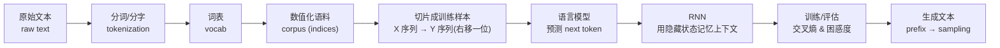
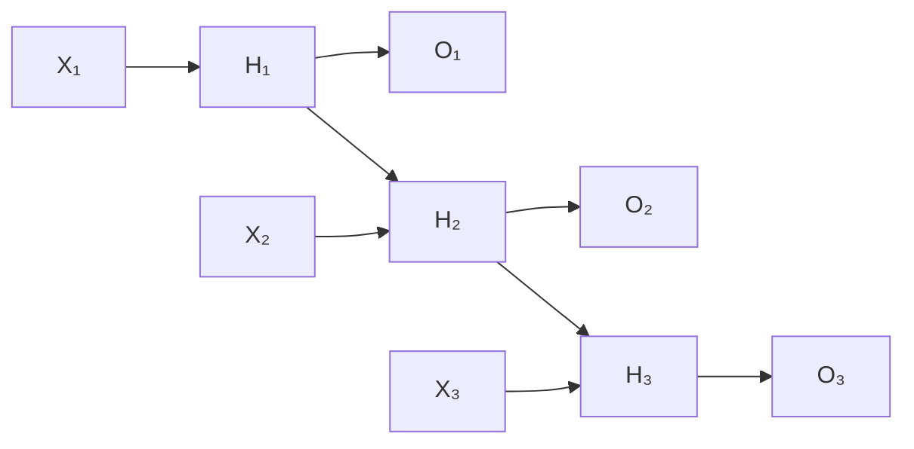

# 第9章 循环神经网络（RNN）— 学习笔记

**参考 Notebooks：**
- [index.ipynb](index.ipynb) — 本章索引
- [sequence.ipynb](sequence.ipynb) — 处理序列（序列建模的基本视角）
- [text-sequence.ipynb](text-sequence.ipynb) — 把原始文本变成序列数据（token / vocab / corpus）
- [language-model.ipynb](language-model.ipynb) — 语言模型（$n$-gram、困惑度、训练数据切片）
- [rnn.ipynb](rnn.ipynb) — 循环神经网络（隐藏状态、展开、字符级语言模型）
- [rnn-scratch.ipynb](rnn-scratch.ipynb) — 从零实现 RNN 语言模型（训练 + 生成）
- [rnn-concise.ipynb](rnn-concise.ipynb) — 简洁实现（调用框架高阶 API）
- [bptt.ipynb](bptt.ipynb) — 时间反向传播（BPTT、梯度消失/爆炸、截断与裁剪）

---

## 开篇：这一章到底在解决什么问题（先看大图）

前面第 2–8 章，我们大多数时候都在做一件事：
**把一个固定长度的输入（一个向量、一张图片）变成一个固定长度的输出（一个数字/一个类别）。**

但现实里有大量任务的输入/输出不是“定长”的，而是**一串按顺序来的东西**：

- 语音：一段音频帧序列
- 文本：一串词/字/子词
- 时间序列：股价、传感器读数
- 视频：一串图像帧
- 机器人控制：一串状态 → 一串动作

这类任务的本质困难是：**“后面发生什么”往往强依赖“前面发生了什么”。**
如果你把序列每个位置当成互相独立的样本（就像表格数据那样），模型就会丢掉最关键的信息：上下文。

这一章的主线可以用一句话概括：

> 我们想学一个模型，让它能“带着记忆”读序列，并且能用过去的信息来预测未来（尤其是文本里的下一个 token）。

为了不迷路，这章我们分成 7 块（它们也是本章 7 个 notebook）：

1) **序列是什么？**（很多任务其实都是“预测下一步”）
2) **文本怎么变成数字？**（token → vocab → index → corpus）
3) **语言模型怎么定义、怎么评估？**（链式法则、$n$-gram、困惑度）
4) **RNN 是怎么“记住过去”的？**（隐藏状态、展开、参数共享）
5) **从零实现一次**（你会真正看见：状态怎么传、损失怎么算、怎么生成文本）
6) **用框架简洁实现一次**（写更少、跑更快）
7) **为什么训练会难？**（BPTT 导致梯度消失/爆炸；截断与裁剪是“工程必需品”）

你可以把本章当成一个“流水线”：



> 小提醒：本章例子主要用**字符级语言模型**（character-level language model），也就是把文本拆成“字符序列”而不是“词序列”。这样 vocab 小、容易跑通，但表达能力上限也更低（后面用 Transformer/子词会更强）。

---

# 原理篇

---

## 一、处理序列：为什么“看历史”是核心 <sub>([sequence.ipynb](sequence.ipynb))</sub>

### 1.1 序列数据和以前数据最大的不同

以前做表格数据（线性回归/softmax/MLP）时，一个样本就是一行特征向量 $\mathbf{x}\in\mathbb{R}^d$，我们几乎默认：
每个样本之间独立同分布（i.i.d.）。

序列不是这样。序列的每个时间步之间往往相关：
“后面的 token/价格/音素”依赖前面的上下文。

所以，序列学习的第一个直觉是：**别急着学 RNN，先把问题改写成“预测下一步”。**

例如股价预测：你想要的是

$$P(x_t \mid x_{t-1}, \ldots, x_1) \tag{1.1}$$
> 这条式子是在说：我们关心“下一步 $x_t$ 的分布”，它依赖过去所有观察值。$x_t$ 是第 $t$ 个时间步的值；右边的条件 $(x_{t-1},\ldots,x_1)$ 是历史。常见误解是“预测一定是一个数”，其实这里是**预测一个分布**，你可以从分布里取期望/方差，也可以直接采样一个可能的未来值。

把这种“用过去预测未来”的思路叫做**自回归（autoregressive）**：用自己的历史预测自己的未来。

### 1.2 两个常用技巧：窗口 & 隐状态（你后面会一直用）

现实问题里，直接用“全部历史”很难做（历史越来越长，输入维度也越来越长）。书里给了两条几乎无处不在的策略：

**策略 A：只看最近 $\tau$ 步（窗口 / window）**

$$P(x_t \mid x_{t-1}, \ldots, x_1)\ \approx\ P(x_t \mid x_{t-1}, \ldots, x_{t-\tau}) \tag{1.2}$$
> 这条式子把“看全部历史”简化成“只看最近 $\tau$ 步”。$\tau$ 叫窗口长度（也可以理解成“记忆长度”）。常见误解是“$\tau$ 越大越好”，但 $\tau$ 太大反而更难学（输入更复杂、噪声更多、训练更慢）。

**策略 B：用一个摘要记忆 $h_t$（隐藏状态 / hidden state）**

$$h_t = g(h_{t-1}, x_{t-1}),\quad \hat{x}_t = f(h_t) \tag{1.3}$$
> 这条式子描述了“记忆滚动更新”的模式：$h_t$ 是“到时间步 $t$ 为止的摘要”；$g$ 是更新规则（把旧记忆 + 新观测变成新记忆）；$f$ 用摘要记忆生成预测 $\hat{x}_t$。常见误解是把 $h_t$ 当成数据里真实存在的列，其实它是模型内部学出来的“记忆变量”，你看不见但能通过训练学到。

你现在不用死记公式，只要记住一句直觉：
**窗口是“我只翻最近几页笔记”；隐藏状态是“我把笔记做成摘要，越写越浓缩”。**

### 1.3 序列任务的三种常见形态（有助于你分类问题）

- **序列 → 单个输出**：比如用一段评论判断情感（正/负）。
- **单个输入 → 序列输出**：比如看一张图片生成一句描述（image captioning）。
- **序列 → 序列**：比如翻译、对话、视频字幕。

序列到序列又分两类：
- **对齐（aligned）**：输入每个时间步都有对应输出（例如词性标注）。
- **不对齐（unaligned）**：输入输出不必一一对应（例如翻译）。

这一章主要先把最基础的“序列建模/语言模型”打牢：**给定前面，预测下一个 token。**

---

## 二、把原始文本变成序列数据：token / vocab / corpus <sub>([text-sequence.ipynb](text-sequence.ipynb))</sub>

这一节非常工程，但它决定你后面所有 NLP 代码能不能跑通。
你可以把它当成“把人类语言翻译成模型能吃的整数序列”的过程。

### 2.1 全流程（你以后做任何 NLP 都逃不掉）

典型预处理管线：

1) 读原始文本（字符串）
2) 切分成 token（词 / 字符 / 子词）
3) 建词表 vocab（token → id）
4) 把文本变成 id 序列（corpus）

这里的关键词，第一次见一定要搞清楚：

- **token（词元）**：文本里“最小单位”。可以是词，也可以是字符。
  - 负责：定义“时间步到底是什么”。
  - 例子：`"hi"` 如果用字符 token，就是 `["h","i"]`；如果用词 token，就可能是 `["hi"]`。
  - 常见误解：token 一定是“词”。不是，字符/子词也很常见。

- **vocab（词表 / vocabulary）**：把 token 映射成整数 id 的字典。
  - 负责：让模型输入变成整数（再进一步变成 one-hot 或 embedding）。
  - 例子：`{"<unk>":0, "h":1, "i":2}`。
  - 常见误解：vocab 是固定的、永远不变。实际工程里 vocab 必须和训练数据绑定，换数据就可能要重建。

- **corpus（语料的数值序列）**：把整段文本按 token 变成 id 列表。
  - 负责：给采样器/数据迭代器提供原材料。
  - 例子：`["h","i","h"] → [1,2,1]`。
  - 常见误解：corpus 是“句子列表”。这里书里为了简化，把整本书直接拼成一个长 id 列表。

### 2.2 为什么本章用字符级 token（而不是词）

字符级的好处：
- vocab 小（几十到几百），训练更快、显存压力小
- 不会有“没见过的词”那么严重（因为字符基本都见过）

坏处：
- 序列变长（一个词变成多个字符），模型要记更久
- 语义层面更弱（模型需要自己“拼出词的意义”）

这就是一个典型的工程取舍：**为了让你先把流程跑通，书里选了更容易的那条路。**

### 2.3 `<unk>`：为什么一定要有“未知 token”

当测试时出现训练阶段没见过的 token，你必须有一个兜底表示。
否则你会遇到“词表里找不到 key”的错误，或者更糟糕：默默映射错。

> 经验规则：任何 vocab 至少需要 `<unk>`；很多任务还会加 `<pad>`, `<bos>`, `<eos>` 等保留 token（reserved tokens）。

---

## 三、语言模型：怎么定义、怎么评估、怎么构造训练样本 <sub>([language-model.ipynb](language-model.ipynb))</sub>

### 3.1 语言模型到底在学什么（别被名字吓到）

语言模型（language model）就是在估计：
给定前面出现的 token，下一步出现每个 token 的概率是多少。

先从“整句概率”开始定义（链式法则）：

$$P(x_1, x_2, \ldots, x_T) = \prod_{t=1}^T P(x_t \mid x_1,\ldots,x_{t-1}) \tag{3.1}$$
> 这条式子把“整段序列的联合概率”拆成了“从左到右，每一步的条件概率连乘”。$x_t$ 是第 $t$ 个 token。它的意义非常朴素：一句话的概率 = 第一个词出现的概率 × 第二个词在第一个词之后出现的概率 × …… 常见误解是“这是 RNN 才有的公式”，其实这只是概率论的链式法则，任何语言模型（$n$-gram、RNN、Transformer）都在用这个分解。

你可以把它当成：模型每一步都回答一个选择题：
“在看到前缀后，下一步应该选哪个 token？”

### 3.2 $n$-gram / 马尔可夫：为什么它能跑但上限很低

如果你假设“只依赖最近 $n-1$ 个 token”，就得到 $n$-gram：

$$P(x_t \mid x_1,\ldots,x_{t-1})\ \approx\ P(x_t \mid x_{t-n+1},\ldots,x_{t-1}) \tag{3.2}$$
> 这条式子就是“有限记忆”的假设：只看最近 $n-1$ 个 token。它让你能用计数来估计概率，但参数量会随着 $n$ 爆炸（很多组合根本没出现过）。常见误解是“把 $n$ 调很大就行”，但数据不够时大 $n$ 只会导致大量组合计数为 0、模型崩溃。

这就是为什么我们需要“隐藏状态”这类神经网络方法：用一个固定维度的向量去承载历史信息，而不是记所有组合的计数表。

### 3.3 困惑度（Perplexity）：语言模型常用的“成绩单”

模型好不好，最直接的方法是看它对真实序列的平均交叉熵（越小越好）。
NLP 里常把它指数化，得到困惑度（perplexity, ppl）：

$$\mathrm{ppl}=\exp\left(-\frac{1}{n}\sum_{t=1}^{n}\log P(x_t \mid x_{t-1},\ldots,x_1)\right) \tag{3.3}$$
> 这条式子可以把困惑度理解成“模型平均每一步有多少个真实选择在让它困惑”。如果模型每一步都把正确 token 的概率给到 1，那么 ppl=1（最完美）；如果模型完全瞎猜并且对 vocab 做均匀分布，那么 ppl 大约等于 vocab 大小（例如 50 个字符就接近 50）。常见误解是“ppl 是百分比”，不是，它是一个倍率/难度量，越接近 1 越好。

**直觉补丁：为什么公式里会同时出现 `log` 和 `exp`？**  
你可以把 PPL 看成三步（这能帮你在公式多的时候不迷路）：
1) 先用 `log` 把概率变成可加的“分数”（原来很多步概率是连乘的，取 `log` 后就变成能相加、能做平均的量）  
2) 平均一下（得到“平均每一步”的难度）  
3) 再用 `exp` 把分数变回一个更直观的“倍数/规模”量（便于解释为“等效有多少个选项”）

> 小备注：这里 `log` 通常默认是自然对数（底数 $e$），因此对应的“还原”就用 `exp`（同样是以 $e$ 为底）。换底不会改变模型好坏排序，只会改变数值尺度。

### 3.4 训练样本怎么造：输入序列 X，目标序列 Y（右移一位）

语言模型训练时，一般做“教师强制（teacher forcing）”：
把真实序列喂给模型，让它在每个时间步预测“下一个 token”。

如果输入是
$$x = [x_1, x_2, ..., x_n]$$
那么目标是
$$y = [x_2, x_3, ..., x_{n+1}]$$
（整体右移一位）。

常见新手坑：
你写训练循环时最容易错的就是这一步的“错位一位”：
- 不是让模型预测“当前 token”
- 是预测“下一个 token”

---

## 四、循环神经网络（RNN）：用隐藏状态“带着记忆”读序列 <sub>([rnn.ipynb](rnn.ipynb))</sub>

### 4.1 “隐藏层” vs “隐藏状态”：名字很像，但完全不是一回事

这点一定要分清：

- **隐藏层（hidden layer）**：网络结构里的中间层（MLP 里你已经见过）。
- **隐藏状态（hidden state）**：序列模型在时间维度上滚动的“记忆变量”，是下一步计算的输入之一。

很多人第一次学 RNN 卡住，就是把这两个混在一起了。

### 4.2 RNN 的核心公式：当前输入 + 上一步记忆 → 新记忆

对一个小批量（batch）来说，常见写法是：

$$\mathbf{H}_t = \phi(\mathbf{X}_t\mathbf{W}_{xh} + \mathbf{H}_{t-1}\mathbf{W}_{hh} + \mathbf{b}_h) \tag{4.1}$$
> 这条式子是“RNN 记忆更新”的核心：$\mathbf{X}_t$ 是第 $t$ 步输入（shape 通常是 `batch_size × input_dim`），$\mathbf{H}_{t-1}$ 是上一步隐藏状态（`batch_size × hidden_dim`）。$\mathbf{W}_{xh}$ 负责把输入映射到隐藏空间，$\mathbf{W}_{hh}$ 负责把旧记忆映射到新记忆，$\mathbf{b}_h$ 是偏置，$\phi$ 是非线性（书里常用 `tanh`）。常见误解是“每个时间步都有不同参数”，其实 RNN 的关键是**参数共享**：所有时间步都用同一组 $\mathbf{W}_{xh},\mathbf{W}_{hh},\mathbf{b}_h$。

输出层通常是：

$$\mathbf{O}_t = \mathbf{H}_t\mathbf{W}_{hq} + \mathbf{b}_q,\quad \hat{\mathbf{Y}}_t=\mathrm{softmax}(\mathbf{O}_t) \tag{4.2}$$
> 这条式子把隐藏状态映射到“下一个 token 的概率分布”。$\mathbf{W}_{hq}$ 把 `hidden_dim` 映射到 `vocab_size`，所以输出维度等于词表大小。常见误解是“输出是一个字符/一个 id”，实际训练时输出是一个长度为 vocab_size 的概率分布（或者 logits），再用交叉熵对齐真实标签。

### 4.3 展开（unroll）：为什么 RNN 其实也能看成前馈网络

RNN 图里看起来有“环”，容易让人觉得计算顺序不清楚。
但真正计算时，你会把它按时间步展开成一条长链：



展开后的网络就是一个很长的前馈网络，只是每一段都在复用同一套参数（weight tying）。

### 4.4 字符级语言模型：用 RNN 预测下一个字符

如果序列是 `"machine"`，我们训练时会用：
- 输入：`"machin"`
- 目标：`"achine"`

训练时每个时间步都算一次交叉熵，最后对时间步做平均（或求和）。

---

## 五、从零实现 RNN 语言模型：看清“状态怎么流动” <sub>([rnn-scratch.ipynb](rnn-scratch.ipynb))</sub>

这一节的价值不在于“以后你都要手写 RNN”（不会的），而在于：
你会真正理解 3 件事：

1) **隐藏状态**到底是什么形状、怎么初始化、怎么传递
2) **输入序列/目标序列**为什么要错位一位
3) **训练稳定性**为什么离不开梯度裁剪（gradient clipping）

### 5.1 先搭一个最小 RNN（只负责算隐藏状态序列）

从零实现时，你会手动维护三组参数：
- $\mathbf{W}_{xh}$：输入 → 隐状态
- $\mathbf{W}_{hh}$：旧隐状态 → 新隐状态
- $\mathbf{b}_{h}$：偏置

并且在 `forward` 里按时间步循环：

```text
state = zeros(batch_size, hidden_dim)
for t in range(num_steps):
    state = tanh(X_t @ W_xh + state @ W_hh + b_h)
    outputs.append(state)
return outputs, state
```

常见新手坑：
- **维度顺序**：很多框架默认输入是 `(num_steps, batch, input_dim)`，不是 `(batch, num_steps, ...)`。
- **state 的设备**：用 PyTorch 时要确保 state 在同一个 device（CPU/GPU）上。

### 5.2 再加一个“输出层”：把隐状态变成 vocab 维度 logits

语言模型需要输出 vocab 大小的分布，所以还要一层：
- $\mathbf{W}_{hq}$：隐状态 → vocab logits
- $\mathbf{b}_q$

这时每个时间步输出一个长度为 `vocab_size` 的向量，和真实 label 做交叉熵。

### 5.3 训练时最关键的两件事：截断序列 & 梯度裁剪

为什么要把长文本切成很多段（num_steps）？
- 计算/显存：展开太长会爆内存
- 优化：展开太长会让梯度更不稳定

为什么要梯度裁剪？
因为偶尔会出现**梯度爆炸（exploding gradients）**，直接把参数一步更新到崩掉。

梯度裁剪的直觉是：
> 如果梯度向量太大，就按比例缩小它，让它的范数不超过阈值。

工程上这几乎是训练 RNN 的标配。

### 5.4 生成文本：prefix + 逐步采样

训练好后，你可以给一个前缀，比如 `"it has"`，然后让模型一次生成一个字符：

1) 把前缀逐字符喂给模型（更新隐藏状态）
2) 之后每一步用模型输出分布选下一个 token（可以取 argmax，也可以采样）
3) 把新 token 再喂回去，循环生成

常见误解：生成时也要用真实下一个字符当输入（训练那样）。  
不对，生成时真实未来不存在，只能用模型自己的输出喂回去。

---

## 六、简洁实现：用框架 API 写更少、跑更快 <sub>([rnn-concise.ipynb](rnn-concise.ipynb))</sub>

这一节你要建立的直觉是：

> “从零实现”是在学原理；“简洁实现”才是日常写法。

以 PyTorch 为例，核心是 `nn.RNN(input_size, hidden_size)`：

- 输入形状通常是 `(seq_len, batch, input_size)`
- 输出会给你：
  - `output`：每个时间步的隐藏状态（`seq_len, batch, hidden_size`）
  - `h_n`：最后一个时间步的隐藏状态（以及多层时的所有层状态）

你仍然需要自己加一个线性层把 hidden 映射到 vocab：
- `Linear(hidden_size → vocab_size)`

> 小坑提醒：很多人第一次用 PyTorch 的 RNN 会被 `batch_first` 搞晕。书里是 time-major（`seq_len` 在最前）。如果你改成 `batch_first=True`，你必须把整个数据管线的维度都改一致。

---

## 七、时间反向传播（BPTT）：RNN 为什么容易梯度消失/爆炸 <sub>([bptt.ipynb](bptt.ipynb))</sub>

### 7.1 直觉：RNN 的反传 = 在“展开后的长链”上反传

你把 RNN 展开后，会发现梯度要穿过很多很多步的矩阵乘法。
如果每一步都乘一个“略小于 1 的因子”，最后就趋近于 0（梯度消失）。
如果每一步都乘一个“略大于 1 的因子”，最后就爆炸（梯度爆炸）。

这和你在 MLP 里学的梯度消失/爆炸是同一类问题，只是 RNN 的“深度”往往是时间步数（可能上百上千），所以问题更显著。

### 7.2 截断 BPTT：为什么我们经常“只反传最近几步”

在实践里，我们几乎不会对超长序列做完整反传，而是把序列切段，只在长度为 `num_steps` 的段内反传。
这叫**截断的时间反向传播（truncated BPTT）**：
它带来的是一个近似梯度，但换来稳定和可训练。

### 7.3 梯度裁剪：RNN 训练的“安全带”

梯度裁剪不会让模型变聪明，但能防止训练偶尔炸掉。
尤其是学习率较大、序列较长时，裁剪几乎是必需的。

---

## 常见坑（我建议你在写代码前先扫一遍）

1) **X/Y 错位**：语言模型的 label 是“右移一位”的序列，不是原序列本身。
2) **维度顺序搞反**：`(seq_len, batch, input_dim)` vs `(batch, seq_len, input_dim)`。
3) **忘了重置/分离隐藏状态**：跨 batch 训练时如果不小心把上一次 batch 的计算图带过来，会导致显存越来越大或梯度不符合预期。
4) **vocab 不一致**：训练 vocab 和验证/测试 vocab 不一致会直接让结果不可比，甚至报错。
5) **困惑度的尺度误解**：ppl 不是百分比，越接近 1 越好；均匀猜测的 ppl 约等于 vocab 大小。

---

## 快速检查清单（你可以拿来对照自己的实现）

- [ ] 能把原始文本 → token → vocab → corpus（整数序列）
- [ ] 能构造 `X` 和 `Y`（Y 是 X 右移一位）
- [ ] 能跑通一次 forward（输出维度 = vocab_size）
- [ ] loss 能下降、ppl 能下降
- [ ] 开了梯度裁剪后训练不会突然爆掉
- [ ] 能用 prefix 生成一段可读文本（哪怕很烂也行）

---

## 下一章预告

如果你感觉“普通 RNN 很难记很久”，你会非常对：这就是 LSTM/GRU 诞生的背景。
第 10 章我们会学“现代循环神经网络”，核心就是用**门控机制（gates）**让模型更容易记住长距离依赖，也更好训练。

---
---

# 代码实现篇

> Placeholder：本章的代码实现会围绕“时间机器（Time Machine）字符级语言模型”展开，目标是把 `text-sequence → language-model → rnn-scratch → rnn-concise` 这条链路完整跑通，并记录你遇到的维度/设备/梯度裁剪等常见坑。后续我会在这里补上可直接照着写的 PyTorch 版本步骤与最小可运行代码骨架。
